# Open-OX Agent Skills 总览与使用指南

> 本仓库有两套 Skill 目录，合计 **36 个**（`.agents/skills` 22 个 + `.cursor/skills` 14 个）。  
> 锁定清单见根目录 `[skills-lock.json](../../skills-lock.json)`（主要为 `.agents` 侧通过 `mattpocock/skills`、`Leonxlnx/taste-skill` 安装的技能）。

---

## 1. 两套目录分别是什么？


| 目录                                      | 数量  | 来源 / 用途                                                      |
| --------------------------------------- | --- | ------------------------------------------------------------ |
| `[.agents/skills/](.)`                  | 22  | **Matt Pocock 工程流** + **Taste 视觉流**；适合产品→Issue→实现→Review 全链路 |
| `[.cursor/skills/](../.cursor/skills/)` | 14  | **Open-OX / ECC 工程规范**；偏 Next.js、测试、API、特效 skill 沉淀          |


在 Cursor Agent 对话中启用方式：

```text
@.agents/skills/<name>/SKILL.md
@.cursor/skills/<name>/SKILL.md
```

或在 prompt 里写：`请使用 <skill-name> skill`。

---


## 2. 技能全景图（按场景选）

```mermaid
flowchart LR
    subgraph plan [规划与文档]
        research[research]
        to_prd[to-prd]
        to_issues[to-issues]
        domain[domain-modeling]
    end
    subgraph design [设计与原型]
        codebase_design[codebase-design]
        prototype[prototype]
        arch[improve-codebase-architecture]
    end
    subgraph visual [视觉与前端]
        image2code[image-to-code]
        taste[design-taste-frontend]
        redesign[redesign-existing-projects]
        gen_visual[generate-visual-skill]
    end
    subgraph build [实现与质量]
        implement[implement]
        tdd[tdd / tdd-workflow]
        review[code-review]
        bugs[diagnosing-bugs]
    end
    subgraph ops [协作与分流]
        setup[setup-matt-pocock-skills]
        triage[triage]
        handoff[handoff]
        grill[grilling / grill-me]
    end

    plan --> design --> visual --> build
    ops --> plan
    ops --> build
```




---


## 3. `.agents/skills` 完整目录（22）


### 3.1 一次性 / 基础设施


| Skill                        | 路径                                                             | 一句话                                    | 何时用                                    |
| ---------------------------- | -------------------------------------------------------------- | -------------------------------------- | -------------------------------------- |
| **setup-matt-pocock-skills** | [setup-matt-pocock-skills/](setup-matt-pocock-skills/SKILL.md) | 配置 Issue Tracker、Triage 标签、Domain 文档布局 | **首次**在本仓库使用 Matt Pocock 工程 skill 前跑一遍 |
| **writing-great-skills**     | [writing-great-skills/](writing-great-skills/SKILL.md)         | 写好 / 改好 Skill 的词汇与原则                   | 自建或 fork skill 时                       |


**示例 prompt：**

```text
@setup-matt-pocock-skills 帮我把 open-ox 配好 GitHub Issue + triage 标签 + docs/adr 结构。
```

---


### 3.2 规划 · 研究 · 文档


| iSkill              | 路径                                           | 一句话                            | 何时用                   |
| ------------------- | -------------------------------------------- | ------------------------------ | --------------------- |
| **research**        | [research/](research/SKILL.md)               | 查权威资料，产出 Markdown 调研文件         | API 选型、竞品、技术事实需要落地成文档 |
| **to-prd**          | [to-prd/](to-prd/SKILL.md)                   | 把当前对话合成 PRD 并发布到 Issue Tracker | 讨论够了，要成文 PRD          |
| **to-issues**       | [to-issues/](to-issues/SKILL.md)             | 把 PRD/计划拆成可独立领取的 Issue（纵向切片）   | PRD 已定，要拆任务           |
| **domain-modeling** | [domain-modeling/](domain-modeling/SKILL.md) | 统一语言、术语表、ADR                   | 领域概念混乱、要写 CONTEXT/ADR |
| **handoff**         | [handoff/](handoff/SKILL.md)                 | 压缩对话为交接文档                      | 换 Agent / 换会话继续同一任务   |


**示例 prompt：**

```text
@to-prd 根据我们刚才讨论的 admin analytics，写 PRD 并创建 GitHub issue。
@to-issues 把 docs/admin-analytics-prd.md 拆成 tracer-bullet issues。
@research 调研 Langfuse vs OpenTelemetry 在 Next.js 里的集成方式，写到 docs/research/。
```

---


### 3.3 设计 · 架构 · 原型


| Skill                             | 路径                                                                       | 一句话                        | 何时用               |
| --------------------------------- | ------------------------------------------------------------------------ | -------------------------- | ----------------- |
| **codebase-design**               | [codebase-design/](codebase-design/SKILL.md)                             | Deep module、接口 seam、可测试性词汇 | 设计模块边界、加深抽象       |
| **improve-codebase-architecture** | [improve-codebase-architecture/](improve-codebase-architecture/SKILL.md) | 扫描加深机会，HTML 报告 + 逐项 grill  | 架构债、模块过浅          |
| **prototype**                     | [prototype/](prototype/SKILL.md)                                         | 可抛弃原型验证状态机 / UI 方向         | 不确定交互或逻辑，先快速试     |
| **grill-me**                      | [grill-me/](grill-me/SKILL.md)                                           | 面试式拷问计划                    | 方案要压测             |
| **grilling**                      | [grilling/](grilling/SKILL.md)                                           | 同上（触发词 grill）              | 用户说「grill 一下这个方案」 |
| **grill-with-docs**               | [grill-with-docs/](grill-with-docs/SKILL.md)                             | Grill 同时产出 ADR / glossary  | 拷问 + 留文档          |


**示例 prompt：**

```text
@improve-codebase-architecture 扫描 ai/flows/generate_project，出 HTML 报告。
@prototype 用 throwaway 页面验证 modify agent 的 continuation 状态机是否合理。
@grilling 拷问我这份 generation queue 重构方案。
```

---


### 3.4 视觉 · 前端（Taste 系列）


| Skill                          | 路径                                                                 | 一句话                                 | 何时用                                             |
| ------------------------------ | ------------------------------------------------------------------ | ----------------------------------- | ----------------------------------------------- |
| **image-to-code**              | [image-to-code/](image-to-code/SKILL.md)                           | **先出 section 设计图 → 深度分析 → 写代码**     | 新 landing、多 section、视觉质量是核心；Codex 下一 section 一图 |
| **design-taste-frontend**      | [design-taste-frontend/](design-taste-frontend/SKILL.md)           | 读 brief 后直接 anti-slop 前端，三 dial 控风格 | 有明确 brief，不需要 Agent 自己生图                        |
| **redesign-existing-projects** | [redesign-existing-projects/](redesign-existing-projects/SKILL.md) | 审计现有站 + 增量升级，不推翻功能                  | 老项目「太 AI 味」要 polish                             |


**三者怎么选？**


| 场景                    | 推荐                                                            |
| --------------------- | ------------------------------------------------------------- |
| 从零做 premium 营销页，环境能出图 | **image-to-code**                                             |
| 从零做页，brief 已很清楚       | **design-taste-frontend**                                     |
| 已有 sites/{id} 要改视觉    | **redesign-existing-projects** → 新 block 可用 **image-to-code** |
| 出图定稿后要微调              | image-to-code → **design-taste-frontend** polish              |


**image-to-code 详细说明** → [image-to-code/USAGE.md](image-to-code/USAGE.md)

**示例 prompt：**

```text
@image-to-code 8 section B2B landing，每 section 独立大图后再实现。
@design-taste-frontend Linear 风 portfolio，VARIANCE=6 MOTION=4。
@redesign-existing-projects 审计 sites/template 首页，去掉 AI slop 三列卡片。
```

---


### 3.5 实现 · 测试 · Review · 排错


| Skill               | 路径                                           | 一句话                                 | 何时用                       |
| ------------------- | -------------------------------------------- | ----------------------------------- | ------------------------- |
| **implement**       | [implement/](implement/SKILL.md)             | 按 PRD/Issue 实现；内建 tdd + code-review | Issue 已 `ready-for-agent` |
| **tdd**             | [tdd/](tdd/SKILL.md)                         | Red-Green-Refactor，偏 integration    | 功能/修复要测试先行                |
| **code-review**     | [code-review/](code-review/SKILL.md)         | Standards + Spec 双轴 Review          | PR、分支、WIP 要 review        |
| **diagnosing-bugs** | [diagnosing-bugs/](diagnosing-bugs/SKILL.md) | 难 bug / 性能回归诊断循环                    | 报错、慢、行为诡异                 |
| **triage**          | [triage/](triage/SKILL.md)                   | Issue/PR 状态机 + Agent Brief          | 维护者分流、写 agent-ready brief |


**示例 prompt：**

```text
@implement 实现 issue #42，按 PRD 验收标准。
@tdd 先为 lib/transport/agentStream 写测试再实现。
@code-review 对比 main...HEAD，Standards + Spec 双轴。
@diagnosing-bugs SSE 在 production 一次性 dump，本地正常。
@triage 把新报的 modify 流中断 issue 分到 ready-for-agent 并写 brief。
```

---


### 3.6 学习 · 教学


| Skill     | 路径                       | 一句话          | 何时用              |
| --------- | ------------------------ | ------------ | ---------------- |
| **teach** | [teach/](teach/SKILL.md) | 在本仓库语境里教用户概念 | 你要系统学某模块，而不只是改代码 |


---


## 4. `.cursor/skills` 完整目录（14）

Open-OX 工程与产品专用，路径前缀：`.cursor/skills/`。


| Skill                     | 一句话                                  | 何时用                                |
| ------------------------- | ------------------------------------ | ---------------------------------- |
| **coding-standards**      | 命名、不可变、可读性基线                         | 任何代码改动前的规范参照                       |
| **frontend-patterns**     | React / Next / 状态 / 性能               | 前端实现细节                             |
| **frontend-design**       | 高设计质量的生产级 UI（偏直接实现）                  | 组件/页视觉与代码同等重要，但**不强制** image-first |
| **backend-patterns**      | Node / Next API / DB 模式              | 服务端与 API 层                         |
| **api-design**            | REST 命名、状态码、分页、错误格式                  | 新 API 或改 contract                  |
| **tdd-workflow**          | TDD + 80% 覆盖（unit/integration/E2E）   | 与 `.agents/tdd` 类似，偏 Open-OX 规则栈   |
| **e2e-testing**           | Playwright POM、CI、防 flaky            | E2E 套件                             |
| **ai-regression-testing** | AI 开发回归、sandbox API 测                | 防「同一模型写又审」盲区                       |
| **verification-loop**     | Claude Code 会话级全面验证                  | 大改后系统性验收                           |
| **documentation-lookup**  | Context7 MCP 查最新库文档                  | Next/React 等 API 以文档为准             |
| **nextjs-turbopack**      | Next 16+ / Turbopack 取舍              | dev 慢、bundler 选型                   |
| **generate-visual-skill** | WebGL/动效源码 → `section/hero` skill 模板 | 「转成 skill」「沉淀特效」                   |
| **agent-sort**            | 按仓库裁剪 ECC 安装（DAILY vs LIBRARY）       | Skill 太多要瘦身                        |
| **code-tour**             | 生成 CodeTour `.tour` 逐步导览             | onboarding / 架构讲解                  |


**Open-OX 特有关联：**

```text
@generate-visual-skill 把这段 hero WebGL 沉淀到 ai/flows/generate_project/prompts/skills/section/hero/
@ai-regression-testing 为 /api/ai/intent-agent 设计 sandbox 回归用例
@documentation-lookup Next.js 16 App Router streaming 最新写法
```

---


## 5. 推荐工作流（Open-OX 场景）


### 5.1 新功能（工程标准流）

```text
1. setup-matt-pocock-skills     （仅首次）
2. research                     （可选，技术不确定时）
3. to-prd / 已有 PRD
4. to-issues
5. triage → ready-for-agent
6. implement + tdd / tdd-workflow
7. code-review
8. verification-loop            （大功能可选）
```


### 5.2 新网站 / Studio 生成视觉

```text
1. image-to-code                （section 参考图 → 分析 → 实现）
   或 design-taste-frontend     （brief 清晰、无需生图）
2. generate-visual-skill        （Hero 动效要进 skill 库时）
3. redesign-existing-projects   （已有 site 视觉升级）
4. frontend-patterns + coding-standards
```


### 5.3 Bug / 线上问题

```text
1. diagnosing-bugs
2. tdd（回归测试）
3. code-review
4. ai-regression-testing        （AI 相关链路）
```


### 5.4 架构 / 模块治理

```text
1. improve-codebase-architecture
2. codebase-design
3. domain-modeling
4. grill-with-docs
```

---


## 6. 快速查表：我说什么 → 用哪个 Skill


| 你说的话                  | Skill                      |
| --------------------- | -------------------------- |
| 「先出设计图再写代码」           | image-to-code              |
| 「别那么 AI 味，做 landing」  | design-taste-frontend      |
| 「把这个旧站改好看」            | redesign-existing-projects |
| 「WebGL 转成 hero skill」 | generate-visual-skill      |
| 「写 PRD / 拆 issue」     | to-prd / to-issues         |
| 「实现 #123」             | implement                  |
| 「测试先行」                | tdd 或 tdd-workflow         |
| 「review 这个分支」         | code-review                |
| 「查为什么 prod 才挂」        | diagnosing-bugs            |
| 「调研 XX 技术」            | research                   |
| 「grill 方案」            | grilling / grill-me        |
| 「交接给下一个 agent」        | handoff                    |
| 「教我这模块怎么工作」           | teach / code-tour          |
| 「REST API 怎么设计」       | api-design                 |
| 「Playwright E2E」      | e2e-testing                |
| 「Skill 太多装不下」         | agent-sort                 |
| 「查 Next 最新文档」         | documentation-lookup       |


---


## 7. 与 Open-OX 生成流水线的关系


| 仓库区域                            | 相关 Skill                                                  |
| ------------------------------- | --------------------------------------------------------- |
| `ai/flows/generate_project/`    | image-to-code、design-taste-frontend、generate-visual-skill |
| `ai/flows/modify_project/`      | diagnosing-bugs、implement、tdd                             |
| `app/studio/`                   | design-taste-frontend、frontend-patterns                   |
| `app/api/`                      | api-design、backend-patterns、ai-regression-testing         |
| `lib/transport/`（Agent SSE 加密等） | tdd-workflow、code-review                                  |
| `docs/` PRD                     | to-prd、to-issues、research                                 |


生成 Hero 时：**image-to-code** 定构图与层次 → **generate-visual-skill** 沉淀可复用 WebGL/动效 → 写入 `prompts/skills/section/hero/`。

---


## 8. 维护与版本

- **锁定**：`skills-lock.json` 记录 `.agents` 侧 skill 的 source commit hash。
- **更新**：从 `mattpocock/skills` / `Leonxlnx/taste-skill` 拉新版本后更新 lock，并跑一条 golden prompt 回归。
- **裁剪**：用 **agent-sort** 决定 DAILY vs LIBRARY，避免一次加载 36 个 skill 撑爆上下文。

---


## 9. 子文档索引


| 文档                                                                     | 内容                                      |
| ---------------------------------------------------------------------- | --------------------------------------- |
| [image-to-code/USAGE.md](image-to-code/USAGE.md)                       | image-to-code 详细用法（出图规则、prompt 模板、验收清单） |
| [triage/AGENT-BRIEF.md](triage/AGENT-BRIEF.md)                         | Agent-ready Issue Brief 写法              |
| [domain-modeling/CONTEXT-FORMAT.md](domain-modeling/CONTEXT-FORMAT.md) | 领域 CONTEXT 格式                           |
| [codebase-design/DEEPENING.md](codebase-design/DEEPENING.md)           | Deep module 加深指南                        |


---


## 10. 修订记录


| 日期         | 说明                                             |
| ---------- | ---------------------------------------------- |
| 2026-07-07 | 初版：汇总 `.agents` 22 + `.cursor` 14 共 36 个 skill |


