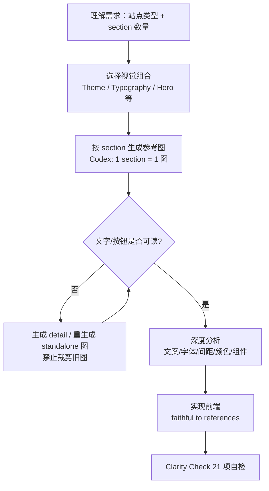

# image-to-code 使用文档

> **Skill 名称**：`image-to-code`  
> **路径**：`.agents/skills/image-to-code/SKILL.md`  
> **来源**：`Leonxlnx/taste-skill`（见仓库根目录 `skills-lock.json`）  
> **适用环境**：Cursor Agent、Codex 等支持**图像生成 + 前端实现**的 Agent 环境  
> **全库 Skill 总览**：见 [`.agents/skills/README.md`](../README.md)（共 36 个 skill 索引与选型）

---

## 1. 这个 Skill 是做什么的？

`image-to-code` 是一套 **「先出设计图 → 深度分析 → 再写代码」** 的网站生产工作流，面向对视觉质量要求高的前端任务。

它与普通「直接写 React/Tailwind」的区别：

| 普通 Agent | image-to-code |
|-----------|---------------|
| 凭记忆写「好看」的模板 | 先生成可分析的设计参考图 |
| 容易产出 AI 味布局 | 从图中提取 typography / spacing / color |
| 一张压缩长图难以还原 | **每 section 一张大图**，细节可读 |
| 实现时容易 drift 成通用 UI | 要求 **faithful translation**，贴近参考图 |

**核心原则**：

```
图像生成（第一） → 深度分析（第二） → 前端实现（第三）
```

图像才是视觉 source of truth，代码是翻译层。

---

## 2. 什么时候应该用？

### ✅ 适合触发

- Hero / Landing Page / 营销页
- 创业公司官网、作品集、产品页
- 多 section 品牌站（4 / 8 / 12 section）
- 「更好看」「更现代」「premium」「redesign」等**以视觉为主**的需求
- 需要 Agent **自己生成**设计参考，而不是你已有完整 Figma

### ❌ 不适合（可跳过 image-first）

- Bug fix、API 对接、纯逻辑重构
- 用户已提供完整 design system / Figma 标注
- 后台 Dashboard、数据表格（本 skill 偏 marketing / brand site）
- 环境**不支持图像生成**（此时只能降级为直接编码，效果会打折）

---

## 3. 如何在 Cursor / Agent 里启用？

### 方式 A：在对话里显式引用（推荐）

在 Agent 对话开头或任务描述里写清楚：

```text
请使用 image-to-code skill，按「先出图、再分析、再写代码」流程完成。

需求：为 AI 写作工具做一个 8 section 的 landing page，风格 premium dark，Hero 要干净、小笔记本首屏可读。
技术栈：Next.js + Tailwind，放在 sites/template 下。
```

Agent 会根据 skill 的 `description` 自动匹配；显式点名更稳。

### 方式 B：@ 引用 Skill 文件

在 Cursor 中 `@` 引用：

```text
.agents/skills/image-to-code/SKILL.md
```

适合长任务，确保 Agent 完整读取 1200+ 行规则。

### 方式 C：与 Open-OX 生成流水线结合

在 Studio 里描述视觉需求时，可在 prompt 末尾加：

```text
[workflow] image-to-code：每个 section 单独生成参考图后再实现，禁止一张长图压缩全站。
```

若你本地有 `design-taste-frontend`，二者关系见 [第 10 节](#10-与其他-skill-如何配合)。

---

## 4. 标准工作流（Agent 应执行的步骤）



### 4.1 推断 section 数量

用户说「做一个 landing」但未给数量时，Skill 提供默认 pack：

| Pack | Sections |
|------|----------|
| 4-section | Hero → Features → Social proof → CTA |
| 8-section | Hero → Trust → Features → Showcase → Benefits → Testimonials → Pricing → CTA |
| 12-section | Hero → Trust → Feature grid → Preview → Problem/Solution → … → FAQ → CTA+Footer |

也可在用户 prompt 里直接写：`共 6 个 section：Hero、Logo bar、Features、Pricing、FAQ、Footer`。

### 4.2 图像生成规则（Codex 重点）

| 规则 | 说明 |
|------|------|
| **一 section 一图** | 8 个 section → 8 张独立大图，不要一张长板塞全站 |
| **宁多勿少** | 文字太小就加 detail 图或重生成，不要为了省事少生成 |
| **禁止裁剪旧图** | 需要 Hero 特写时，**重新生成** Hero 图，不要从大图里 cut |
| **重生成保语言一致** | 新图是同一 design system 的「更清晰版本」，不是换风格 |

### 4.3 分析阶段必须提取的内容

实现前 Agent 应对每张 section 图做结构化分析（可输出为表格或 bullet）：

- **文案**：Headline、Subheadline、CTA、section 标题（能读就读出来）
- **Typography**：字号关系、字重、行数、display vs body 对比
- **Spacing**：section 间距、卡片 padding、gutter、Hero 留白
- **Color**：背景、accent、按钮 fill、文字层级、边框/阴影
- **Components**：按钮形状/层级、卡片结构、media frame、radius 逻辑
- **Layout**：网格/分栏、对齐、视觉焦点、section 节奏

分析不够 → **先补图再写代码**，不要猜。

### 4.4 实现阶段纪律

- **Faithful copy**：布局、间距、配色、组件风格贴近参考图
- **Anti-drift**：不要实现时「顺手改成通用三列卡片」
- **Anti-slop**：避免 purple AI 渐变、卡片套卡片、假系统标签、pills 泛滥
- **Hero 极简**：标题 1–3 行，首屏小笔记本可读，不要塞满假数据/徽章

---

## 5. 默认配置参数（Dials）

Skill 内置默认值，用户可在 prompt 里覆盖：

| 参数 | 默认 | 含义 |
|------|------|------|
| `DESIGN_VARIANCE` | 8 | 1=保守对称，10=强艺术不对称 |
| `VISUAL_DENSITY` | 3 | 1=透气，10=信息密集 |
| `ART_DIRECTION` | 8 | 1=安全商业，10=大胆创意 |
| `IMPLEMENTATION_CLARITY` | 9 | 1=情绪板，10=可施工 UI |
| `IMAGE_USAGE_PRIORITY` | 9 | 图像在构图中的权重 |
| `SPACING_GENEROSITY` | 9 | 留白 generous 程度 |
| `ANALYSIS_PRECISION` | 10 | 分析深度 |
| `IMAGE_GENERATION_EAGERNESS` | 10 | 生成图像的积极性 |
| `UI_SIMPLICITY_DISCIPLINE` | 9 | 减少无意义 micro-UI |

### 常用口语 → 参数调整

| 用户说法 | Agent 应倾向 |
|----------|-------------|
| 「干净 / calm / minimal」 | ↓ density，↑ clarity & spacing |
| 「很疯 / Awwwards / 实验」 | ↑ variance & art direction |
| 「premium SaaS」 | clarity 高，art direction 克制 |
| 「editorial / 杂志感」 | 允许更强 typography 与 asymmetry |

示例 prompt：

```text
使用 image-to-code，DESIGN_VARIANCE=6，VISUAL_DENSITY=2，做一版偏 editorial 的 4 section 品牌页。
```

---

## 6. Prompt 模板（可直接复制）

### 6.1 单 Hero

```text
@image-to-code

为「AI 代码审查工具」做一个 Hero section。
要求：Deep Dark、标题最多 2 行、一个 primary CTA + 一个 ghost CTA、右侧产品 UI 预览。
先单独生成 Hero 参考图（必要时加一张 detail 图读清字号和按钮），分析后再用 Next.js + Tailwind 实现。
禁止卡片套卡片，禁止假系统标签。
```

### 6.2 完整 8-section Landing

```text
@image-to-code

做一个 B2B SaaS landing，共 8 个 section（Hero / Trust bar / Features / Product showcase / Benefits / Testimonials / Pricing / CTA）。
风格：Quiet Premium Neutral + Swiss grid，小笔记本首屏 Hero 必须可读。
Codex 规则：每个 section 一张独立大图，全部 analyze 后再写代码。
技术：React 组件化，Tailwind，responsive。
```

### 6.3 基于参考 URL 的「同气质新站」

```text
@image-to-code

参考 https://example.com 的信息架构和 premium 气质，但不要抄袭；做 4 section 创业公司官网。
流程：先出 4 张 section 图 → 提取 design tokens → 实现。
配色偏暖 neutral，不要 AI 紫蓝渐变。
```

### 6.4 已有代码库的 section 追加

```text
@image-to-code

在 app/page.tsx 现有 Hero 下方新增 Pricing section。
先只生成 Pricing section 的参考图（+ detail 图若按钮太小），分析 spacing/卡片结构后插入，与现有 dark theme 一致。
```

---

## 7. Agent 输出物预期

一次完整任务，理想情况下你会看到：

1. **Design Read**（可选但推荐）：站点类型、section 数、视觉方向一句话
2. **Section 参考图**：N 张（+ 可选 detail 图）
3. **Design Analysis**：每张图的 typography / spacing / color / components 摘要
4. **Design Tokens 归纳**：色板、radius、spacing scale、type scale（可从分析中推导）
5. **代码实现**：组件 + 页面文件
6. **自检**：Clarity Check（skill 第 35 节 21 条）

若 Agent 跳过出图直接写代码，应提醒它：**「按 image-to-code，请先 section 参考图」**。

---

## 8. 质量检查清单（用户验收用）

交付前可对照：

- [ ] 是否**先出图**再写代码？
- [ ] 多 section 时是否为**分 section 大图**（非一张压缩长图）？
- [ ] Hero 是否**简洁**（1–3 行标题、首屏不 overcrowded）？
- [ ] 是否避免 **cards-in-cards-in-cards**、巨大 rounded 外框？
- [ ] 是否减少无意义 **pills / 假系统标签 / 装饰性 jargon**？
- [ ] 实现是否与参考图 **同一品牌世界**（非 generic 重写）？
- [ ] Typography / spacing 是否 **generous**，非默认 tight Tailwind？
- [ ] 小笔记本（~1280×800）首屏是否仍可读？
- [ ] 文案是否来自图中可读文字（非纯 lorem / unleash / revolutionize）？

---

## 9. 常见问题与排查

### Q1：Agent 直接写代码，没有生成图片

**原因**：环境无图像能力，或 prompt 偏技术、未强调 visual-first。  
**处理**：显式写「必须使用 image-to-code，先生成 section 参考图」；确认 Agent 有 `GenerateImage` 或等价能力。

### Q2：只生成一张包含全站的小图，文字看不清

**原因**：违反 Codex section 规则。  
**处理**：要求「8 section → 8 张独立大图；看不清的 section 重生成 standalone，禁止 crop」。

### Q3：图很好看，代码变成普通 AI 模板

**原因**：design drift，未做 faithful translation。  
**处理**：要求 Agent 输出 analysis 后再实现；对照参考图逐 section 验收；引用 skill 第 26–27 节 anti-drift 规则。

### Q4：Hero 太挤、标签太多

**原因**：违反 Hero minimalism / micro-UI clutter 规则。  
**处理**：prompt 加「Hero 只要 headline + subline + 2 CTA + 一个视觉焦点，不要 pills/假系统文案」。

### Q5：和用户提供的设计稿冲突

**原因**：用户已有 Figma/截图时，不应再让 Agent 瞎生成替代稿。  
**处理**：改用「以用户设计稿为 source of truth，image-to-code 只负责分析与 faithful 实现」；或换 `design-taste-frontend` / 直接实现。

---

## 10. 与其他 Skill 如何配合

| Skill | 关系 |
|-------|------|
| **`design-taste-frontend`** | 偏「读 brief → 直接写 anti-slop 前端」；**无强制 image-first**。视觉探索阶段用 `image-to-code`，定稿后微调 taste 用 design-taste。 |
| **`redesign-existing-projects`** | 偏**审计现有站**并增量升级。已有代码库 redesign：先 redesign audit，新 section 视觉用 image-to-code 出参考图。 |
| **`generate-visual-skill`**（Open-OX `.cursor/skills`） | 偏 Hero **动效/WebGL skill 沉淀**；静态 section 视觉参考仍用 image-to-code。 |
| **`prototype`** | 快速原型可 prototype；要 premium 视觉 fidelity 时切 image-to-code。 |

推荐组合：

```text
新站从零：image-to-code（出图+实现） → design-taste-frontend（polish pass）
老站改版：redesign-existing-projects（audit） → image-to-code（新 Hero/新 section）
```

---

## 11. Open-OX 项目内实践建议

1. **生成目标路径**：与现有 `sites/{projectId}` 或 template 结构对齐，组件放 `components/sections/`。
2. **与 design-system.md 对齐**：若项目已有 `design-system.md`，分析阶段应产出与之兼容的 tokens，或在实现后更新该文件。
3. **Section skills**：Hero 若需 WebGL/动效，image-to-code 负责**静态构图与层次**，动效再交给 section hero skills。
4. **Studio prompt**：用户 brief 里写 section 数量与风格词，比在 Agent 里事后纠偏更高效。
5. **版本锁定**：`skills-lock.json` 记录 hash；升级 skill 后重新跑一条 golden prompt 对比输出。

---

## 12. 反模式速查（Agent 必须避免）

| 反模式 | 正确做法 |
|--------|----------|
| 一张长图塞 10 个 section | 每 section 独立大图 |
| 从大图 crop Hero | 重新生成 Hero standalone |
| 图少省 token | 看不清就加 detail 图 |
| 实现时改成三列等宽卡片 | 跟随参考图 layout |
| Hero 4+ 行标题 | 压缩文案，最多 3 行 |
| 「00 orchestration layer」类假标签 | 删掉，用 real hierarchy |
| 全站 giant rounded 外容器 | 开放 layout + 有目的的 container |
| 默认紫蓝 AI gradient | 从参考图提取真实 palette |

---

## 13. 最小可行示例（端到端）

**用户输入：**

```text
@.agents/skills/image-to-code/SKILL.md
做一个 4 section 的「独立开发者工具」landing：Hero、Features、Testimonials、CTA。Light mode，editorial 一点，Next.js App Router + Tailwind。
```

**Agent 应执行：**

1. 声明：4 section pack，editorial + light，variance≈7
2. 生成 4 张 section 图（Hero 可加 1 张 detail）
3. 输出 4 段 analysis（文案/字体/间距/色/组件）
4. 实现 `app/page.tsx` + section 组件
5. 自检 Clarity Check

**用户验收：** 对比第 8 节清单 + 浏览器 1280px 宽度看 Hero。

---

## 14. 相关文件

| 文件 | 说明 |
|------|------|
| `.agents/skills/image-to-code/SKILL.md` | Skill 完整规则（Agent 读取） |
| `.agents/skills/image-to-code/USAGE.md` | 本文档（人类阅读） |
| `skills-lock.json` | Skill 安装与 hash 锁定 |
| `.agents/skills/design-taste-frontend/SKILL.md` | 互补：直接 anti-slop 编码 |
| `.agents/skills/redesign-existing-projects/SKILL.md` | 互补：现有项目 redesign |

---

## 15. 修订记录

| 日期 | 说明 |
|------|------|
| 2026-07-07 | 初版：基于 `image-to-code` SKILL.md v1 编写使用文档 |
