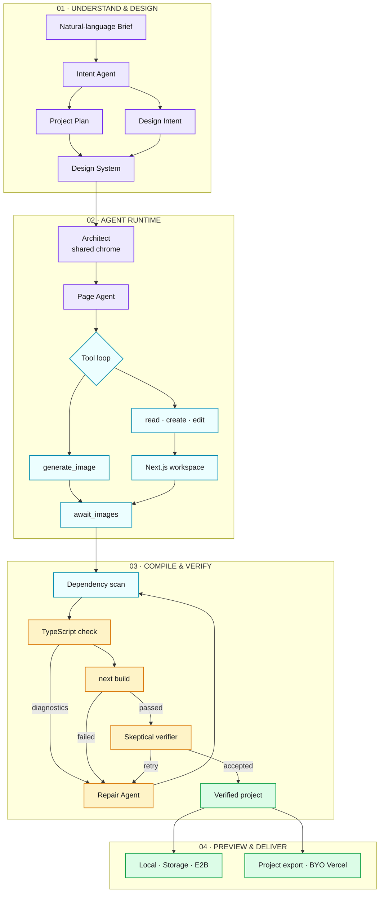

<h1 align="center">Open-OX</h1>

<strong>From one brief to a real, editable, deployable website.</strong>

  An AI-native website production engine that plans, designs, implements, 
  verifies, repairs, previews, and ships real Next.js projects.

  <a href="./README.zh-CN.md">简体中文</a> ·
  <a href="https://open-ox.tech">Live Product</a> ·
  <a href="https://p.open-ox.tech/2026-05-25T10-54-47-190Z_awwwards-ai-saas">Generated Example</a> ·
  <a href="#what-open-ox-does">Features</a> ·
  <a href="#how-it-works">How it works</a> ·
  <a href="./docs/product-iteration-outline.md">Roadmap</a>

  <a href="https://open-ox.tech"><strong>Open Open-OX →</strong></a>
  &nbsp;&nbsp;·&nbsp;&nbsp;
  <a href="https://p.open-ox.tech/2026-05-25T10-54-47-190Z_awwwards-ai-saas"><strong>Explore a generated site →</strong></a>

---

  

<em>One workbench for intent, agent traces, source-aware modification, preview, and delivery.</em>

## Why Open-OX

Most AI site builders stop when a page looks convincing. Open-OX continues until the result is a software project you can inspect, modify, build, export, and deploy.

| Typical AI site builder | Open-OX |
|---|---|
| Screenshot or hosted preview | Real Next.js source code |
| One-shot generation | Structured, observable production pipeline |
| Regenerate to make changes | Modify Agent and element-level Design Mode |
| Opaque execution | Live topology, logs, and agent traces |
| Platform-owned hosting | Project export and bring-your-own Vercel |
| “Looks right” as the finish line | Typecheck, build, and targeted auto-repair |

## Live projects

| Link | What it is |
|---|---|
| [open-ox.tech](https://open-ox.tech) | The live Open-OX product |
| [Awwwards AI SaaS](https://p.open-ox.tech/2026-05-25T10-54-47-190Z_awwwards-ai-saas) | A real website generated and published through Open-OX |

Preview URLs are served independently from the main application, so generated sites can be opened and shared without exposing Studio or project editing access.

## What Open-OX does

### Prompt to project

Describe the site in natural language. Open-OX turns the request into a structured brief, visual direction, project plan, design system, and implementable architecture before page agents write production code.

- Natural-language brief and reference images
- Structured intent and information architecture
- Design-system generation before page implementation
- Real React, TypeScript, assets, and project files on disk
- Single-page and deliberately scoped multi-page projects

  

### A recoverable agent runtime, not a prompt chain

Open-OX does not squeeze an entire website into one oversized prompt. Every stage has structured input, durable files, and checkpoints. An interrupted run can skip completed work and resume from the latest verified stage instead of paying to regenerate everything.

`Brief → Design intent → Plan → Design system → Architecture → Page agents → Typecheck → Build → Repair`

- **Chrome-first architecture** — the Architect owns the shared shell, navigation, and page boundaries before Page Agents implement content, preventing every agent from inventing another header
- **Autonomous tool loops** — Page Agents use `create / read / edit / generate_image` against a real workspace instead of returning a Markdown code dump
- **Checkpoint recovery** — the design system, scaffold, and page artifacts become durable resume facts
- **Async asset barrier** — code and image generation run concurrently; `await_images` guarantees assets reach disk before the build gate
- **Observable event stream** — Studio receives node states, tool names, arguments, bounded results, touched files, and agent traces as work happens

  

### Modify Agent

The first generation is only the starting point. Ask for a change in natural language and the Modify Agent reads the existing project, searches the codebase, edits the relevant files, and verifies the result.

- Tool-driven read, search, edit, subagent, and build loop
- Changes applied to the current project instead of regenerating it
- Touched-file tracking, structured diffs, and modification history
- Context bounded to relevant files and recent work
- Image generation available when the requested change needs a real asset

### Design Mode: browser selection, AST writeback

Many visual editors leave changes in a runtime CSS layer. Open-OX instruments JSX with compile-time `file:line:col` coordinates, maps a browser selection back to source, applies the edit through a server-side JSX AST transform, and rebuilds the preview to verify it.

- `data-ox-source` maps the selected DOM node precisely back to source
- Deterministic color, typography, spacing, and radius edits become targeted AST mutations
- Direct Apply is the only automatic write path; edits without source coordinates are rejected
- Structural changes fall back to a user-confirmed Modify draft
- Changes live in the real project and survive export

  

### Preview you can trust

Open-OX treats preview as part of the product contract. Projects can run through local development, deterministic static previews, or isolated E2B environments depending on the workflow.

- Local `next dev` with HMR and source instrumentation
- Static export backed by storage for stable shareable previews
- Isolated E2B sandbox creation, reconnection, and rebuild
- Preview rebuild controls and visible runtime state

### A compiler loop that does not trust the model

Open-OX never treats “done” from the model as proof. After files land, the runtime scans imports, installs missing dependencies, runs language-service TypeScript checks over the generated boundary, and executes a real production build.

- Diagnostics identify the failing files so the Repair Agent sees only relevant source
- Up to five incremental repair rounds fix the project without overwriting the whole site
- Dependencies are rescanned after repair in case a patch introduced a new package
- An independent skeptical verifier reviews the repair and can feed evidence back into another repair pass
- Delivery requires agreement from the files on disk, the type system, and `next build`

### Export and bring-your-own deployment

The generated artifact belongs to you. Export the complete project or connect your own Vercel account and deploy to infrastructure you control.

- Download the real project source
- Vercel OAuth connection to your account and billing
- First deploy creates and binds a project; later deploys reuse it
- Preview publishing and production deployment remain separate
- Disconnecting Open-OX never deletes the remote Vercel project

  

### Credits and capability-gated integrations

Generation and modification usage is metered transparently through Credits. Optional services only appear when configured, so the core product does not pretend unavailable capabilities exist.

- Token usage converted into understandable Credits
- Free grants, subscriptions, and credit packs
- Design Mode direct edits do not consume generation credits
- Optional Stripe, Vercel, E2B, Langfuse, Ark, Feishu, Google, and Linux.do capabilities

## How it works

1. **Describe** the site, audience, content, and visual direction.
2. **Confirm** the brief and structure before expensive generation begins.
3. **Watch** agents plan, design, implement, typecheck, build, and repair the project.
4. **Refine** through conversation or precise Design Mode edits.
5. **Preview, export, or deploy** without surrendering ownership of the source.

## Built for

- Founders validating and shipping a product site
- Designers who want editable implementation rather than a static mockup
- Developers who want an inspectable starting point instead of disposable generated HTML
- Small teams that need a repeatable path from brief to production-ready website

## Product principles

- **Verifiable beats flashy** — if it does not build, preview, and remain editable, it is not done.
- **Transparent beats black-box** — pipeline state and agent work should be inspectable.
- **Modification is first-class** — generation starts the project; iteration finishes the product.
- **You own the artifact** — source code and production hosting remain portable.
- **Constraints buy quality** — clear stages and build gates outperform unconstrained generation.

## Explore the project

- [Product roadmap](./docs/product-iteration-outline.md)
- [Architecture decisions](./docs/adr/)
- [Product requirements](./docs/product/)
- [Domain glossary](./CONTEXT.md)
- [Changelog](./app/[locale]/changelog/page.tsx)

<strong>Think it. Build it. Run it.</strong>

