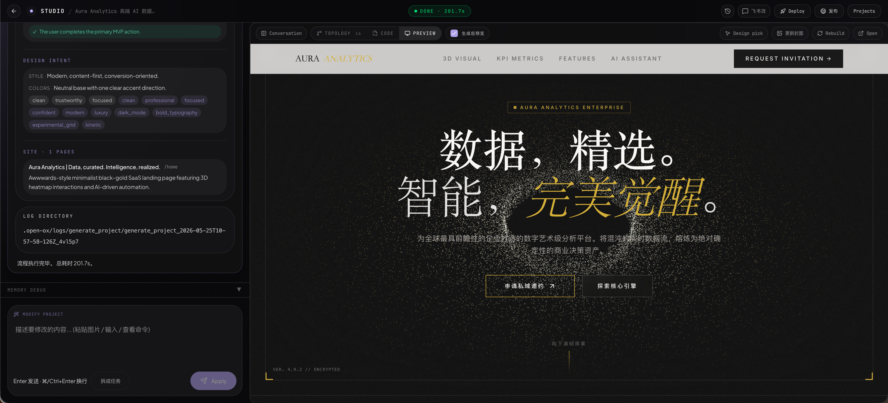
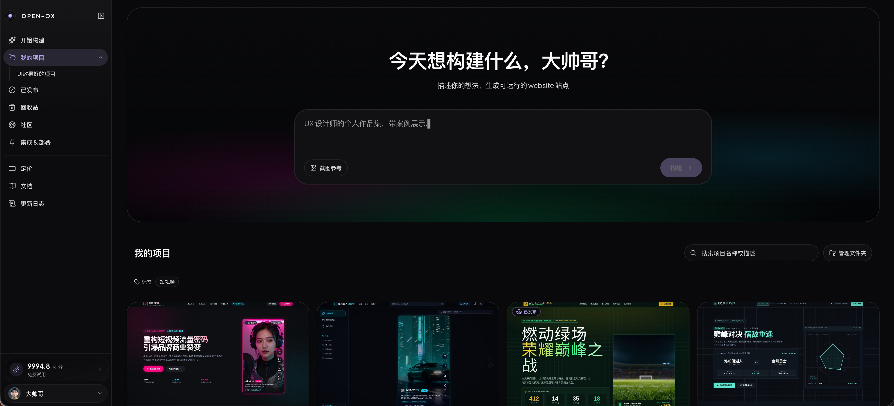
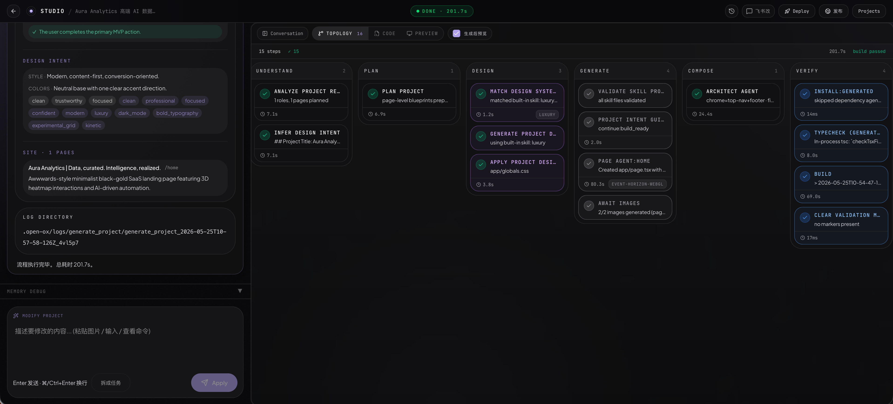
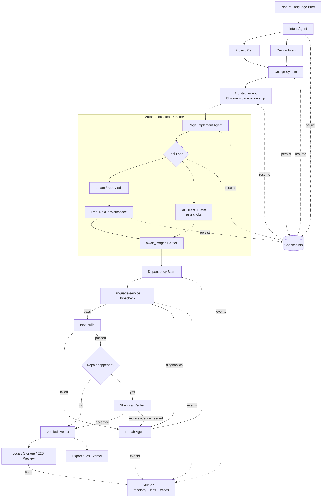
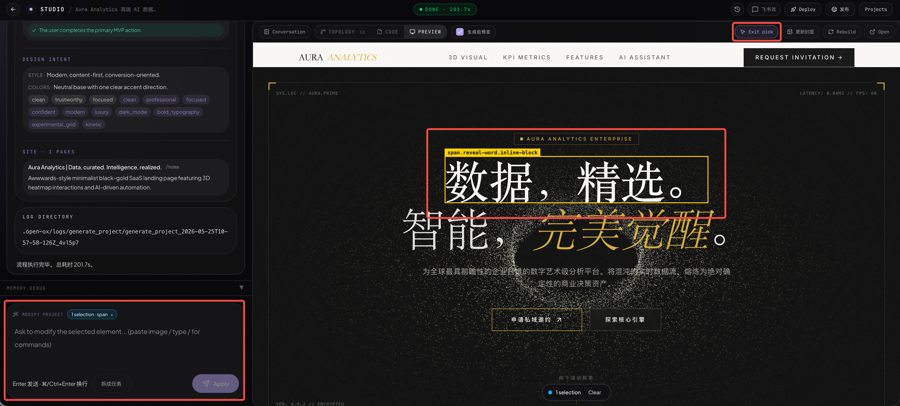
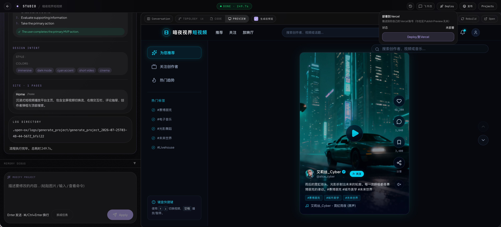

<h1 align="center">Open-OX</h1>

<strong>一句 Brief，生成一个真实、可改、可部署的网站。</strong>

  AI 原生网站生产引擎：理解、规划、设计、实现、验证、修复、预览并交付 
  可以继续维护的真实 Next.js 工程。

  <a href="./README.md">English</a> ·
  <a href="https://open-ox.tech">在线产品</a> ·
  <a href="https://p.open-ox.tech/2026-05-25T10-54-47-190Z_awwwards-ai-saas">生成案例</a> ·
  <a href="#open-ox-能做什么">功能</a> ·
  <a href="#工作方式">工作方式</a> ·
  <a href="./docs/product-iteration-outline.md">路线图</a>

  <a href="https://open-ox.tech"><strong>打开 Open-OX →</strong></a>
  &nbsp;&nbsp;·&nbsp;&nbsp;
  <a href="https://p.open-ox.tech/2026-05-25T10-54-47-190Z_awwwards-ai-saas"><strong>查看真实生成案例 →</strong></a>

---

  

<em>意图、Agent 轨迹、源码级修改、预览与交付，都在同一个工作台。</em>

## 为什么是 Open-OX

多数 AI 建站工具在页面「看起来不错」时就结束了。Open-OX 会继续工作，直到产物成为一个可以检查、修改、构建、导出和部署的软件工程。

| 常见 AI 建站工具 | Open-OX |
|---|---|
| 截图或托管预览 | 真实 Next.js 源码 |
| 一次性生成 | 结构化、可观察的生产流水线 |
| 修改只能重新生成 | Modify Agent + 元素级 Design Mode |
| 黑盒执行 | 实时拓扑、日志和 Agent 轨迹 |
| 平台托管锁定 | 工程导出 + 自带 Vercel 账号 |
| 看起来对就算完成 | 类型检查、构建和定向自动修复 |

## 在线体验

| 地址 | 内容 |
|---|---|
| [open-ox.tech](https://open-ox.tech) | Open-OX 主产品 |
| [Awwwards AI SaaS](https://p.open-ox.tech/2026-05-25T10-54-47-190Z_awwwards-ai-saas) | 由 Open-OX 真实生成并发布的网站案例 |

案例预览使用独立于主应用的域名提供服务，因此生成站点可以直接打开和分享，同时不会暴露 Studio 或项目编辑权限。

## Open-OX 能做什么

### 从描述到工程

用自然语言描述网站。Open-OX 会先形成结构化 Brief、视觉方向、项目规划、设计系统和可实现的架构，再由 Page Agents 编写生产代码。

- 自然语言 Brief 与参考图片
- 结构化意图与信息架构
- 页面实现之前先生成 Design System
- 在磁盘上写出真实 React、TypeScript、素材和工程文件
- 支持单页项目与范围明确的多页项目

  

### 不是 Prompt Chain，而是可恢复的 Agent Runtime

Open-OX 没有把整站生成塞进一个超级 Prompt。每个阶段都有结构化输入、磁盘产物和 checkpoint；任务中断后可以跳过已经完成的阶段继续执行，不需要从头烧一遍 Token。

`Brief → 设计意图 → 规划 → 设计系统 → 架构 → Page Agents → 类型检查 → 构建 → 修复`

- **Chrome-first 架构**：Architect 先确定全站壳层、导航和页面所有权，再让 Page Agents 实现页面，避免每个 Agent 各造一套 Header
- **自主工具循环**：Page Agent 不是吐出一段 Markdown，而是通过 `create / read / edit / generate_image` 在真实工作区内完成任务
- **Checkpoint 恢复**：设计系统、脚手架和页面产物都会成为恢复事实，中断后从最近完成节点继续
- **异步素材 barrier**：页面代码可以先行，图片任务并发生成，`await_images` 会在构建前确保素材真正落盘
- **可观察事件流**：节点状态、工具名、参数、截断结果、触碰文件和 Agent 轨迹持续推送到 Studio

  

### Modify Agent

第一次生成只是起点。用自然语言提出修改，Modify Agent 会读取现有工程、搜索代码、编辑相关文件并验证结果。

- 工具驱动的读取、搜索、编辑、子 Agent 和构建循环
- 在当前工程上修改，而不是整站重新生成
- 每轮持续维护 touched files、结构化 Diff 和修改历史
- 上下文聚焦于相关文件与近期工作
- 修改需要真实视觉素材时可以调用图片生成

### Design Mode：浏览器点选，AST 写回真实源码

很多可视化编辑器只在运行时覆盖一层 CSS。Open-OX 在编译期给 JSX 注入 `file:line:col` 坐标；用户在浏览器里点选元素后，服务端通过 JSX AST 修改真实 TSX，再重建预览验证结果。

- 通过 `data-ox-source` 把 DOM 精确定位回源码
- 颜色、字号、间距和圆角等确定性属性走 AST 精确变更
- Direct Apply 是唯一自动写盘路径，没有来源坐标就拒绝修改
- 结构性修改自动降级成 Modify 草稿，必须由用户确认
- 修改直接进入项目源码，导出后不会丢失

  

### 可信的预览

Open-OX 把预览视为产品契约的一部分。项目可以根据工作流运行在本地开发、确定性静态预览或隔离的 E2B 环境中。

- 支持 HMR 与源码插桩的本地 `next dev`
- 基于 Storage 的稳定、可分享静态预览
- E2B 沙箱创建、重连与重建，文件系统与运行时隔离
- 可见的运行状态和预览重建控制

### 编译器闭环：生成代码必须通过机器验证

Open-OX 不把“模型说完成了”当作完成。页面落盘后，系统会扫描 import、补齐依赖，对生成范围做语言服务级 TypeScript 检查，再执行真实生产构建。

- 从诊断信息中提取失败文件，只把相关源码交给 Repair Agent
- 构建失败后最多执行 5 轮增量修复，不整站覆盖
- Repair 新增依赖后重新扫描和安装，避免修好代码却漏掉包
- 修复完成后交给独立 skeptical verifier 复核；证据不足时把诊断重新喂回修复循环
- 最终交付标准是磁盘源码、类型系统和 `next build` 同时认可

### 工程导出与自带部署账号

生成产物属于用户。你可以导出完整工程，也可以连接自己的 Vercel 账号，把网站部署到自己控制的基础设施。

- 下载真实项目源码
- Vercel OAuth 连接到你的账号与账单
- 首次部署创建并绑定项目，后续部署复用绑定
- 预览发布与生产部署是两条独立路径
- 断开 Open-OX 绝不会删除远端 Vercel 项目

  

### Credits 与按能力开启的集成

生成和修改通过 Credits 透明计量。可选服务只在完成配置时出现，核心产品不会假装不存在的能力可用。

- 把 Token 使用量换算成易理解的 Credits
- 免费赠额、订阅与加油包
- Design Mode 直接修改不消耗生成 Credits
- 可选 Stripe、Vercel、E2B、Langfuse、Ark、飞书、Google、Linux.do 能力

## 工作方式

1. **描述**网站、受众、内容和视觉方向。
2. **确认** Brief 与结构，再进入高成本生成阶段。
3. **观察** Agents 规划、设计、实现、类型检查、构建和修复工程。
4. **迭代**，通过对话修改或 Design Mode 精确调整。
5. **预览、导出或部署**，同时保留源码所有权。

## 适合谁

- 需要快速验证并上线产品网站的创始人
- 希望拿到可编辑实现，而不是静态稿的设计师
- 需要可检查工程起点，而不是一次性生成 HTML 的开发者
- 需要稳定复用「Brief 到生产网站」路径的小团队

## 产品原则

- **可验证胜过炫技** — 不能构建、预览和继续修改，就还没有完成。
- **透明胜过黑盒** — 流水线状态和 Agent 工作过程应该可以检查。
- **修改是一等能力** — 生成启动项目，迭代完成产品。
- **产物属于用户** — 源码与生产托管必须保持可迁移。
- **约束带来质量** — 清晰阶段与构建门禁优于无边界生成。

## 继续了解

- [产品路线图](./docs/product-iteration-outline.md)
- [架构决策](./docs/adr/)
- [产品需求](./docs/product/)
- [领域术语表](./CONTEXT.md)
- [更新日志](./app/[locale]/changelog/page.tsx)

<strong>Think it. Build it. Run it.</strong>

