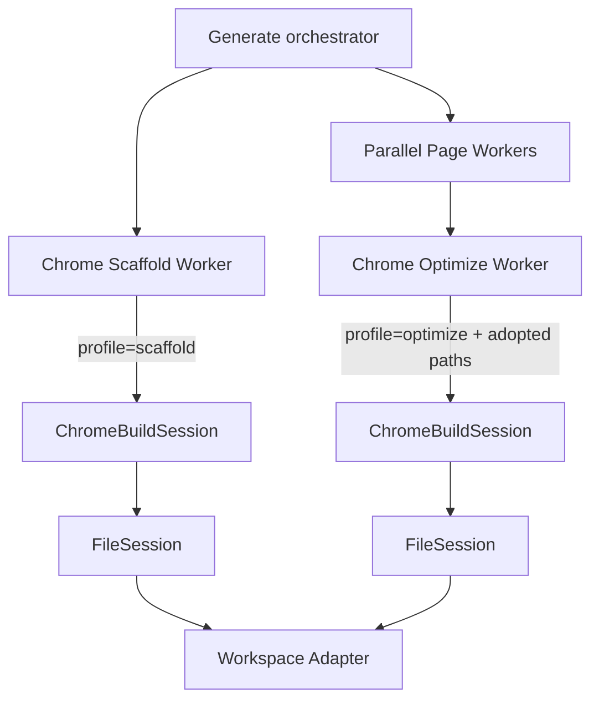
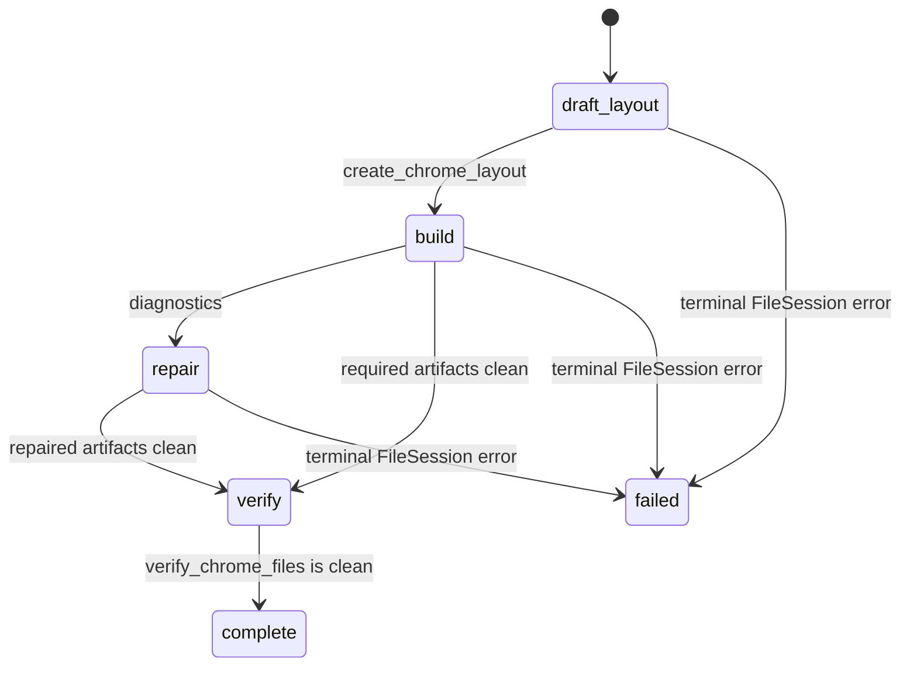

# Chrome Build Session v2 Architecture

**Status:** Implemented

**Date:** 2026-07-25
**Scope:** Generate pipeline `architect_scaffold_agent` and `chrome_optimize_agent`

## Decision

Both Chrome Role Workers now call one deep Module:

```ts
runChromeBuildSession(spec): Promise<ChromeBuildSessionResult>
```

The worker composes prompts and projects semantic progress events. `ChromeBuildSession` owns the
profile state machine, legal tool surface, file ownership, command translation, recovery turns,
managed context state, and deterministic completion. `FileSession` owns create-once semantics,
mutation idempotency, revision compare-and-swap, diagnostics, and serialized workspace commands.

## Architecture comparison

| Concern | Previous architecture | Chrome v2 |
|---|---|---|
| file commands | both workers received generic `write_file` / `edit_file` | profile-specific Chrome commands only |
| lifecycle | prompt asked the model not to repeat writes | create-once + mutation digest cache + revision CAS |
| ownership | both sessions could create or overwrite the same paths | Scaffold creates owned paths; Optimize adopts existing paths only |
| first Scaffold action | any generic tool was legal | only `create_chrome_layout` |
| Optimize mutation | could create a second shell or new files | only read and replace adopted files |
| same-response calls | read and write could execute concurrently | every Chrome stateful command is dispatched serially |
| completion | model-owned completion tool and callback boolean | clean verification after the latest mutation |
| context | rollout-dependent generic history | managed AgentContext with current structured task state |
| UI writes | inferred from raw generic tool names | semantic Chrome file events |
| reported files | always included layout even without a write | derived from successful session mutations only |

## Current architecture



The two calls share one Module implementation but not mutable session state. Artifact continuity uses the
workspace artifact itself: Optimize preloads the current layout and surveyed `components/chrome/**`
files, then every replacement must name the exact revision it read.

## Executable profiles

### Scaffold



- `draft_layout`: exposes only `create_chrome_layout`; the runtime binds `app/layout.tsx`.
- `build`: exposes component creation, snapshot reads, revision replacements, and verification.
- a global form requires at least one `components/chrome/**` artifact.
- an `unspecified` plan must resolve its form in the layout command; form declaration does not
  complete the worker.
- once required artifacts are clean, only verification remains.
- an invalid or incomplete session preserves the existing deterministic minimal-layout fallback.

### Optimize

- adopts `app/layout.tsx` and the exact Chrome component paths discovered by the disk survey;
- exposes `read_chrome_file`, `replace_chrome_file`, and `verify_chrome_files` only;
- cannot create files or mutate a path outside the adopted set;
- after any successful replacement, the next legal action is verification;
- a no-change run completes through a clean verification;
- a stale replacement revision forces a fresh read before another replacement.

## File protocol

1. A create command is accepted once per session-owned path.
2. Replaying the identical mutation digest returns the cached event and performs no second write.
3. Later edits require `read_chrome_file(path)` and its canonical `sha256` revision.
4. `replace_chrome_file(path, baseRevision, content)` commits only if the disk revision still
   matches.
5. Formatting and scoped diagnostics run inside the workspace Adapter.
6. Completion requires `verify_chrome_files` after the latest mutation and zero diagnostics.

Chrome commands are also registered as serial-only in the generic ToolLoop. This protects the
state machine if a provider ignores `parallel_tool_calls: false` and returns read plus write in one
assistant response.

## Technical route and improvement points

1. **Deep orchestration Module:** one interface hides two executable profiles instead of duplicating
   callback state machines in both workers.
2. **Capability-shaped tools:** the model can only request actions valid in the current phase; prompt
   text is guidance, not the enforcement mechanism.
3. **Transactional artifact continuity:** Scaffold-to-Optimize continuity uses canonical disk revisions instead
   of conversational memory or inferred ownership.
4. **Deterministic stopping:** a model message or completion call cannot claim success; only current
   artifacts plus a clean post-mutation verification can complete.
5. **Managed context:** every round publishes the latest profile, phase, form, mutations,
   diagnostics, next action, and ownership as structured task state.
6. **Semantic observability:** UI and traces receive runtime-resolved paths and cached-write status,
   so replayed mutations do not appear as new writes.

## Acceptance invariants

- successful duplicate creates for one Chrome path: **0**;
- Optimize-created files: **0**;
- replacement without a current exact revision: **0**;
- concurrent Chrome read/write execution from one model response: **0**;
- completion without a clean verification after the latest mutation: **0**;
- successful mutation outside `app/layout.tsx` or owned/adopted `components/chrome/**`: **0**;
- completion-tool calls in either Chrome profile: **0**.
