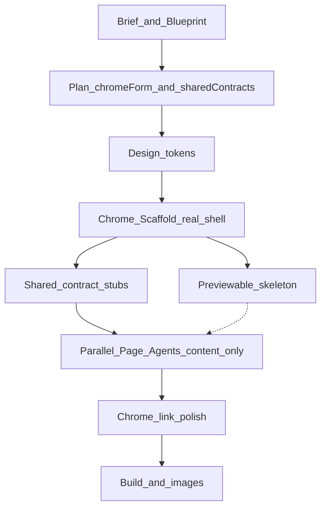

# Chrome-first 生成管线技术架构

**版本**：v0.1  
**日期**：2026-07-15  
**状态**：目标架构（落地中）  
**调研**：[ai-builder-chrome-shell-pipelines-20260715.md](../research/ai-builder-chrome-shell-pipelines-20260715.md)  
**ADR**：[0005-chrome-first-generate-pipeline.md](../adr/0005-chrome-first-generate-pipeline.md)

---

## 1. 问题

open-ox 曾走 **chrome-deferred**：pass-through layout → 并行 Page Agent → 后置 Chrome Agent。失败模式：

- Page Agent 在页内写顶栏 / 底栏 Tab
- Chrome Agent 再挂 sticky 顶栏 → **双重导航**
- list / detail 并行时抢共享卡片与字段契约

同业公开模式是 **单 agent（± Plan）整体拥有 layout + pages**，不并行抢壳。open-ox 若保留页级并行换墙钟，必须在**规划层**先锁死 chrome 所有权。

---

## 2. 决策摘要

1. **默认 chrome-first**：Plan 选定 `chromeForm` → Chrome Scaffold **先**落真实壳 → Page Agent **只填内容**（可并行）。
2. **`chrome_optimize_agent` 降为 link polish**：修正路由 / section 锚点，不换壳、不发明第二套 Nav。
3. **例外是计划结果**：screenshot replicate、`chromeForm ∈ {page-local, none}` → 不挂全局壳。
4. **共享契约串行预写**：list/detail 的实体字段与共享组件路径先落盘，再并行写页。
5. **努力档**拨模型/thinking，不靠「整页互不知晓地并行」换速度。
6. **非所有权并行**：生图、`install_deps` 等可与页生成重叠。

---

## 3. 流水线



| 阶段 | 做什么 | 不做什么 |
|------|--------|----------|
| Plan / Blueprint | `chromeForm`、routes、`sharedContracts` | 不写 TSX |
| Chrome Scaffold | `components/chrome/**` + layout 挂载 | 不深做页内容 |
| Preview skeleton | 真导航 + 空/占位路由可预览 | — |
| Shared stubs | 按契约写 `components/shared/*` 一次 | 不并行抢写 |
| Page Agents | 目标 `page.tsx` + 页专属组件 | 禁写 layout / chrome / 复制 Nav |
| Chrome polish | 按磁盘路由/锚点修 href | 不换 chromeForm、不第二套 Nav |
| 非所有权并行 | images / install / typecheck | 不并行写壳 |

---

## 4. 核心契约

### 4.1 `chromeForm`

写入 `site.informationArchitecture.chromeForm`：

`top-nav` | `top-nav+footer` | `sidebar` | `bottom-tabs` | `page-local` | `none`

- 前四者 → **必须**先跑 `architect_scaffold_agent`。
- `page-local` / `none` / screenshot replicate → skip 全局壳。

缺省时由 `productType` 启发式推断（dashboard→sidebar，immersive/feed→page-local，默认 top-nav+footer）。

### 4.2 Page Agent 所有权

- 路径禁写：`app/layout.tsx`、`components/chrome/**`、`app/globals.css`（既有）。
- Bootstrap 注入**已挂载**的 layout + chrome，文案为「壳已存在，从内容区开始」。

### 4.3 `sharedContracts`

```ts
{
  entityName: string;
  fields: string[];
  sharedComponentPath?: string; // e.g. components/shared/ItemCard.tsx
  listSlug?: string;
  detailRoutePattern?: string;  // e.g. /items/[id]
}
```

流水线在页并行前 **串行** 写入 stub，Page Agent 复用路径。

### 4.4 努力档

| 档 | 映射 |
|----|------|
| Fast | scaffold / page → flash；thinking minimal/low |
| Balanced | 沿用 DB step_model_configs + runtime model |
| Deep | scaffold / chrome polish / 难页 → 更强模型；thinking medium/high |

---

## 5. 实现入口

| 区域 | 路径 |
|------|------|
| 编排 | `ai/flows/generate_project/runGenerateProject.ts` |
| Scaffold | `ai/flows/generate_project/steps/architectScaffoldAgent.ts` |
| Polish | `ai/flows/generate_project/steps/chromeOptimizeAgent.ts` |
| Plan | `ai/flows/generate_project/steps/planProject.ts` |
| 形态 / 契约 | `ai/flows/generate_project/shared/chromeForm.ts`、`writeSharedContractStubs.ts` |
| 努力档 | `lib/config/effortTiers.ts` |
| Checkpoint | `ai/flows/generate_project/shared/checkpoint.ts` |

---

## 6. 预览体验

1. **Skeleton ready**：Scaffold 结束后 Studio 可预览真导航 + 空页。  
2. **Pages filling**：并行页写入时内容渐丰。  
3. **非所有权并行**：images / install 与页重叠。

---

## 7. 回归清单

- [ ] 多页营销站：仅一套顶栏/页脚，无双重搜索铃铛  
- [ ] immersive + `page-local`：不挂全局营销顶栏  
- [ ] 截图复刻：page-owns-chrome 不变  
- [ ] list/detail：共享卡片路径一致  
- [ ] checkpoint：`skipScaffold` 后页并行可恢复  
