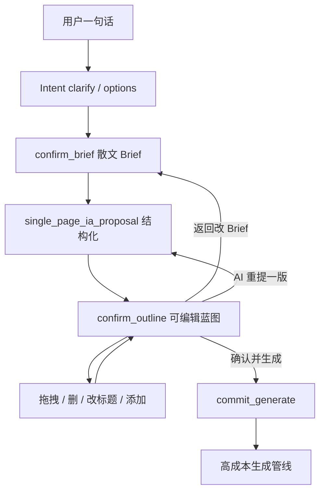
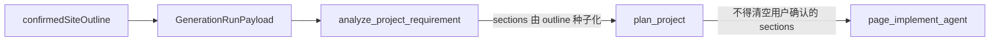

# 可编辑站点蓝图预览 · PRD

**版本**：v0.1  
**日期**：2026-07-11  
**状态**：草案（设计已锁定：Intent Agent 确认层）  
**目标**：生成前用可编辑低保真蓝图把「赌一把」变成「确认后执行」，抬首次可用率  
**关联**：

- 想法池：[ux-expansion-ideas-20260710.md](./ux-expansion-ideas-20260710.md) **§2.1**
- 路线图：[product-iteration-outline.md](../product-iteration-outline.md) **C2 生成前确认**
- 相邻：§2.2 Guided Brief、§2.3 / [studio-visual-experience-v0.1-prd.md](./studio-visual-experience-v0.1-prd.md) Image Reference（独立立项，不合并 UI）
- 实现锚点：`ai/flows/generate_project/intentAgent/`、`ai/tools/system/singlePageIaProposalTool.ts`、`lib/generation/types.ts`、`app/studio/components/BuildConversation.tsx`

---

## 1. Problem Statement

### 1.1 现状

| 现状 | 问题 |
|------|------|
| Intent Agent 以 `confirm_brief` + `briefDraftMarkdown` 确认需求 | 用户确认的是**散文 Brief**，看不到首页由哪些模块组成 |
| `single_page_ia_proposal` 只出 Markdown，供 Agent 推理 | 不落 UI、不可编辑、不进 generation payload |
| `plan_project` 故意输出 `sections: []`；page implement 自由发挥 | 即使有纲要，也**无法约束**最终模块组成 |
| `BlueprintOverview` 仅在生成完成后只读展示 | 贵 token 已经花完；结构不对只能靠 Modify 补锅 |

### 1.2 用户需要

1. 在点「开始生成」之前，看到一版**低保真线框 + 模块清单**（Hero / Features / Pricing…）。
2. 能**拖拽排序、删模块、改标题**，再确认执行。
3. 确认过的结构必须**真正约束**后续高成本生成，而不是安慰剂 UI。

### 1.3 成功标准（可验收）

1. **确认门**：Studio 路径在 `commit_generate` 前至少出现一次可编辑 outline（`confirm_outline`）；用户可改后再提交。
2. **结构一致**：首次生成成品的 section 类型与顺序，与用户确认的 `SiteOutline.modules` 一致（允许视觉/文案发挥；**不允许擅自增删模块**）。
3. **契约可测**：`confirmedSiteOutline` 进入 `GenerationRunPayload`；analyze / plan / implement 有单测或 harness 断言「不得清空用户确认的 sections」。
4. **心智正确**：线框刻意低保真（无真实配色/字体/图），用户不会误以为是成品预览。

---

## 2. Goals / Non-goals

### 2.1 Goals（v0.1）

- 在 Intent Agent 确认层插入可编辑 **SiteOutline**（单页 `home`）。
- Studio 内嵌低保真线框 + 模块清单编辑器。
- 确认结果经 payload 进入管线，并约束 analyze → plan → page implement。

### 2.2 Non-goals（v0.1）

| 不做 | 原因 |
|------|------|
| Worker 内 `analyze`/`plan` 后暂停（`awaiting_blueprint`） | 属 v0.2 / 完整 C2 演进；本版选 Intent Agent 廉价确认层 |
| 多页 sitemap / 导航编辑 | 当前 MVP 硬约束单 `home` |
| 像素级视觉、Design Mode、真实组件预览 | 避免与成品预览混淆；改站另有 Design Mode |
| 与 §2.3 参考图拆 section 合并为同一 UI | 可交叉链接；独立立项 |
| 本轮改 `CONTEXT.md` / 新 ADR | PRD 定稿并实现 payload 契约时再补 |

---

## 3. 已锁定决策

| 决策 | 选择 |
|------|------|
| 插入点 | Intent Agent：`confirm_brief` 之后、`commit_generate` 之前 |
| 产物 | 轻量 **SiteOutline**（对齐 `SectionSpec`），不另造平行「蓝图真相」 |
| 页面范围 | 仅 `home`（`pageSlug: "home"`） |
| 用户编辑权威 | UI 提交的 outline **覆盖** Agent 草稿 |
| Brief vs Outline | Brief = 做什么/给谁/气质；Outline = 首页从上到下有哪些块 |

---

## 4. 用户流程与状态



### 4.1 与现有状态的关系

- 项目仍处 Intent 对话态（今日多为 `awaiting_input` / generating 未入队）。
- `confirm_outline` 是新的 yield kind；UI 进入 **outline 编辑态**，主 CTA 变为「确认并生成」。
- 用户点确认 → `commit_generate`（带 `merged_brief` + `site_outline`）→ 入队 worker；其后流程与今日相同，但 payload 多 `confirmedSiteOutline`。

### 4.2 推荐对话顺序

```
clarify / options → confirm_brief →（调用 IA 工具）→ confirm_outline → commit_generate
```

Agent **不得**在未展示可编辑 outline 的情况下直接 `commit_generate`（Studio 默认路径）。例外：显式 feature flag 关闭本能力时，回退到今日「仅 confirm_brief → commit」行为。

---

## 5. 数据模型：SiteOutline

不引入与 `ProjectBlueprint` 平行的第二套持久真相。SiteOutline 是**生成前确认用的轻量 IA**；commit 后映射进 `site.pages[].sections`（`SectionSpec`）。

### 5.1 形状

```ts
type SiteOutlineModuleType =
  | "hero"
  | "logo_cloud"
  | "features"
  | "how_it_works"
  | "testimonials"
  | "pricing"
  | "faq"
  | "cta"
  | "footer"
  | "custom";

type SiteOutlineModule = {
  id: string;           // 稳定 id（客户端生成或工具生成）；拖拽与映射 fileName 用
  type: SiteOutlineModuleType;
  title: string;        // 用户可改；线框上显示
  intent?: string;      // 模块目的（1–2 句）
  contentHints?: string; // 关键文案/元素提示
};

type SiteOutline = {
  pageSlug: "home";
  pageGoal: string;     // 一句话页面目标
  modules: SiteOutlineModule[];
};
```

### 5.2 与 Brief / Blueprint 的边界

| 产物 | 管什么 | 谁确认 |
|------|--------|--------|
| **Brief**（`briefDraftMarkdown` / `mergedBrief`） | 产品是什么、受众、气质、必有内容事实 | `confirm_brief` |
| **SiteOutline** | 首页模块类型、标题、顺序 | `confirm_outline` + UI 编辑 |
| **ProjectBlueprint / PlannedProjectBlueprint** | analyze/plan 后的完整结构化蓝图 | 管线内部；v0.1 用户不直接编辑 |

### 5.3 映射到 SectionSpec

| SiteOutlineModule | SectionSpec |
|-------------------|-------------|
| `type` | `type` |
| `title` + `intent` | `intent`（可拼接） |
| `contentHints` | `contentHints` |
| `id` / `type` | `fileName`（实现时约定命名，如 `Hero.tsx`；PRD 不锁具体字符串） |

顺序 = `modules` 数组顺序 = 页面从上到下。

### 5.4 模块枚举（v0.1）

上表枚举为默认集合。`custom` 允许自由标题模块（type 仍为 `custom`，title 用户自填）。实现时可微调标签文案，但 **payload JSON 的 `type` 字符串应稳定**，避免破坏已入队 job。

---

## 6. Studio UX 规格

落点：[`BuildConversation.tsx`](../../app/studio/components/BuildConversation.tsx) / Intent yield 面板。  
新组件建议名：`SiteOutlineEditor`（**不要**把 post-build [`BlueprintOverview.tsx`](../../app/studio/components/BlueprintOverview.tsx) 硬改成编辑态；可复用展示语义）。

### 6.1 布局

1. **对话区**：既有消息流；Brief 摘要可折叠。
2. **主区 · 低保真线框**：灰块按 `modules` 纵向堆叠；每块显示 `title` + `type` 标签；无真实配色/字体/图片。
3. **清单区**（侧栏或线框旁）：同一 `modules` 的可编辑列表。
4. **主 CTA**：确认并生成。
5. **次操作**：返回改 Brief；让 AI 重提一版 outline。

### 6.2 编辑操作

| 操作 | 行为 |
|------|------|
| 拖拽排序 | 更新 `modules` 顺序；线框同步 |
| 删模块 | 从列表移除；至少保留 1 个模块（建议至少含 `hero` 或任意一块，禁止空页） |
| 改标题 | 点选模块 → 改 `title`；线框同步 |
| 添加模块 | 从枚举选择 `type`；默认 `title` = 类型可读名；可立即改标题 |
| AI 重提 | 再调 IA 工具 → 新 `confirm_outline`；**丢弃**当前未提交编辑（需轻量确认：「用新提案替换当前编辑？」） |

### 6.3 空态 / 错误

| 情况 | 处理 |
|------|------|
| IA 工具失败 | 展示错误 +「重试」；允许用户手动从空清单「添加模块」后仍可确认 |
| `modules.length === 0` | 禁用主 CTA；提示至少添加一个模块 |
| 用户跳过 outline（flag 关） | 回退今日路径，不阻塞生成 |

### 6.4 文案原则

- 主 CTA：**确认并生成**（不是「看起来不错」这类模糊语）。
- 辅助说明一句即可：「这是结构预览，不是最终设计；生成后可在 Studio 继续改。」

---

## 7. Intent Agent 协议

### 7.1 Yield kind

扩展 `IntentAgentYieldKind`：

```ts
type IntentAgentYieldKind =
  | "capability"
  | "clarify"
  | "options"
  | "confirm_brief"
  | "confirm_outline"; // NEW
```

`confirm_outline` payload：

- `message`：短说明（给对话气泡）
- `siteOutline`：`SiteOutline` JSON（**必填**）
- `suggestedReplies`：可选（如「就按这个生成」「再加点 FAQ」）

### 7.2 工具变更

| 工具 | 变更 |
|------|------|
| `single_page_ia_proposal` | 从「仅 Markdown」升级为 **结构化 JSON**（`SiteOutline`）+ 可选人类可读摘要；结果供 Agent 经 `yield_to_user(kind=confirm_outline)` 交给 UI |
| `yield_to_user` | `kind` 枚举加入 `confirm_outline`；增加 `site_outline` 参数 |
| `commit_generate` | 增加 `site_outline`（完整 JSON）；或服务端从最近一次 `confirm_outline` yield 合并（类似 `commitMergeBrief`）。**以客户端最终提交为准** |

### 7.3 客户端提交权威

用户在 `SiteOutlineEditor` 中的编辑结果，在触发确认时随 `commit_generate`（或等价 API 字段）提交，**覆盖**会话中 Agent 草稿 outline。

---

## 8. Generation payload 与管线契约

### 8.1 Payload

扩展 [`GenerationRunPayloadBody`](../../lib/generation/types.ts)：

```ts
confirmedSiteOutline?: SiteOutline;
```

与今日的 `effectivePrompt` / Intent 合并 brief 并列。`enableIntentGuide` 等现有字段不变；Studio Intent 路径仍建议 `enableIntentGuide: false`。

### 8.2 管线约束（写死）



1. **analyze**：若 payload 含 `confirmedSiteOutline`，以之为 `home` 页 `sections` 种子（可补充 role/capability 绑定，但不得改写用户确认的模块集合与顺序，除非实现层有显式「用户未确认」回退）。
2. **plan_project**：**不得再强制 `sections: []`**（今日 `planProject.agent.md` 行为必须改）。可丰富 `pageDesignPlan`，但 section 清单以确认 outline 为准。
3. **page_implement_agent**：消费 section manifest（type / intent / contentHints / 顺序）。允许视觉与文案发挥；**禁止擅自增删用户确认过的模块**。若实现中发现必须偏离，须在 completion summary 中显式说明（实现阶段再定摘要字段）。

无 `confirmedSiteOutline` 时：保持今日行为（兼容旧客户端 / flag 关），不强制回归。

---

## 9. 验收清单

### 9.1 产品

- [ ] Studio 新建项目：Brief 确认后出现可编辑线框 + 模块清单
- [ ] 拖拽、删除、改标题、添加模块后，「确认并生成」带上编辑后的 outline
- [ ] 生成结果模块组成与确认 outline 一致（抽检 ≥ 5 个典型 prompt）
- [ ] 线框无真实视觉皮肤；文案标明非成品

### 9.2 工程

- [ ] `confirm_outline` yield + UI 渲染 `SiteOutlineEditor`
- [ ] `GenerationRunPayloadBody.confirmedSiteOutline` 入队并可在 worker 读到
- [ ] plan 步骤在有确认 outline 时保留 sections
- [ ] page implement 有「manifest 约束」提示/测试
- [ ] feature flag 可关闭并回退旧路径

### 9.3 指标（上线后观察）

| 指标 | 方向 |
|------|------|
| 首次生成后「大改结构」类 Modify 占比 | 下降 |
| Intent → commit 转化中 outline 编辑率 | 可观测（至少有编辑 vs 原样确认） |
| 含 outline 的 run 的 token/时长 | 相对基线可接受（outline 阶段应远低于 page implement） |

---

## 10. 分期

| 版本 | 内容 |
|------|------|
| **v0.1（本 PRD）** | Intent Agent 确认层 + SiteOutline 编辑器 + payload 约束管线 |
| **v0.2** | 可选：worker 在 analyze/plan 后暂停，编辑更接近真实的 `PlannedProjectBlueprint`（完整 C2）；多页 IA |
| **以后** | 与 §2.3 视觉分析摘要并排；可交互 IA 演进为完整信息架构编辑器 |

---

## 11. 开放问题（实现前可再收窄）

1. **模块枚举最终列表**：是否保留 `how_it_works` / `footer`（footer 是否算 page section 还是 chrome）——实现时与 architect scaffold 对齐。
2. **`custom` 模块**：是否限制数量（建议最多 3），避免 outline 膨胀。
3. **commit 合并策略**：客户端必传 `site_outline` vs 服务端从 yield 回填 + 客户端 patch——推荐**客户端必传完整 JSON**，服务端校验非空即可。

---

## 12. 术语（本 PRD 用法）

| 术语 | 含义 |
|------|------|
| **Brief** | 散文需求；Intent `confirm_brief` |
| **SiteOutline** | 生成前可编辑的单页模块纲要 |
| **Blueprint** / `ProjectBlueprint` | 管线 analyze 后的结构化蓝图 |
| **PlannedProjectBlueprint** | plan 后含 `pageDesignPlan` 的蓝图 |
| **生成前确认** | 路线图 C2；本 PRD 是其可交互落地 |
| **纲要** | C2 用语；本 PRD 中具体化为 SiteOutline + 线框 |

勿与 post-build **Blueprint Overview**、Design Mode、Modify history turn 混称。
