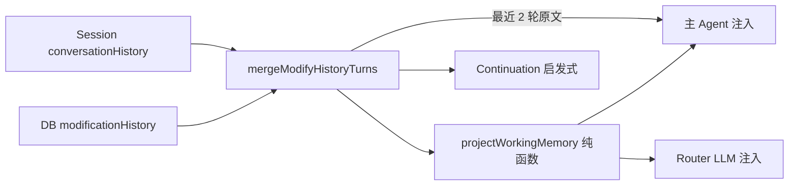

# Modify Working Memory · 落地设计 v0.1

**版本**：v0.1  
**日期**：2026-07-11  
**状态**：已锁定（grilling 共识；P0/P1 已实现）  
**目标**：提高 Modify 短程续写可靠性，同时压低 prompt 历史噪音  
**关联**：

- 域模型：`CONTEXT.md` → `ModifyHistoryTurn`
- 现实现：`ai/flows/modify_project/history/modifyHistoryTurn.ts`、`runModifyProject.ts`、`intent/modifyContinuation.ts`
- Debug：`GET /api/projects/[id]/memory`、`MemoryDebugPanel`、`/memory`
- 调研对照：[claude-memory-design-20260710.md](../research/claude-memory-design-20260710.md)

---

## 1. 问题与成功标准

### 1.1 要解决的失败模式

| ID | 失败模式 | 用户体感 |
|----|----------|----------|
| **A** | 短程失忆 | 刚改完 Hero，下一句「再大一点」不知道指什么 / 改错文件 |
| **D** | 上下文噪音 | 塞太多旧 turn，模型被旧 Result 带偏 |

**本轮不解决**：跨会话偏好记忆（B）、长期设计决策漂移（C）、用户可编辑记忆 UI（E 的产品面）。`/memory` 仅作工程可观测性增强，不是用户向「记忆管理」功能。

### 1.2 成功标准（可验收）

1. **指代续写**：`code_change` → Agent 追问 → 用户短回复（「再大一点」「就按你说的」）时，主 Agent 与 Router 都能稳定看到焦点文件与未决问题。
2. **噪音下降**：主 Agent 注入的历史不再是「最近 10 轮全文」；有明确 token 预算形态（状态卡 + 至多 2 轮原文，且非最近轮 Result 截断）。
3. **行为可测**：状态卡由纯函数从 turn 列表投影；单测覆盖粘滞、截断、`/clear` 清空、空历史省略。
4. **无双源真相**：不新增 DB 列存状态卡；不在浏览器单独持久化状态卡。

---

## 2. 现状基线

今日 Modify「记忆」实质是 **transcript 窗口**：

```
merge(DB modificationHistory, session conversationHistory)
  → slice(-10)
  → "## Previous Modifications … User / Result / Files"
```

| 层 | 位置 | 作用 |
|----|------|------|
| Layer 1 DB | `project.modificationHistory` | 持久 turn |
| Layer 2 Session | Studio `modifyHistory` → `conversationHistory` | 未落库 / 去重合并 |
| Layer 3 Prompt | `buildHistoryContext(..., maxTurns=10)` | 注入主 Agent |
| Router | `mergedHistory.slice(-2)` + `formatRecentHistoryForRouter` | 分类用短历史 |
| Continuation | 完整 merged 的最后一轮 `awaitingReply` | 启发式续写，**保留** |

`/clear`：UI 写入 system 标记 + `contextCleared=true` → 请求侧 `dbHistory=[]`、`conversationHistory=[]`。状态卡现算方案下，清空后自然无工作记忆。

---

## 3. 目标架构

### 3.1 一句话

**工作记忆 = 从 turn 列表确定性投影出的状态卡 + 最近 2 轮原文（非对称截断）。**  
每次 Modify 请求现算；状态卡是投影，不是第三种持久实体。

### 3.2 数据流



`clearContext=true` 时 Merge 输入为空 → 投影为空 → 两路均不注入历史块。

### 3.3 与 Claude Memory 的边界（刻意不做）

对照调研笔记：Claude 有产品摘要 / CLAUDE.md+MEMORY.md / API `/memories` 等多套 **durable** 记忆。本 v0.1 **只做 session 工作记忆投影**，对标的是「当前任务上下文」，不是 Auto Memory。durable 层若要做，另立项，且需可检视 UI。

---

## 4. 状态卡规格

### 4.1 类型（逻辑）

```ts
type ModifyWorkingMemory = {
  focusFiles: string[];           // 0..3
  pendingQuestion?: string;       // 仅 awaitingReply
  lastIntent?: ModifyIntentCategory;
  lastChangeSummary?: string;     // 最近一次有文件变更的摘要
  // activeConstraint: v0.1 不出现在注入中（schema 可预留，恒不输出）
};
```

空字段 **省略**（不写 `pendingQuestion: ""`）。整卡在无历史时不注入任何 working-memory 块。

### 4.2 字段推导规则（纯确定性）

常量（实现时可集中为 named const）：

| 常量 | 值 |
|------|-----|
| `FOCUS_LOOKBACK_TURNS` | 5 |
| `FOCUS_FILES_MAX` | 3 |
| `SUMMARY_MAX_CHARS` | 400 |
| `RECENT_RAW_TURNS` | 2 |
| `PREV_TURN_RESULT_MAX_CHARS` | 400 |

#### `focusFiles`

1. 在 merged turns 上从新到旧扫描，窗口 = 最近 `FOCUS_LOOKBACK_TURNS`。
2. 取 **最近一次** `touchedFiles.length > 0` 的那一轮的文件列表。
3. 去重、规范化路径（与现有 `normalizeTouchedFiles` 一致）。
4. 截断到最多 `FOCUS_FILES_MAX` 个（保持该轮原有顺序）。
5. 窗口内全无文件 → 省略 / 空数组且不输出该行。

#### `pendingQuestion`

1. 取最后一轮 turn。
2. 若 `awaitingReply !== true` → 省略。
3. 否则 `truncate(assistantText, SUMMARY_MAX_CHARS)`。

#### `lastIntent`

1. 取最后一轮的 `intentCategory`（若有）。
2. 无则省略。

#### `lastChangeSummary`

1. 在最近 `FOCUS_LOOKBACK_TURNS` 内从新到旧找 **第一次** `touchedFiles.length > 0` 的 turn。
2. 对其 `assistantText` 做 `truncate(..., SUMMARY_MAX_CHARS)`。
3. 找不到 → 省略。
4. **粘滞**：中间夹杂 conversation / 无文件轮时，仍使用更早那次变更摘要（与 `focusFiles` 同构）。

#### `activeConstraint`

**v0.1 恒不输出。** 不写关键词规则、不从 Agent 文本抽取。若未来要做，优先显式 UI / 用户原话覆盖层，而不是静默抽取。

### 4.3 截断函数

- 按 Unicode 码位或 JS string length 均可，但需单测固定行为。
- 超长则切到 `max` 并保证不在半截无意义处也可接受；统一加 `…`（若尚未以省略号结尾）。
- `pendingQuestion` 与 `lastChangeSummary` 共用同一截断工具。

---

## 5. Prompt 注入规格

### 5.1 主 Modify Agent

替换今日 `buildHistoryContext` 的「10 轮全文」为：

```text
## Working memory
- focusFiles: a.tsx, b.tsx
- pendingQuestion: …
- lastIntent: code_change
- lastChangeSummary: …

## Recent turns (oldest first)
1. User: "…"
   Result: …          ← 倒数第 2 轮：Result 最多 400 字
   Files: …
2. User: "…"
   Result: …          ← 最近 1 轮：Result 全文
   Files: …
```

规则：

- 仅当 merged 非空时输出上述块。
- 状态卡无任何非空字段时，可只输出 Recent turns（或仍输出空卡——**推荐：有 turns 就输出卡，只列有值的行**）。
- Recent turns = `slice(-2)`；若只有 1 轮则只打 1 轮。
- **非对称截断**：索引上「不是最后一轮」的 `assistantText` → `PREV_TURN_RESULT_MAX_CHARS`；最后一轮不截断。
- `Files` 行：无文件则省略该行（与现格式一致）。

### 5.2 Intent Router（LLM 提示）

- 注入 **同一套状态卡**（同一投影函数）。
- **不带** Recent turns 原文（或若实现方便，允许完全不调用 `formatRecentHistoryForRouter`）。
- Continuation **启发式**（`modifyContinuation.ts`）仍使用完整 merged turns + `awaitingReply`，**不改**为读状态卡。

### 5.3 谁调用投影

建议单一入口，例如：

```ts
buildModifyWorkingMemoryContext(dbHistory, sessionHistory) → {
  memory: ModifyWorkingMemory;
  recentTurns: ModifyHistoryTurn[]; // 已按注入规则截断 Result 的视图，或分离 format
  agentPromptBlock: string;
  routerPromptBlock: string; // 仅状态卡
}
```

`runModifyProject`：主 Agent 用 `agentPromptBlock`；Router 用 `routerPromptBlock`。  
避免 Router / Agent 各写一套推导。

---

## 6. 模块与改动面（实现时）

| 区域 | 动作 |
|------|------|
| `ai/flows/modify_project/history/` | 新增 `modifyWorkingMemory.ts`（投影 + format）；单测 `modifyWorkingMemory.test.ts` |
| `modifyHistoryTurn.ts` | 保留 merge / turn 解析；`buildHistoryContext` 改为委托新模块，或标记 deprecated 后替换调用点 |
| `runModifyProject.ts` | 主 Agent / Router 改接新 block；Continuation 入参不变 |
| `modifyIntentRouter.ts` | 接收 working-memory 字符串（或 memory 对象），替换/弱化 raw history block |
| `GET .../memory` | Layer 3 preview 改为新注入；增加 `workingMemory` 字段展示投影结果 |
| `MemoryDebugPanel` | 展示状态卡 + 新 prompt preview（工程向） |
| DB / Studio payload | **不改** schema；`ModifyClientHistoryPayload` 不变 |

**非目标改动**：不改 `modificationHistory` 持久化形状；不改 `/clear` 协议（已够用）。

---

## 7. `/clear` 与边界行为

| 场景 | 期望 |
|------|------|
| `clearContext=true` | 无状态卡、无 recent turns |
| 仅 conversation 轮、从未改文件 | 可有 `lastIntent` / `pendingQuestion`；无 `focusFiles` / `lastChangeSummary` |
| 改文件 → 追问 → 短回复 | `focusFiles` 与 `lastChangeSummary` 粘滞到变更轮；`pendingQuestion` 在追问轮有值 |
| 刷新页面后 | 仍从 DB history 投影（短程跨刷新可用）；这不是 durable「偏好记忆」 |
| 系统 `/clear` UI 行 | 不参与语义 turn 时，merge 侧应已排除或 clearContext 已清空；实现时确认 system message 不会污染投影 |

---

## 8. 测试计划

### 8.1 单测（必做）

1. 空历史 → 空 prompt。
2. 单轮 `code_change` 有文件 → `focusFiles` / `lastChangeSummary` / `lastIntent`。
3. 变更 → `awaitingReply` 追问 → 用户短指令（无文件）→ 焦点与摘要粘滞；`pendingQuestion` 在追问后一轮为假则清除。
4. 粘滞窗口外（>5 轮无文件）→ `focusFiles` 清空。
5. `focusFiles` 超过 3 个 → 截断。
6. 截断长度：400 边界、恰等于 400、加 `…`。
7. 主 Agent：2 轮时上一轮 Result 截断、最近轮不截断。
8. Router block 不含 `## Recent turns`。
9. `clearContext` 路径（或空 merge）→ 两路皆空。

### 8.2 手工验收（Studio）

1. 改 Hero → Agent 若追问 → 答「再大一点」→ 仍改同一文件族。
2. 连续 10+ 轮后，`/memory` 中 Layer 3 不再是 10 轮全文墙。
3. `/clear` 后下一句 Modify 不带旧焦点。

---

## 9. 实现分期

| 阶段 | 内容 | 完成定义 |
|------|------|----------|
| **P0** | 投影纯函数 + format + 单测；替换 `buildHistoryContext`；Router 接状态卡 | CI 绿；行为符合 §4–§5 |
| **P1** | `/memory` API + DebugPanel 展示 `workingMemory` | 工程师可目检投影 |
| **P2**（可选） | 调常量（lookback / max files / 截断）基于真实会话 | 不改架构 |

**明确不做（本版本）**：LLM 抽取状态卡、向量召回历史、`activeConstraint` 规则、DB 持久化状态卡、用户向记忆编辑 UI、跨项目品牌记忆。

---

## 10. 决策记录（grilling）

| # | 决策 | 选择 |
|---|------|------|
| 1 | 主目标 | A + D |
| 2 | 形态 | 结构化状态卡 + 最近少数原文 turn |
| 3 | 字段 | `focusFiles` / `pendingQuestion` / `lastIntent` / `lastChangeSummary` / `activeConstraint`（占位） |
| 4 | 更新方式 | 纯确定性投影 |
| 5 | 原文轮数 | 2 |
| 6 | 存储 | 每次请求现算，不单存 |
| 7 | Router vs Agent | 同卡；Router 更瘦（无原文轮） |
| 8 | `focusFiles` | 近 5 轮粘滞，最多 3 文件 |
| 9 | `activeConstraint` | v1 恒空 |
| 10 | `pendingQuestion` | `awaitingReply` 时截断 ~400 |
| 11 | `lastChangeSummary` | 有文件变更才填，近 5 轮粘滞，~400 |
| 12 | 原文截断 | 非对称：上一轮 400，最近轮全文 |

---

## 11. 开放项（实现前可默认）

以下不影响架构锁定，实现时可按推荐默认，不必再开产品讨论：

1. Prompt 小标题文案：`## Working memory` / `## Recent turns`（英文，与现有 `Previous Modifications` 风格一致）。
2. `lastIntent` 是否写入 Router 卡：是。
3. system `/clear` 行若仍出现在 session 数组：投影前过滤 `instruction === "/clear"` 或 `isSystemMessage`（若 turn 模型可辨）。

若实现中发现 Continuation 与状态卡偶发不一致，**以 Continuation 启发式 + turn 列表为准**，修投影，不让启发式改读状态卡。
