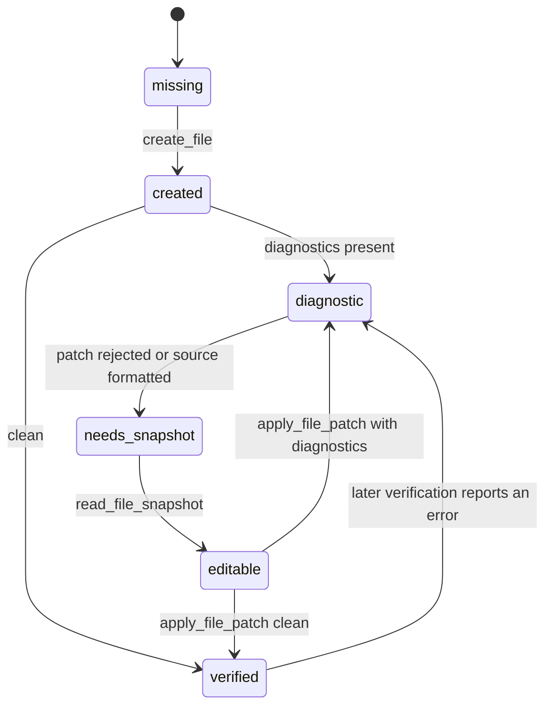

# Page Agent File Session Architecture

**Status:** Proposed  
**Date:** 2026-07-24  
**Research:** [Agent file-editing protocols](../research/agent-file-editing-protocols-20260724.md)

## 1. Problem

Page workers currently call generic filesystem tools directly. The LLM must remember which files
exist, which version it last saw, whether Prettier changed the source, whether a diagnostic belongs
to the current revision, and whether a repeated call is a retry or a new edit. That state is spread
across prompts, tool executors, loop callbacks, module-level trackers, and UI step rendering.

This produces recurring failure modes:

- the same path is written repeatedly because `write_file` remains available after creation;
- exact-string edits fail after formatting changes the source;
- a failed edit is retried without first refreshing the file snapshot;
- parallel page workers are displayed as one undifferentiated stream;
- model completion signals and artifact validation disagree;
- iteration limits hide the actual exit reason and repeated-operation count.

The root problem is not model obedience. The file lifecycle is part of the model's implicit context
instead of explicit runtime state.

## 2. Decision

Introduce a shared **File Session module** at the seam between an agent loop and workspace I/O.
Generate Page, Modify, and Repair use the same module through different policies.

The external interface is intentionally small:

```ts
interface FileSession {
  tools(): ChatCompletionTool[];
  execute(call: ToolCall): Promise<FileSessionEvent>;
  stopDecision(): StopDecision;
  result(): FileSessionResult;
}

function createFileSession(options: FileSessionOptions): FileSession;
```

The caller supplies task policy and ownership once. The module owns revisions, lifecycle,
idempotency, mutation execution, diagnostics, retry transitions, completion, and semantic events.

### 2.1 Evidence from existing coding agents

The design follows documented mechanisms rather than assumptions about private Cursor internals:

- Cursor documents a tool-result feedback loop, checkpoints, and post-change review, but does not
  document revision hashes or its edit-matching algorithm.
- Claude Code separates whole-file Write from partial Edit and grounds edits against current file
  content.
- Aider carries successful edit blocks forward, reflects only failed work with nearby real content,
  and bounds reflection to three attempts.
- Codex uses a grammar-constrained patch protocol and records the applied delta, including partial
  failure information.

The detailed primary-source comparison is in the linked research note.

## 3. Agent-facing commands

The LLM receives four file commands. Generic `write_file` and exact-string `edit_file` are not
exposed inside a File Session.

### `create_file`

```ts
create_file({ path, content })
```

- Valid only when the session has no revision for `path` and the policy owns the path.
- Writes and formats once.
- Returns the canonical formatted revision and diagnostics.
- Repeating the same command digest is idempotent and returns the cached result.
- A different create for an existing path returns `FILE_ALREADY_CREATED` plus its current revision;
  it does not mutate the workspace.

### `read_file_snapshot`

```ts
read_file_snapshot({ path })
```

Returns canonical, line-numbered content and a revision:

```ts
{
  path: string;
  revision: `sha256:${string}`;
  content: string;
}
```

### `apply_file_patch`

```ts
apply_file_patch({
  path,
  baseRevision,
  edits: Array<{
    range: { start: Position; end: Position };
    newText: string;
  }>;
})
```

- Applies all edits atomically against one snapshot.
- Uses 0-based UTF-16 ranges, matching LSP and the existing `apply_workspace_edits` implementation.
- Rejects stale revisions without changing disk.
- Returns the new formatted revision and diagnostics.
- A stale revision transitions the file to `needs_snapshot`; it does not allow another patch until a
  fresh snapshot is read.

### `verify_files`

```ts
verify_files({ paths?: string[] })
```

Runs scoped verification over changed files and returns structured diagnostics tied to exact
revisions. It does not mutate files.

## 4. Runtime state

The state is server-owned and never reconstructed from chat history.

```ts
type FilePhase =
  | "missing"
  | "created"
  | "needs_snapshot"
  | "editable"
  | "diagnostic"
  | "verified";

interface FileRecord {
  path: string;
  owner: string;
  phase: FilePhase;
  revision: string | null;
  successfulMutations: number;
  consecutiveFailures: number;
  diagnostics: Diagnostic[];
  lastCommandDigest: string | null;
  lastResult: FileSessionEvent | null;
}
```

State transitions:



Important invariants:

1. A path has one owner per generation run.
2. Creation happens at most once per path.
3. Every patch names the exact base revision.
4. Diagnostics name the revision they were produced from.
5. A stale or failed patch cannot be repeated before a new snapshot.
6. Completion is a deterministic postcondition, not an LLM declaration.

## 5. Page policy

Page workers receive a policy, not ad hoc executor guards:

```ts
const policy: FileSessionPolicy = {
  owner: `page:${slug}`,
  writable: [targetPath, `${componentRoot}/**`],
  requiredArtifacts: [targetPath],
  requiredValidators: ["non_stub_page", "default_export", "scoped_typescript"],
  maxFiles: 8,
  maxMutationsPerFile: 4,
  maxConsecutiveFailuresPerFile: 2,
};
```

The model may create page-local components before or after the route. The runtime does not reject a
valid owned component merely because the route is still a stub. Instead, the stop hook refuses
completion until every required artifact exists and passes its validators.

Near the iteration budget, `tools()` narrows the command schema to missing required artifacts. This
is a state-derived interface, not a prompt-only instruction.

## 6. Loop protocol

Each round follows one protocol:

1. File Session creates a compact state card from runtime state.
2. The model receives the state card and currently legal tools.
3. File Session executes at most one mutation command.
4. It updates revisions and diagnostics from the canonical formatted source.
5. It emits one semantic event.
6. The stop hook evaluates required artifacts and verification.

Example state card:

```text
File session: page:schedule

Required:
- app/schedule/page.tsx — missing

Created:
- components/pages/schedule/ScheduleView.tsx
  revision: sha256:abc
  state: diagnostic
  errors: 2

Next legal actions:
- read_file_snapshot ScheduleView.tsx
- create_file app/schedule/page.tsx
```

Chat compaction may remove old source payloads because correctness lives in File Session state and
revisions, not in remembered tool arguments.

## 7. Failure handling

Failures are classified and drive a state transition:

| Failure | Transition | Next legal action |
|---|---|---|
| Existing file on create | keep current revision | snapshot or patch |
| Stale patch revision | `needs_snapshot` | snapshot only |
| Invalid range | `needs_snapshot` | snapshot only |
| Ownership violation | terminal policy error | none |
| Type diagnostic | `diagnostic` | snapshot or verify another file |
| Empty assistant response | no state change | retry once with legal tools required |
| Same command digest | cached result | no duplicate mutation/event |
| Repeated failures over policy | terminal session error | none |

HTTP retries remain below the File Session seam and carry an idempotency key. A response is only
executed once after the provider call succeeds.

## 8. Completion

Remove `page_implementation_complete` and implicit completion.

```ts
type StopDecision =
  | { kind: "continue"; reason: string; requiredTools: string[] }
  | { kind: "complete" }
  | { kind: "failed"; error: FileSessionError };
```

A Page session completes when:

- every required artifact exists;
- the target is not the bootstrap stub;
- the target has a default export;
- no required file has unresolved scoped diagnostics;
- no mutation is waiting for a fresh snapshot.

The LLM may stop calling tools. The runtime decides whether that stop is accepted.

## 9. Parallel ownership

Parallel workers keep independent File Session instances. Module-level global read/write trackers
are removed from agent correctness. Shared paths are owned by a serial scaffold session before page
parallelism begins.

Workspace writes use compare-and-swap against the recorded revision. Even if ownership is
misconfigured, concurrent changes produce `STALE_REVISION` instead of silent overwrite.

## 10. UI event model

The UI renders semantic file activity rather than every low-level attempt:

```ts
type FileSessionEvent =
  | { type: "file_created"; owner: string; path: string; revision: string }
  | { type: "file_updated"; owner: string; path: string; revision: string; editCount: number }
  | { type: "file_needs_attention"; owner: string; path: string; diagnostics: Diagnostic[] }
  | { type: "file_verified"; owner: string; path: string }
  | { type: "session_completed"; owner: string };
```

Repeated internal retries with the same command digest are not appended as new rows. The UI groups
events by owner and path, so concurrent `home`, `players`, and `schedule` work is distinguishable.

## 11. Module placement

```text
ai/shared/fileSession/
  fileSession.ts          # external interface
  stateMachine.ts         # lifecycle and stop decisions
  commandProtocol.ts      # schemas and command parsing
  revisionStore.ts        # in-session revisions
  workspaceAdapter.ts     # production filesystem adapter
  inMemoryAdapter.ts      # tests
  diagnostics.ts          # revision-bound verification
  events.ts               # semantic event projection
```

Dependencies:

- State machine and command protocol: in-process.
- Workspace: local-substitutable through production and in-memory adapters.
- Model/provider: remains outside File Session; the agent loop supplies parsed calls.

The external seam stays small while the module hides the complex lifecycle. Tests exercise the same
interface used by Page, Modify, and Repair.

## 12. Migration

### Phase 1: Extract revision-safe mutation

- Promote `apply_workspace_edits` internals into `ai/shared/fileSession`.
- Add an in-memory workspace adapter.
- Add command-digest idempotency.
- Keep existing loops unchanged.

### Phase 2: Migrate Page Agent

- Replace Page `write_file/edit_file` exposure with File Session commands.
- Replace `writtenPaths`, target-first guards, pending-read flags, and duplicate-write checks.
- Replace `page_implementation_complete` with `stopDecision()`.
- Emit semantic UI events.

### Phase 3: Migrate Modify and Repair

- Move Modify loop state/tool gate file logic behind File Session.
- Replace exact-string edits with revision patches.
- Keep profile-specific ownership and verification as policies.

### Phase 4: Delete legacy paths

- Remove agent use of generic `edit_file`.
- Remove module-level file read/write trackers from correctness decisions.
- Remove duplicated Page/Modify retry and completion logic.
- Retain low-level filesystem executors only as internal adapters or non-agent utilities.

## 13. Verification

Tests at the File Session interface must cover:

1. create then repeated identical create is idempotent;
2. create then different create does not overwrite;
3. patch succeeds only against the current revision;
4. stale patch forces a snapshot before retry;
5. formatting updates the returned canonical revision;
6. diagnostics are tied to the produced revision;
7. parallel sessions cannot write outside ownership;
8. required artifact missing prevents completion;
9. valid page completes without a completion tool;
10. duplicate provider delivery executes one mutation and emits one event;
11. context compaction does not change outcomes;
12. UI groups events by owner and path.

Run deterministic fault-injection tests with stale revisions, duplicate command delivery, formatting
changes, empty model responses, and concurrent sessions.

## 14. Success metrics

- Duplicate successful create mutations per path: **0**.
- Silent overwrites from concurrent workers: **0**.
- Repeated identical failed commands: **0** after one classified response.
- Page sessions ending with the bootstrap stub: **0** in the regression corpus.
- Median mutation calls per generated file: at most **2**.
- UI rows caused only by internal retries: **0**.
- Completion errors caused solely by a missing completion-tool call: **0**.

## 15. Rejected alternatives

### More prompt instructions

Rejected because prompts cannot enforce lifecycle, idempotency, or concurrency.

### More executor guards around `write_file`

Rejected because guards detect invalid decisions after the model has already spent a round and the
UI has already observed an error. They do not provide a coherent next state.

### Keep exact-string `edit_file`

Rejected as the primary mutation protocol because formatter changes and context compression make
exact string identity unreliable. It may remain a low-level utility outside agent sessions.

### One giant generated source write

Rejected as the general solution because it avoids lifecycle design rather than solving it, performs
poorly for large pages, and makes localized recovery expensive.
