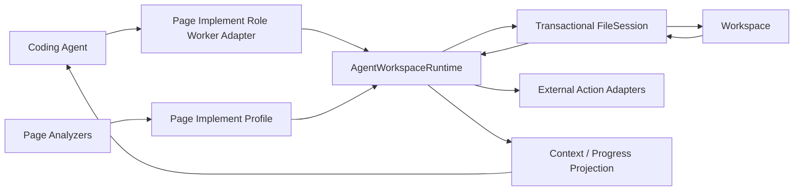

# Page Implement Role Worker Hybrid Runtime Migration Report

Date: 2026-07-26

## 1. Executive summary

This migration replaces the Page-specific lifecycle controller with a hybrid architecture:

- the Agent still decides page structure, source code, file decomposition, image prompts, and repair strategy;
- a generic `AgentWorkspaceRuntime` owns deterministic workspace capabilities, revision-safe edits,
  verification freshness, and completion decisions;
- Page contributes a narrow Profile and a compatibility Adapter for its current tool names;
- uncertain static-analysis observations no longer become blocking completion requirements.

The migration is intentionally incremental. Existing model-facing Page tool names remain stable to
avoid combining an architectural migration with a provider-protocol migration.

## 2. Why the previous architecture kept failing

The previous `PageBuildSession` simultaneously owned:

1. Page phases such as `draft_target`, `build`, and `repair`.
2. Tool availability.
3. Duplicate-create adoption.
4. Snapshot and edit focus.
5. Image requirement routing.
6. Verification freshness.
7. Completion decisions.
8. Deterministic recovery.

`FileSession`, the image analyzer, prompts, context projection, and progress projection also owned
parts of the same lifecycle. A new condition in any one place could disagree with the others.

Typical failure pattern:

```text
analyzer emits requirement
→ Page phase selects one tool
→ FileSession expects a different prerequisite
→ model cannot satisfy both contracts
→ empty stop recovery repeats the incompatible state
```

The `item.product.image` failure was one example: uncertainty from static analysis became a blocking
requirement even though no deterministic edit could resolve a legitimate runtime binding.

## 3. Target architecture



### Responsibility split

| Concern | Owner |
|---|---|
| Page layout and source | Agent |
| File decomposition | Agent |
| Image prompt | Agent |
| Tool capability planning | `AgentWorkspaceRuntime` |
| Duplicate create normalization | `AgentWorkspaceRuntime` |
| Snapshot and revision rules | `AgentWorkspaceRuntime` + `FileSession` |
| Workspace ownership | `FileSession` configured by Page Implement Profile |
| Page validity | Page Implement Profile |
| Image inspection | Page analyzer |
| Blocking vs non-blocking finding | Page Implement Profile |
| Completion and verification freshness | `AgentWorkspaceRuntime` |
| Provider payload normalization | existing Tool Loop Provider Adapter |

## 4. New deep Module

The new seam is `AgentWorkspaceRuntime`.

```ts
interface AgentWorkspaceRuntime {
  initialize(): Promise<void>;
  plan(): AgentWorkspacePlan;
  project(): AgentWorkspaceProjection;
  execute(intent: AgentWorkspaceIntent): Promise<ToolResult | string>;
}
```

This interface hides:

- primary-artifact bootstrap handling;
- capability authorization;
- duplicate-create adoption;
- focused edits;
- stale-revision recovery;
- exact-text-to-patch conversion;
- external action dispatch;
- blocking-finding validation;
- verification freshness;
- completion decisions.

The deletion test is satisfied: removing this Module would force these rules back into every Agent
Adapter. Page no longer contains its own implementation of those rules.

## 5. Agent-driven behavior

The Runtime does not prescribe page construction steps. During normal building it exposes generic
capabilities for creating, reading, editing, verifying, and calling configured external actions.
The Coding Agent chooses what to do inside the Page Implement Role Worker contract.

Runtime intervention is limited to stable invariants:

- an invalid required primary artifact must be created or replaced first;
- an existing path cannot be created again;
- an edit requires a current revision;
- a stale edit requires a new read;
- a blocking Finding must have an executable resolution;
- a changed revision must be verified before completion.

## 6. Finding contract

Analyzers no longer directly control tools. Page maps analyzer output into the generic Finding model:

```ts
interface AgentWorkspaceFinding {
  code: string;
  message: string;
  path?: string;
  blocking: boolean;
  resolution?:
    | { kind: "external"; capability: string }
    | { kind: "edit"; path: string };
}
```

Rules:

1. A blocking Finding without a resolution fails immediately with `UNRESOLVABLE_FINDING`.
2. Missing declared assets resolve through the external image capability.
3. Proven placeholder references resolve through read/edit.
4. Static-analysis uncertainty is non-blocking.

This prevents a repeat of `item.product.image → source_diagnostic → edit-only → empty stop`.

## 7. Key flows after migration

### Default scaffold

```text
invalid primary artifact
→ create_primary capability
→ create_target_page compatibility tool
→ FileSession atomic baseline replacement
→ verify capability
```

### Existing component

```text
Agent requests create(path)
→ Runtime discovers existing artifact
→ create is not executed
→ Runtime reads snapshot
→ focused edit capability
→ revision-safe patch
```

### Declared local image

```text
source references /images/home-hero.png
→ blocking MISSING_ASSET Finding
→ generate_image external capability
→ image written at declared path
→ Finding disappears
→ verify
```

### Runtime image binding

```text
src={item.product.image}
→ analyzer resolves static map data when possible
→ otherwise records uncertainty only
→ no blocking Finding
→ no forced source edit
```

### Stale edit

```text
edit with stale revision
→ FileSession returns STALE_REVISION
→ Runtime records requiredReadPath
→ only read capability is exposed
→ successful read clears prerequisite
→ edit becomes legal again
```

## 8. Removed architecture

The following Page-specific lifecycle implementations were deleted:

- `pageBuildPhase`;
- `pageBuildDecision`;
- `pageRevisionStatus`;
- `toolsForPageBuildPhase`;
- Page-local duplicate-create state;
- Page-local exact-text patch conversion;
- Page-local stale revision planning;
- tests coupled to those internal phase functions.

Their behavior is now tested at the `AgentWorkspaceRuntime` interface and through Page integration.

## 9. Compatibility layer retained

The model still sees:

- `create_target_page`;
- `create_page_component`;
- `read_page_file`;
- `edit_page_file`;
- `verify_page_files`;
- `generate_image`.

These names are now a Page Implement Role Worker Adapter over generic intents. Retaining them limits deployment risk for
Gemini-compatible providers and avoids changing prompts, tool semantics, and context compaction in
the same release.

Future migration can expose generic names after provider conformance tests are in place. It is not
required for sharing the Runtime with Chrome or other coding workers.

## 10. Known remaining risks

1. `FileSession.stopDecision()` still combines required artifact validation and some Page-configured
   completion callbacks. A later version should return structured Findings instead of reason strings.
2. Deterministic recovery remains in the Page Implement Role Worker Adapter. It now executes through the generic Runtime,
   but policy for when automation is appropriate should eventually move into a generic recovery
   strategy Module.
3. Image analysis remains Page-specific, which is intentional. Its output contract should migrate
   fully from `PageArtifactRequirement` to `AgentWorkspaceFinding` to remove the final translation.
4. Chrome still has its own build-session controller and remains the compatibility consumer of
   deprecated `FileSession` event/getter interfaces. It should adopt `AgentWorkspaceRuntime` only
   after this Page migration is stable in production.
5. Model-facing tool names remain Page-specific compatibility aliases.

## 11. Recommended next steps

1. Add production metrics for capability plans, illegal intents, unresolved Findings, stale edits,
   and empty stops.
2. Run Page generation canaries across Gemini and non-Gemini providers.
3. Convert FileSession completion reasons into structured Findings.
4. Extract deterministic recovery behind a generic strategy interface.
5. Migrate Chrome using a Chrome Profile and its existing tool Adapter.
6. Remove Page compatibility tool names only after prompt and provider migration tests pass.

## 12. Acceptance criteria for this version

- Page capability selection is owned by `AgentWorkspaceRuntime`.
- Page cannot execute a capability absent from the current plan.
- Duplicate create never mutates an existing file.
- Stale edit always narrows to read.
- Invalid primary scaffold is replaced through the primary capability.
- Blocking Findings always have executable resolutions or fail fast.
- Runtime image bindings do not become blocking source edits.
- Modified revisions require verification before completion.
- Existing Page integration behavior remains covered through the Adapter.

## 13. Independent review closure

Two independent reviews compared the migration with repository standards and the agreed
architecture. Their blocking findings were resolved in this version:

1. Successful external actions now invalidate verification freshness, so generated assets cannot
   bypass the required verify step.
2. An edit Finding must target an owned artifact already loaded into the transaction. Otherwise the
   Runtime fails with `UNRESOLVABLE_EDIT_FINDING` instead of advertising a plan that cannot execute.
3. Read/edit recovery is represented by a typed prerequisite state (`none`, `read_required`, or
   `edit_ready`) instead of two nullable path variables.
4. Repository terminology now consistently identifies this pipeline component as the Page
   Implement Role Worker.

The structured FileSession snapshot and Runtime-owned context projection identified by the first
review are now implemented. `FileSessionSnapshot.prerequisite` replaces prose parsing,
`planFromSnapshot` keeps plan and projection atomic, and the Runtime produces the model context card
and durable task state. The Page Implement Role Worker Adapter no longer interprets FileSession
events or completion reason strings.

## 14. Verification results

Focused verification after the review fixes:

- 5 test files passed;
- 48 tests passed across `AgentWorkspaceRuntime`, `FileSession`, the site workspace Adapter, the
  Page Build Session integration, and the Page Implement Role Worker;
- TypeScript passed with `tsc --noEmit`.

Full regression verification was run once because this change affects the core generation flow:

- 199 test files passed;
- 1013 tests passed;
- ESLint and `git diff --check` passed.

Vite still reports two pre-existing missing source-map warnings for generated JavaScript under
`lib/config` and `lib/supabase`; they do not fail the suite.
