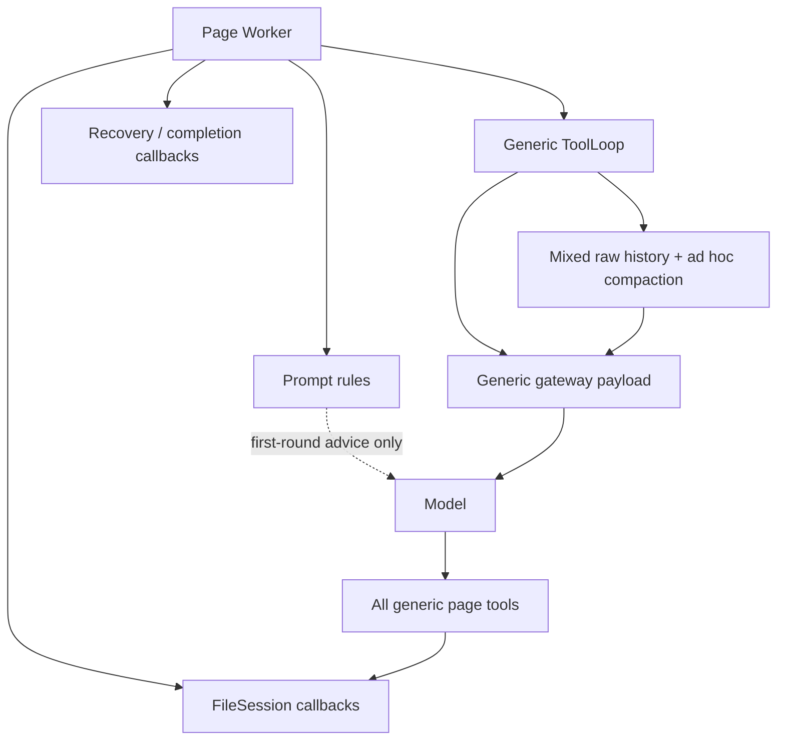
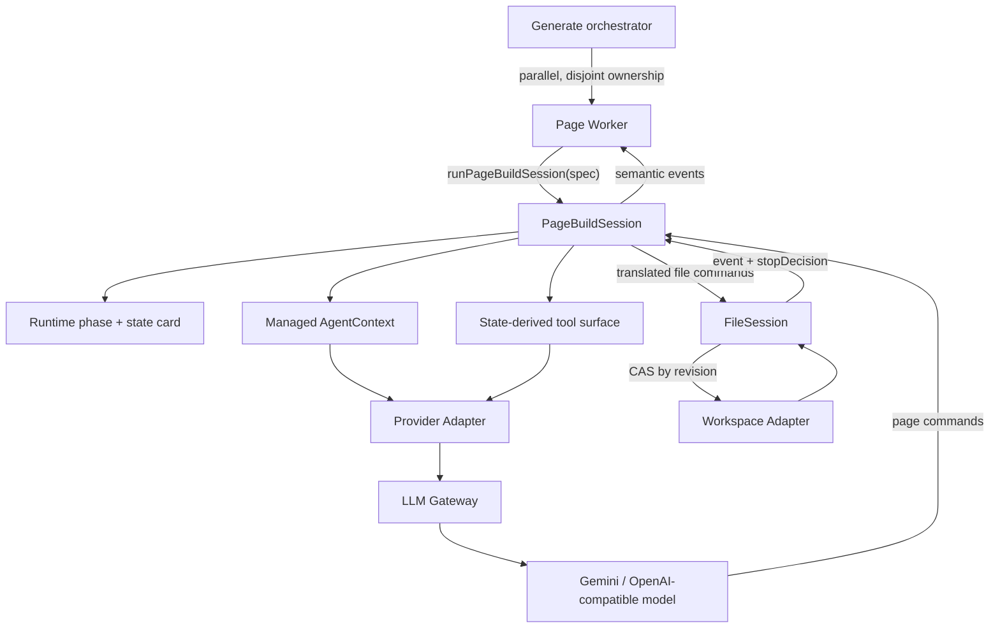
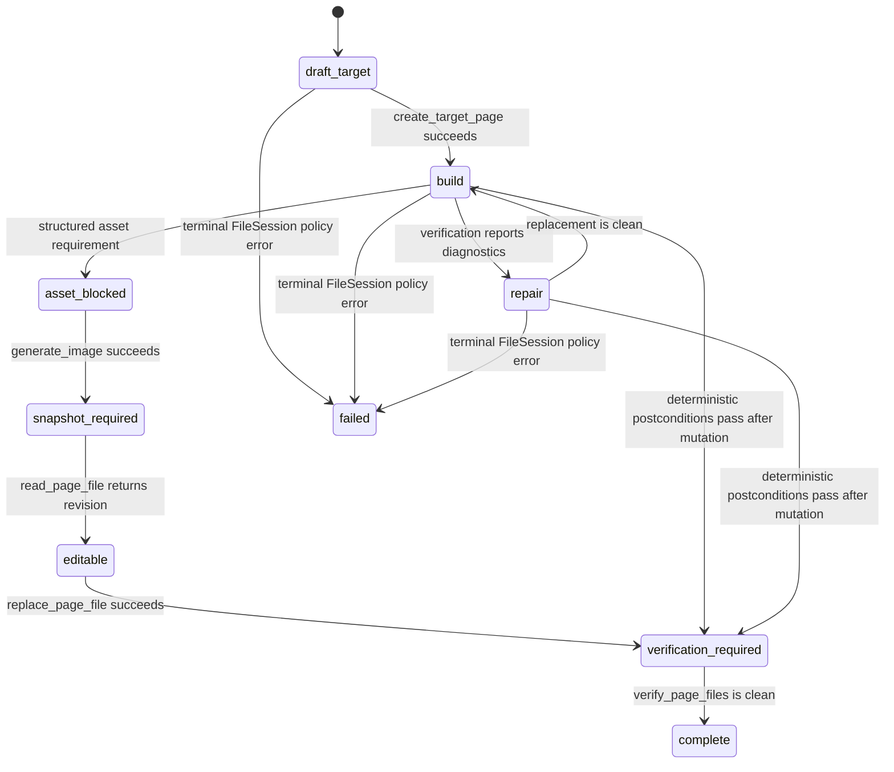

# Page Build Session v2 Architecture

**Status:** Implemented

**Date:** 2026-07-25
**Scope:** Generate pipeline `page_implement_agent`

## 1. Decision

Page Implement remains a parallel **Role Worker**, but it no longer assembles a generic tool loop.
Each worker calls one deep Module:

```ts
runPageBuildSession(spec): Promise<PageBuildSessionResult>
```

`PageBuildSession` owns the runtime phase, legal tool surface, recovery turns, context projection,
tool-to-file-command translation, and stop decision. The Page Worker owns only composition:
prompts, image policy, UI event projection, and final artifact validation.

Image inspection and generation enter the Module through one `PageAssetLifecycle` Adapter. This
keeps a requirement and the capability that satisfies it in one interface instead of coordinating
independent optional callbacks.

Provider-specific request shapes are owned by `ProviderAdapter`; workspace lifecycle and
compare-and-swap writes are owned by `FileSession`. These three seams separate orchestration,
provider protocol, and filesystem correctness.

## 2. Previous architecture



The old worker distributed one state machine across prompt text, ToolLoop callbacks, FileSession,
and UI bookkeeping. The model could choose image generation or component writes before the target,
repeat successful creates, and emit patch coordinates against stale or formatted source. Generic
history retained large failed source arguments. The gateway also inferred request controls instead
of projecting an explicit provider contract.

## 3. Current architecture



The external interface is small, while the Module hides the high-risk behavior. Deleting
`PageBuildSession` would force phase logic, tool gating, recovery, and translation back into every
Page Worker caller; this is the intended depth and locality.

## 4. Runtime state machine



Tool availability is an effect of state, not an instruction the model may ignore:

| Phase / condition | Exposed tools |
|---|---|
| `draft_target` | `create_target_page` only |
| asset requirement needs an asset | `generate_image` only |
| generated asset needs source edit | `read_page_file` only |
| requirement source has a fresh revision | `replace_page_file` only |
| current mutation needs verification | `verify_page_files` only |
| target exists | `create_page_component`, `read_page_file`, `replace_page_file`, `verify_page_files`, optional `generate_image` |
| fresh snapshot required | `read_page_file` only |
| `complete` / `failed` | none |

The target command intentionally has no `path` argument. `PageBuildSession` binds it to the
orchestrator-provided route, eliminating wrong-route and missing-path first writes.
Every tool call is authorized again at execution time against the current lifecycle. This protects
the workspace even when a provider returns a tool that was not exposed for that iteration. An
illegal command returns `ILLEGAL_LIFECYCLE_COMMAND` before `FileSession`, so it cannot consume the
workspace failure budget. Once a path is present, its create command is permanently illegal;
further changes require read plus revision-safe replacement.

## 5. File mutation protocol

Page v2 does not ask the model to calculate UTF-16 patch coordinates. A revision flow is used:

1. `read_page_file(path)` returns canonical content and `sha256` revision.
2. The model produces complete replacement content.
3. `replace_page_file(path, baseRevision, content)` performs compare-and-swap.
4. Formatting and scoped diagnostics produce a new canonical revision.
5. A stale revision narrows the next tool surface to `read_page_file`.

`FileSession` still supports patch commands for other profiles, but Page v2 uses full-file
replacement because generated page files are bounded and provider-generated text coordinates were
the source of `Debug Failure. False expression.` failures. The revision check preserves concurrent
write safety without making the model reproduce editor internals.

## 6. Provider protocol

`ProviderAdapter` is the only Module allowed to translate internal chat state into a wire payload.
For Gemini-compatible models it:

- turns late internal system continuations into user turns;
- normalizes assistant tool-call arguments and tool results to strings;
- changes coordinate schema fields from `number` to `integer`;
- omits unsupported `tool_choice`, `parallel_tool_calls`, and `thinking_level` fields;
- validates message termination and tool-call/result structure before network I/O.

For OpenAI-compatible models it preserves supported controls. The gateway no longer silently adds
`tool_choice: auto`; omission is a deliberate provider decision. Langfuse records provider,
tool-schema hash, effective controls, final role, and payload bytes so an `INVALID_ARGUMENT` can be
diagnosed against the actual wire contract. Because Gemini requests are already normalized on the
first attempt, a generic Gemini `INVALID_ARGUMENT` is surfaced immediately instead of performing a
wire-identical “minimal” retry; optional-control retry remains available only where it changes the
provider payload.

## 7. Context architecture

Page v2 always uses managed `AgentContext`; it does not depend on rollout flags. The canonical event
log remains lossless, while each model request is a deterministic projection.

Retention rules:

| Information | Canonical log | Model projection |
|---|---|---|
| Page durable task state | every revision retained | only the latest `task_state` event is pinned |
| latest required snapshot/revision | retained | pinned while needed |
| successful source mutation body | retained in canonical event history | replaced by tool/path/revision receipt |
| oversized failed mutation body | retained in canonical event history | omitted; error, target, and recovery action retained |
| resolved diagnostics | retained | collapsed to a typed receipt |
| stale reads/search output | retained | dropped when superseded |
| tool-call/result pair | retained atomically | retained or compacted atomically |

Completion budget is reserved before input projection. When deterministic compaction cannot make
the context fit, the loop fails before sending a provider request instead of issuing
`max_tokens=1`. Length recovery adds a bounded continuation and requests one small legal action.

## 8. Failure-domain separation

| Failure domain | Owner | Examples | Recovery |
|---|---|---|---|
| orchestration | `PageBuildSession` | illegal first action, empty stop, iteration pressure | narrow tools, state-card user continuation, bounded retry |
| workspace transaction | `FileSession` | duplicate create, stale revision, ownership, mutation limit | typed event and deterministic transition |
| local I/O / diagnostics | workspace Adapter | missing file, formatter failure, TypeScript diagnostics | scoped error; no provider compatibility claim |
| context budget | `AgentContext` | oversized tool history, unresolved diagnostic state | deterministic projection or typed exhaustion |
| provider wire protocol | `ProviderAdapter` | late system role, unsupported field, schema mismatch | normalize/omit before network; reject invalid local payload |
| provider capability | model gateway | explicit function-calling unsupported response | fail as capability mismatch only with explicit evidence |

A generic provider `INVALID_ARGUMENT` is no longer relabeled as “model lacks tool support.” This is
important because compatibility, malformed history, schema rejection, and context exhaustion have
different owners and different remediations.

When Gemini stops without a tool call while a typed asset requirement remains, recovery preserves
the complete requirement (`path`, `reference`, `nextAction`, and replacement path when available)
and names the exact legal tool. After two empty model recoveries, `PageBuildSession` executes only
unambiguous lifecycle transitions itself: required image generation, literal reference replacement
against a fresh revision, and full verification. Dynamic source diagnostics remain model-owned.
This avoids converting provider non-compliance into an incomplete page while keeping code reasoning
out of the deterministic controller.

## 9. Old versus current architecture

| Concern | Previous | Current |
|---|---|---|
| first action | prompt says what to do | runtime exposes only `create_target_page` |
| target ownership | model supplies path | runtime binds target path |
| orchestration state | split across prompt/callbacks | one PageBuildSession state machine |
| edit protocol | model-generated text ranges | full-file replacement with revision CAS |
| completion | callbacks and model stopping intertwined | artifact requirements + `FileSession.stopDecision()` + post-mutation verification are authoritative |
| context mode | rollout/legacy dependent | managed AgentContext for every Page session |
| failed write history | large rejected source may recur | body omitted from projection; typed failure stays visible |
| provider payload | generic gateway inference | provider-specific projection and validation |
| 400 classification | often reported as no tool support | protocol, arguments, and capability separated |
| observability | model/error text | provider + schema hash + effective wire controls + payload size |
| parallel pages | shared low-level behavior easy to mix | independent session and disjoint path ownership per page |
| UI file event | depended on model-supplied path | runtime-bound target path projected semantically |

## 10. Improvements

1. **Correctness is executable.** First-round order, ownership, revision freshness, mutation limits,
   create-once semantics, asset-to-edit transitions, and completion are runtime invariants rather
   than prompt compliance.
2. **The Page Worker is shallower as a caller and the Module is deeper.** One call replaces direct
   ownership of the LLM loop, dynamic tools, file translation, recovery, and stop logic.
3. **Provider differences are local.** Gemini quirks no longer leak into the Page Worker or generic
   context logic.
4. **Compaction is semantic.** It preserves unresolved state and protocol units while removing
   source payloads that are reproducible from the workspace.
5. **Retries are bounded and classified.** Empty stops, stale revisions, context pressure, and
   provider rejection no longer share one generic retry path.
6. **Parallelism is safer.** Each page owns a disjoint namespace and every replacement names an
   exact revision.
7. **Failures are diagnosable.** Langfuse can distinguish bad history, bad schema, optional request
   controls, context pressure, and explicit tool-capability rejection.

## 11. Technical route

### Route A — provider seam

- Project internal chat state through `ProviderAdapter`.
- Validate the final wire payload before request.
- Keep effective provider controls and schema fingerprint in tracing.

### Route B — Page orchestration seam

- Route all Page tool loops through `runPageBuildSession`.
- Derive tools and recovery messages from the runtime phase.
- Bind target path server-side and allow at most one source mutation per assistant response.

### Route C — workspace transaction seam

- Translate Page commands into `FileSession` commands.
- Use create-once semantics for new files.
- Use read + revision-safe full replacement for Page repairs.
- Keep deterministic completion and ownership in FileSession.

### Route D — context projection seam

- Force managed AgentContext for Page sessions.
- Append structured `task_state` revisions and project only the newest one.
- Keep source payloads in canonical history and omit reproducible/resolved bodies at projection time.
- Preserve current state, unresolved diagnostics, revisions, and protocol atomicity.

### Route E — rollout and observability

- Run focused contract tests at ProviderAdapter, PageBuildSession, FileSession, and AgentContext
  interfaces.
- Compare provider `INVALID_ARGUMENT`, empty-stop recovery, context-exhaustion, duplicate-create,
  stale-revision, and page-completion rates before and after rollout.
- Roll back Page v2 at the worker-to-session seam if production metrics regress; FileSession and
  ProviderAdapter remain independently usable.

## 12. Acceptance and production metrics

- first successful Page mutation targets the required `page.tsx`: **100%**;
- pre-target image/component calls executed: **0**;
- duplicate successful creates per path: **0**;
- silent concurrent overwrite: **0**;
- Page requests sent with a late Gemini system role: **0**;
- Page requests sent with Gemini-unsupported optional controls: **0**;
- failed mutation source bytes reintroduced into normal projection: **0**;
- context failures that reach the provider with `max_tokens < 1024`: **0**;
- completion accepted without a valid target/default export/clean diagnostics: **0**.

## 13. Follow-on scope

Modify and Repair may adopt the same FileSession and ProviderAdapter seams, but their workflow state
must remain profile-specific. Page v2 does not introduce free-form subagent spawning, shared mutable
page ownership, or a second completion signal.
