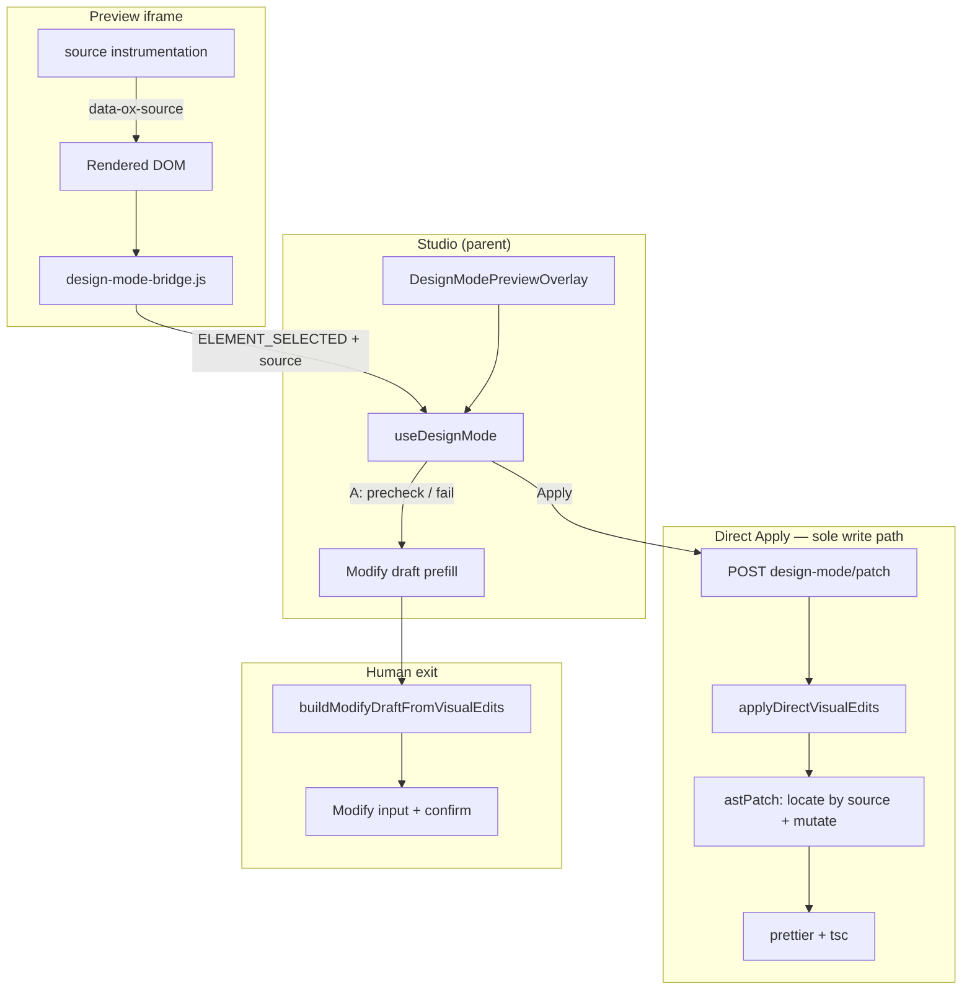
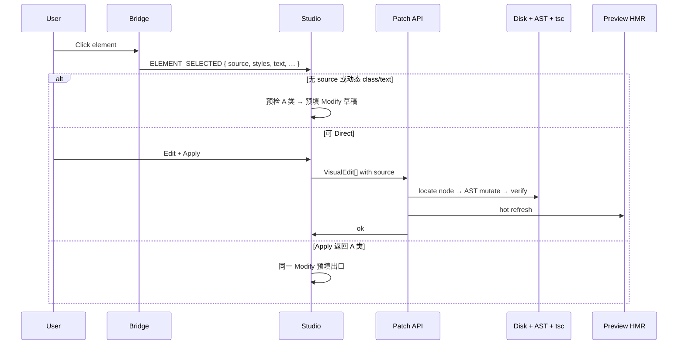

# Studio Design Mode · 源码反写技术架构

**版本**：v0.3（源坐标主路径）  
**日期**：2026-07-09  
**状态**：目标架构（主路径接线中）  
**关联 PRD**：[studio-visual-experience-v0.1-prd.md](./studio-visual-experience-v0.1-prd.md)（P0-A 产品意图；Apply 路径以本文为准）  
**调研**：[lovable-visual-edits-localization-20260709.md](../research/lovable-visual-edits-localization-20260709.md)  
**实现入口**：`sourceInstrumentation/*`、`astPatch/*`、`POST /api/projects/[id]/design-mode/patch`

> **产品决策（v0.3）**  
> 1. **定位主键** = 编译期注入的源坐标 `file:line:col`（`data-ox-source`），点选 O(1)。  
> 2. **反写** = **服务端 JSX AST** 突变（Tailwind / 静态文案）；**唯一写盘路径**。  
> 3. **Modify** = A 类失败 / 预检不可 Direct 时的 **人工出口**（预填草稿 → 用户确认），不是第二条写盘引擎。  
> 4. **`data-ox-id` / ripgrep** = 非主路径（遗留）；不再作为定位 seam。

---

## 1. 核心问题

Preview iframe 里的 DOM **不是** 源码：

| Preview 侧 | 源码侧 |
| ---------- | ------ |
| 浏览器 computed style（`rgb()`, `16px`） | Tailwind class 或 CSS module |
| 扁平 DOM + hydration 后结构 | React 组件树、条件渲染、map |
| 无稳定文件路径 | `components/sections/*.tsx`、`app/**/page.tsx` |

**反写成功的定义**：用户对选中元素做的 **文案 / 4 类样式** 变更，在 **唯一对应的 JSX 节点** 被持久化，且 **tsc 通过 + preview HMR 可见**。

**对标 Lovable（学什么 / 不抄什么）**：学 **源坐标定位 + AST 突变**；不抄浏览器整仓 AST、不抄强制 Vite 云容器、不把主路径改成「选中 + 聊天」。详见调研笔记。

---

## 2. 设计原则

1. **Preview 只负责采集，不负责写盘** — bridge 产出带 `source` 的 `VisualEdit`，Studio 发起 Apply。
2. **定位靠坐标，不靠猜** — `file:line:col`（+ tag）落到唯一 JSX；无坐标 → 预检 / A 类失败 → Modify 预填。
3. **反写靠服务端 AST** — 按坐标找节点，改 `StringLiteral` className / 静态 JSX 文案；不写 computed CSS。
4. **写盘必须可验证** — snapshot → mutate → prettier → `verifyWrittenSourceFile`；歧义或动态表达式 → 不猜，走 Modify。
5. **与 Modify 解耦** — Direct 是唯一自动写盘路径；Modify 仅人工出口。

---

## 3. 系统分层



### 3.1 模块职责

| 层 | 路径 | 职责 |
| -- | ---- | ---- |
| 协议 | `protocol.ts` | `VisualEdit`、`DesignModeElementPayload`（含 `source`）、postMessage |
| 注入 | `sourceInstrumentation/*` + template loader | 编译期写入 `data-ox-source` / textKind / classKind |
| Bridge | `public/open-ox/design-mode-bridge.js` | 点选、读 computed style、**上报 source**、live overlay |
| Studio | `useDesignMode` + overlay | 编辑态、预检、Apply、Modify 预填 |
| 定位+突变 | `astPatch/applyAstVisualEdits.ts` | 按 `OxSourceMeta` 找 JSX 节点并 AST 改写 |
| Tailwind 规则 | `directPatch/sourceMutator.ts` | computed → utility upsert（AST 与行级共用） |
| 编排 | `directPatch/applyDirectPatch.ts` | 要求 source → AST → verify → diffs |
| 人工出口 | `buildModifyDraftFromVisualEdits.ts` | `VisualEdit[]` → Modify 指令草稿 |
| API | `…/design-mode/patch/route.ts` | 鉴权、写盘、指纹、`hotRefreshDevServer` |

---

## 4. 端到端数据流



### 4.1 `VisualEdit` 契约

```ts
// 主路径：必须带 source
{ kind: "style", source: OxSourceMeta, property, before, after, selectorHint, elementLabel }
{ kind: "text",  source: OxSourceMeta, before, after, selectorHint, elementLabel }

// OxSourceMeta
{ version: 1, file, line, column, tag, textKind, classKind }
```

`before`/`after` 是语义 diff；style 的 `after` 来自控件，写盘时再转为 Tailwind utility。

---

## 5. 定位（源坐标主路径）

### 5.1 注入契约

| 项 | 规则 |
| -- | ---- |
| 属性 | `data-ox-source`（base64url JSON）、`data-ox-text-kind`、`data-ox-class-kind` |
| 时机 | **local `next dev`**：webpack/loader 编译期注入（template `source-instrumentation-loader`） |
| Bridge | `findOxSource` → payload.`source` / `textKind` / `classKind` |
| Patch | `edit.source` → 打开 `file` → 按 line/col + tag 匹配唯一 JSX 节点 |

对标 Lovable：`lovable-tagger` 用 jsx-dev-runtime 的 `file:line:col`；Open-OX 用显式 `data-ox-source`，便于 iframe bridge 读取（不依赖跨 frame Symbol）。

### 5.2 安全阀

| 场景 | 行为 |
| ---- | ---- |
| 无 `source` | 预检 / `NO_SOURCE_MAPPING` → Modify 预填 |
| 找不到节点 | `SOURCE_NODE_NOT_FOUND` → Modify |
| `classKind` / `textKind` ≠ static | 预检 / `DYNAMIC_*` → Modify |
| 动态表达式 className | 不猜 → Modify |

### 5.3 遗留（非主路径）

- `data-ox-id`：生成提示仍可保留作产品/可读性，**不参与**定位 seam。  
- `directPatch/resolveTarget` ripgrep：冻结；仅历史兼容，Apply 主路径不再调用。

### 5.4 Preview 后端

| 后端 | 源坐标 |
| ---- | ------ |
| `OPEN_OX_PREVIEW_BACKEND=local` | preview 启动时 **磁盘 backfill** `data-ox-source`；默认 **Turbopack**（快）。可选 webpack loader 仅作遗留兜底 |
| `site-previews` 静态代理 | 无编译期注入 → 预检无 source → Modify 出口（或提示切 local preview） |

---

## 6. 反写（服务端 AST）

1. `findElementBySource`：同 tag，line/col 最近且在阈值内。  
2. Style：仅 `className` **StringLiteral** → `upsertTailwindUtility`。  
3. Text：仅静态 `JsxText`，块内替换。  
4. `prettier` + `verifyWrittenSourceFile`。  
5. `hotRefreshDevServer` + Studio `bumpPreviewAfterDirectPatch`。

**不做**：浏览器整仓 AST、regex 扫全文件当主路径、静默 `runModifyProject`。

---

## 7. Modify 人工出口

| 触发 | 行为 |
| ---- | ---- |
| 预检：无 source / 动态 class 或 text | 提示 +「用 Modify 改」→ `buildModifyDraftFromVisualEdits` 填入 Modify 输入框 |
| Apply 返回 A 类 code | 同上（用户确认后再发 Modify） |

**不是** Apply 编排内的 fallback adapter。

---

## 8. Feature Flag 与产品边界

- `NEXT_PUBLIC_STUDIO_DESIGN_MODE=1`  
- Direct **不**改 layout、不增删 DOM、不 multi-breakpoint  
- PRD「禁止无确认直接写盘」→ **已 override**：Direct Apply 写盘；Modify 仅 A 类人工出口  

---

## 9. 测试策略

| 层级 | 覆盖 |
| ---- | ---- |
| 单元 | `sourceMeta`、`instrumentTsx`、`applyAstVisualEdits`、`sourceMutator` |
| 契约 | bridge `ELEMENT_SELECTED` 含 `source`（与 protocol 对齐） |
| 集成 | patch API + 带 `data-ox-source` 的 fixture（待补） |
| E2E | pick → edit → Apply → 文件断言（待补） |

---

## 10. 演进（相对 v0.2）

```text
v0.2  data-ox-id + rg + 行级突变（主） / AST（未接线）
  ↓
v0.3  data-ox-source + 服务端 AST（主） / Modify 预填（A 类）
      data-ox-id、rg 降级为遗留
```

---

## 11. 关键代码索引

| Concern | 文件 |
| ------- | ---- |
| 协议 / VisualEdit | `lib/studio/designMode/protocol.ts` |
| 源坐标编解码 | `lib/studio/designMode/sourceInstrumentation/sourceMeta.ts` |
| 编译期注入 | `sites/template/open-ox/source-instrumentation-loader.cjs` |
| iframe bridge | `public/open-ox/design-mode-bridge.js` |
| AST 定位+突变 | `lib/studio/designMode/astPatch/applyAstVisualEdits.ts` |
| Apply 编排 | `lib/studio/designMode/directPatch/applyDirectPatch.ts` |
| Modify 草稿 | `lib/studio/designMode/buildModifyDraftFromVisualEdits.ts` |
| HTTP | `app/api/projects/[id]/design-mode/patch/route.ts` |
| Studio | `app/studio/hooks/useDesignMode.ts` |

---

## 变更记录

| 日期 | 变更 |
| ---- | ---- |
| 2026-07-09 | v0.3：定位改源坐标；反写改服务端 AST；Modify 为 A 类人工出口；对齐 Lovable 调研 |
| 2026-07-08 | v0.2：M2 `data-ox-id` + rg |
| 2026-07-08 | v0.1：Direct Patch MVP |
