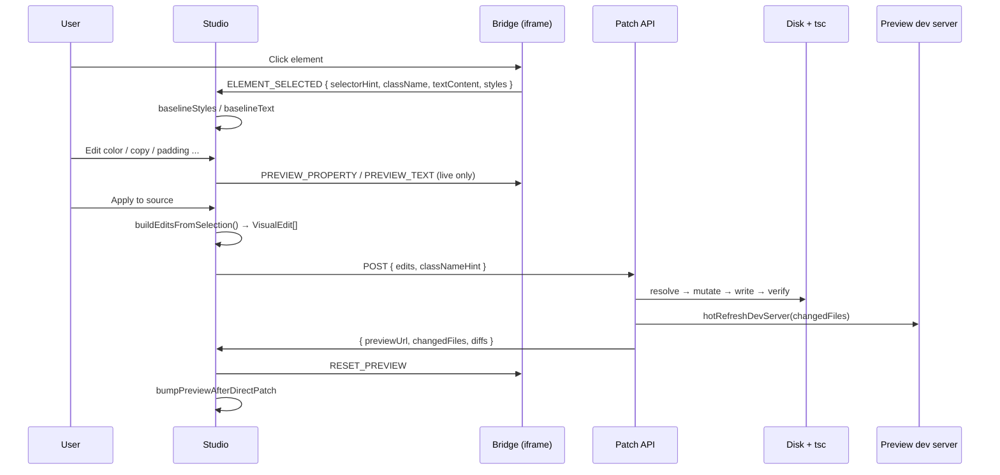
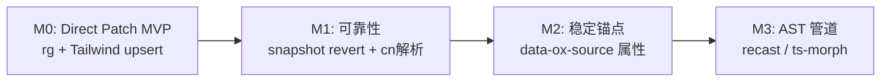

# Studio Design Mode · 源码反写技术架构

**版本**：v0.2（M2 锚点主路径）  
**日期**：2026-07-08  
**状态**：已实现（M2 + rg fallback）  
**关联 PRD**：[studio-visual-experience-v0.1-prd.md](./studio-visual-experience-v0.1-prd.md)  
**实现入口**：`lib/studio/designMode/anchor.ts`、`directPatch/*`、`POST /api/projects/[id]/design-mode/patch`

> **产品决策**：采用 **M2 稳定锚点**（`data-ox-id`）作为源码定位主路径；无锚点时降级为 M0 ripgrep 启发式。

---

## 1. 核心问题

Preview iframe 里的 DOM **不是** 源码：


| Preview 侧                           | 源码侧                                           |
| ----------------------------------- | --------------------------------------------- |
| 浏览器 computed style（`rgb()`, `16px`） | Tailwind class 或 CSS module                   |
| 扁平 DOM + hydration 后结构              | React 组件树、条件渲染、map                            |
| 无稳定文件路径                             | `components/sections/*.tsx`、`app/**/page.tsx` |


**反写成功的定义**：用户对选中元素做的 **文案 / 4 类样式** 变更，在 **唯一对应的源码位置** 被持久化，且 **tsc 通过 + preview HMR 可见**。

---


## 2. 设计原则

1. **Preview 只负责采集，不负责写盘** — iframe bridge 产出结构化 `VisualEdit`，Studio 侧发起 patch。
2. **写盘必须可验证** — 每次 patch 前 snapshot、写后 prettier + `verifyWrittenSourceFile`；失败则 **整批回滚语义**（当前：遇错即 abort，不写半成品）。
3. **宁可失败，不可误写** — 定位歧义时返回 422，不猜文件、不猜行。
4. **Tailwind-first 突变** — v1 只支持把 computed style 映射为 **Tailwind utility upsert**，不解析 CSS-in-JS / 动态 className 表达式。
5. **与 Modify 解耦** — Direct Patch 是主路径；Modify 仅作 fallback / 复杂变更（layout、新组件）。

---


## 3. 系统分层

```mermaid
flowchart TB
  subgraph Studio["Studio (parent)"]
    UI[DesignModePreviewOverlay]
    Hook[useDesignMode]
    API[POST design-mode/patch]
  end

  subgraph Preview["Preview iframe"]
    Bridge[design-mode-bridge.js]
    DOM[Rendered DOM]
  end

  subgraph PatchEngine["Direct Patch Engine (server)"]
    Resolve[resolveTarget.ts]
    Mutate[sourceMutator.ts]
    Apply[applyDirectPatch.ts]
    Verify[tsxDiagnostics + FileSnapshotTracker]
  end

  subgraph Project["Project on disk"]
    TSX[*.tsx sources]
    DevServer[local next dev / hot refresh]
  end

  DOM -->|click / styles| Bridge
  Bridge -->|ELEMENT_SELECTED| Hook
  Hook -->|PREVIEW_* postMessage| Bridge
  UI -->|Apply| Hook
  Hook -->|VisualEdit[]| API
  API --> Apply
  Apply --> Resolve --> Mutate --> TSX
  Apply --> Verify
  API --> DevServer
  DevServer -->|HMR| DOM
```


### 3.1 模块职责


| 层         | 路径                                                  | 职责                                                     |
| --------- | --------------------------------------------------- | ------------------------------------------------------ |
| 协议        | `lib/studio/designMode/protocol.ts`                 | `VisualEdit`、`DesignModeElementPayload`、postMessage 动作 |
| Bridge    | `public/studio/design-mode-bridge.js`               | 点选、读 computed style / text、live preview overlay        |
| Studio UI | `useDesignMode.ts` + `DesignModePreviewOverlay.tsx` | 编辑态、baseline diff、调用 patch API                         |
| 定位        | `anchor.ts` + `directPatch/resolveTarget.ts`          | **M2：`data-ox-id` 主路径**；M0 rg fallback              |
| 突变        | `directPatch/sourceMutator.ts`                      | Tailwind upsert、className 行替换、文案替换                     |
| 编排        | `directPatch/applyDirectPatch.ts`                   | 多 edit 顺序应用、snapshot diff                              |
| API       | `app/api/projects/.../patch/route.ts`               | 鉴权、写盘、指纹同步、`hotRefreshDevServer`                       |


---


## 4. 端到端数据流




### 4.1 `VisualEdit` 契约

两种 edit，均带 **定位 hint**（非 DOM 选择器引擎）：

```ts
// style
{ kind: "style", property: "color"|"fontSize"|"padding"|"borderRadius",
  before: "rgb(...)", after: "#ff5500", selectorHint, elementLabel }

// text
{ kind: "text", before: "独立出版", after: "自助出版", selectorHint, elementLabel }
```

`before/after` 是 patch 的 **语义 diff**，不是 DOM patch；style 的 `after` 来自 slider/color picker，写盘时再转为 Tailwind utility。

---


## 5. 如何保证「找对文件、改对行」（M2 主路径）

反写可靠性 **80% 在定位**。**主路径：M2 `data-ox-id` 锚点**；无锚点时降级 M0 ripgrep。

### 5.1 锚点契约（M2）

| 项 | 规则 |
|----|------|
| 属性名 | `data-ox-id` |
| 格式 | kebab-case，全项目唯一，建议 `{section-slug}-{role}` |
| 生成 | `section.default.md` 强制：root / headline / subcopy / CTA 等可编辑节点 |
| Bridge | 点选时向上查找最近 `data-ox-id` → `payload.oxId` |
| Patch | `VisualEdit.oxId` → rg 定位唯一 TSX → 锚点元素块内 patch |

**示例：**

```tsx
<h1 data-ox-id="hero-headline" className="text-4xl">独立出版</h1>
```

### 5.2 定位优先级

```
1. edit.oxId 存在 → rg `data-ox-id="{oxId}"` → 必须唯一 TSX 文件
2. 行级：锚点行唯一 → 在锚点 JSX 元素块内找 className / 文案
3. 无 oxId → M0 fallback（文案 rg、classNameHint、selectorHint）
```

### 5.3 锚点元素块扫描

锚点属性可能与 `<h1` 分行书写。`findAnchorElementLineRange`：

- 向上扫描 opening tag（≤6 行）
- 向下扫描 matching `</tag>`
- **文案 / className patch 仅限该块**，避免同文件重复文案误伤

### 5.4 M0 fallback（无锚点 / 老项目）

| 信号 | 用途 |
|------|------|
| `edit.before`（文案） | `rg -l` 全文搜索 |
| `classNameHint` | 缩小多文件歧义 |
| `selectorHint` | class token 二次搜索 |

### 5.6 老项目 backfill

无 `data-ox-id` 的历史 section 在 **Preview 启动 / Rebuild** 时自动 backfill（`backfillOxAnchorsInProject`）：

- 扫描 `components/sections/*.tsx`
- 为 `section` / `h1`–`h3` / `p` / `button` / `a` 插入 `{slug}-{role}` 锚点
- 手动触发：`POST /api/projects/[id]/design-mode/backfill`

### 5.7 Preview 基座 Next 版本同步

`sites/template` 与 Open-OX 主应用对齐 **Next 16.3 preview**（`syncProjectRuntimeVersionsFromTemplate`）。本地 preview 启动时会：

1. 将项目 `package.json` 的 `next` / `react` / `react-dom` 同步为 template 版本  
2. 必要时清除项目 `node_modules` 以使用 template 共享依赖  
3. 再 `next dev`

### 5.5 唯一性 = 安全阀


| 场景                 | 行为                                    |
| ------------------ | ------------------------------------- |
| 0 命中               | 422，`Could not find source file...`   |
| 1 命中               | 422，`Ambiguous ... match`             |
| 1 命中但无 className 行 | 422，`No className attribute to patch` |


**产品含义**：用户看到明确错误，可改文案 uniqueness、或走 Modify fallback；系统 **不会** 静默改错文件。

---


## 6. 如何保证「改对内容」


### 6.1 Style → Tailwind（`sourceMutator.ts`）

computed style 不写入源码；统一 **upsert utility**：


| 属性           | Preview 值示例         | 写入 utility       |
| ------------ | ------------------- | ---------------- |
| color        | `#ff5500` / `rgb()` | `text-[#ff5500]` |
| fontSize     | `24px`              | `text-[24px]`    |
| padding      | `12px`              | `p-[12px]`       |
| borderRadius | `8px`               | `rounded-[8px]`  |


**冲突规则**（`tokenConflicts`）：

- 改 color：移除 `text-[#...]`、`text-white` 等 **色类**，**保留** `text-lg`、`text-[16px]` 等字号类。
- 改 fontSize：移除字号 scale / `text-[Npx]`。
- 改 padding / radius：移除同前缀 family 后 append 新 arbitrary utility。

**className 行匹配**：支持 `"..."`、`'...'`、``{`...`}`` 三种字面量；**第一个**匹配行被替换。

### 6.2 Text → 字面量替换

- 全文件 `before` 出现次数 **必须 === 1**
- 替换为 `after`（不解析 JSX 结构）
- 限制：仅适合 **短、唯一** 的可见文案；重复 CTA 文案会失败


### 6.3 写后验证链

```
write file
  → tryFormatSource (prettier)
  → verifyWrittenSourceFile(relPath)  // 项目 tsc 诊断
  → 失败则返回 PATCH_FAILED（当前未自动 revert 文件，见 §8 缺口）
```

---


## 7. Preview 与 Bridge 一致性

Bridge 必须在 **所有 preview 后端** 可用：


| 后端                              | Bridge 注入                                                    |
| ------------------------------- | ------------------------------------------------------------ |
| `site-previews` 代理              | HTML inject `injectBridgeIntoHtml`                           |
| `OPEN_OX_PREVIEW_BACKEND=local` | `ensureDesignModeBridgeInProject` 复制 template + patch layout |
| 新项目 template                    | `OpenOxPreviewBridge.tsx` bootstrap                          |


Bridge 采集与 Studio 一致：

- `getComputedStyle` → 4 属性
- `canEditText`：叶子文本节点、非 `svg/button/input` 等
- `selectorHint`：与 `buildSelectorHint.ts` 同逻辑（测试覆盖）

**postMessage origin**：`localhost` / `127.0.0.1` 双发，避免 loopback 不一致导致 bridge 假死。

---


## 8. Apply 后刷新

```
classifyModificationScope(diffs)  // style-only → hot, structural → rebuild
hotRefreshDevServer(supabase, projectId, changedFiles)
syncLocalProjectFingerprint
Studio: bumpPreviewAfterDirectPatch(previewUrl)  // iframe key++，不 full rebuild
Bridge: RESET_PREVIEW  // 去掉 inline preview override
```

目标：**源码变更 → dev server HMR → iframe 反映持久化结果**，而非仅 DOM 临时样式。

---


## 9. 可靠性矩阵（当前 vs 目标）


| 维度           | MVP（已实现）            | P1 目标                      | P2 目标                   |
| ------------ | ------------------- | -------------------------- | ----------------------- |
| 文件定位         | rg + 唯一命中           | `data-ox-id` 编译时注入         | TS/JSX AST + source map |
| 行定位          | 单行 className / text | `cn()` 多参数解析               | Babel recast 改 AST      |
| 样式表达         | Tailwind arbitrary  | 识别 design token / CSS var  | Theme 级 token 面板        |
| 动态 className | ❌ 失败                | 有限 `cn()` 支持               | 全表达式                    |
| 文案           | 唯一字符串               | section 作用域 + i18n key     | CMS 字段                  |
| 失败回滚         | ❌ 无 auto revert     | FileSnapshotTracker revert | 事务 + undo 栈             |
| Undo         | UI disabled         | snapshot revert            | 用户级 history             |
| 复杂 layout    | ❌                   | Modify fallback 按钮         | 混合路径                    |


---


## 10. 已知失败模式（运维 / 支持）


| 用户现象                         | 根因                              | 建议                             |
| ---------------------------- | ------------------------------- | ------------------------------ |
| `Ambiguous text match`       | 同文案多处（如「了解更多」）                  | 改更长 unique 片段，或 Modify         |
| `Could not find source file` | 文案来自 props/i18n/MDX，不在 TSX 字面量  | Modify 或改数据源                   |
| `No className attribute`     | 样式在父级 / `@apply / inline style` | Modify                         |
| `Typecheck failed`           | patch 破坏 JSX                    | 手动 git revert；待 P1 auto revert |
| Bridge unavailable           | local preview 缺 bootstrap       | Rebuild preview（ensure bridge） |
| 改了 preview 但 Apply 后跳变       | HMR 用源码覆盖 inline preview        | 预期行为                           |


---


## 11. 测试策略


| 层级  | 覆盖                                                   |
| --- | ---------------------------------------------------- |
| 单元  | `sourceMutator.test.ts` — utility upsert、冲突、text 唯一性 |
| 单元  | `buildSelectorHint.test.ts` — hint 稳定                |
| 单元  | `resolveTarget`（待补） — fixture 项目多文件歧义                |
| 集成  | patch API + temp project dir（待补）                     |
| E2E | pick → edit nav copy → Apply → rg 断言文件变更（待补）         |


**门禁**：Direct Patch PR 须 `tsc` + 上述单测绿；集成/E2E 作为 P1。

---


## 12. Feature Flag 与产品边界

- `NEXT_PUBLIC_STUDIO_DESIGN_MODE=1` — 总开关
- Direct Patch **不** 改 layout、不增删 DOM、不 multi-breakpoint
- PRD Out of Scope 中「无 Modify 确认的直接写文件」— **产品决策已 override**；本文档描述的新默认路径

---


## 13. 演进路线（建议）




**M2 锚点方案（推荐优先于纯 AST）**：generate 流水线在 section 根节点注入：

```tsx
<section data-ox-path="components/sections/Hero.tsx:42">
```

Bridge 选中时带上 `dataOxPath` → patch **O(1) 定位**，rg 仅作 fallback。对现有项目可通过 Modify 一次性 backfill。

---


## 14. 关键代码索引


| Concern         | 文件                                                      |
| --------------- | ------------------------------------------------------- |
| 协议 / VisualEdit | `lib/studio/designMode/protocol.ts`                     |
| iframe bridge   | `public/studio/design-mode-bridge.js`                   |
| Apply 编排        | `lib/studio/designMode/directPatch/applyDirectPatch.ts` |
| 文件/行定位          | `lib/studio/designMode/directPatch/resolveTarget.ts`    |
| 源码突变            | `lib/studio/designMode/directPatch/sourceMutator.ts`    |
| HTTP 入口         | `app/api/projects/[id]/design-mode/patch/route.ts`      |
| Studio 状态机      | `app/studio/hooks/useDesignMode.ts`                     |


---


## 15. 评审问题（请产品 / 工程确认）

1. **M2 锚点**是否纳入 generate 模板（一次性解决老项目定位 pain）？
2. patch 失败是否 **自动 revert** 已写文件（当前 partial write 风险）？
3. 是否保留 **「Send to Modify」** 作为显式 fallback，还是仅错误文案引导？
4. Undo 优先级：snapshot revert vs git-only？
5. 是否更新 PRD v0.5，将 Direct Patch 写为主路径并调整成功指标？

---


## 变更记录


| 日期         | 变更                               |
| ---------- | -------------------------------- |
| 2026-07-08 | v0.2：落地 M2 `data-ox-id` 主路径 + generate prompt + bridge + resolve |
| 2026-07-08 | v0.1：Direct Patch 反写架构、定位/突变/验证/演进 |


