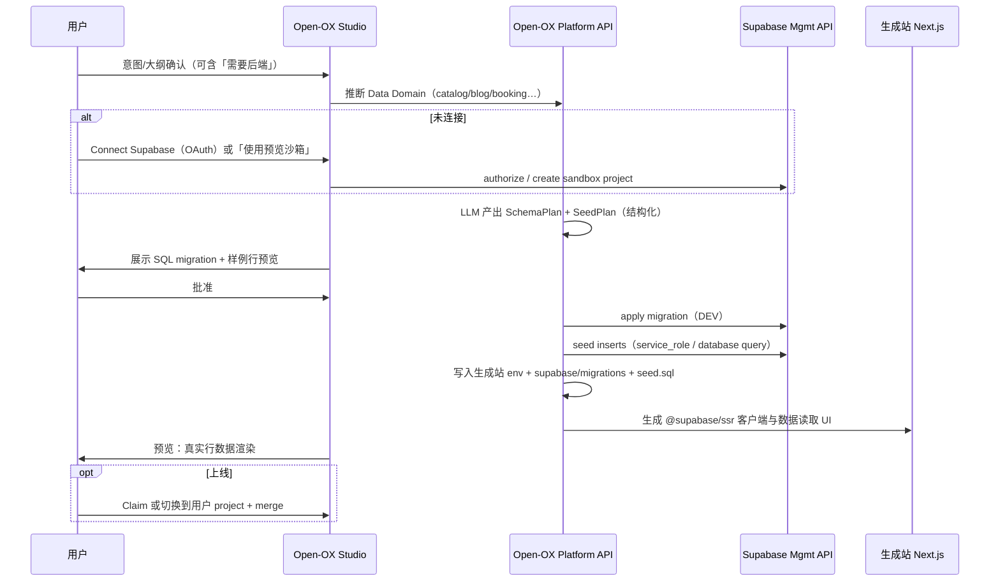

# 调研：AI Builder 如何连接 Supabase 并生成真实数据 — Open-OX 技术架构建议（2026-07-20）

**状态**：完成（仅第一方公开材料：官方 docs / help / Management API / MCP；**未登录**各产品内部编辑器做黑盒逆向；**不**采第三方「揭秘」或 Reddit 传言）  
**日期**：2026-07-20  
**问题**：同类 AI website/app builders 如何让用户把生成项目接到 Supabase，并产出可用的真实/种子数据？Open-OX 应采用怎样的端到端技术架构？  
**工程落地**：见 [`docs/product/supabase-connect-implementation-plan.md`](../product/supabase-connect-implementation-plan.md)（BYO MVP 详细实现方案；对标 ADR-0003 Vercel OAuth）。

**范围**：

1. Lovable（Cloud vs BYO Supabase）、Bolt.new、v0 / Vercel Marketplace、Replit（内置 SQL / 外部 Secrets）。
2. Supabase 平台侧：OAuth Integration、Management API、Supabase for Platforms、MCP、migrations / seed、RLS、claim flow。
3. Softgen 等小众 builder：仅在有清晰第一方文档时记入；否则标「未知」。
4. 与既有调研交叉、不整篇复述：[`ai-builder-fast-preview-architecture-20260717.md`](./ai-builder-fast-preview-architecture-20260717.md)、[`docs/architecture.md`](../architecture.md)。

**方法约束**：

1. 每条主张尽量回到所属产品/平台的官方页面；引用短事实短语 + URL。
2. 内部编排未知时，只报**可观察产品行为**与文档承诺，并标「未知」。
3. 架构建议区分 **MVP / v1 / v2**，并标明依赖 Supabase「select customers」能力的接口。

---

## 1. 结论摘要（Verdict）

主流 AI builder 在「接 Supabase + 有数据可看」上收敛成同一套产品形状：

| 模式 | 一句话 | 代表 |
|------|--------|------|
| **A. Platform-provisioned（默认）** | 平台在自己的 org 里代开后端（底层仍是 Supabase），用户零配置即可有 DB/Auth/Storage | Lovable Cloud；Bolt Database（文档称认证由 Supabase 驱动） |
| **B. BYO via OAuth（推荐给「要所有权」的用户）** | 用户授权 workspace ↔ Supabase org，再选/建 project；平台用 Management API 代跑 migration / Edge Function | Lovable Supabase integration；Bolt Applications → Connect Supabase |
| **C. Marketplace / env 注入** | 一键装集成 → 自动写 env（URL + anon/publishable）→ agent 可执行 SQL | v0 Integrations + Vercel Marketplace |
| **D. Secrets 粘贴 / Agent 接线** | 用户把 URL/key 放进 Secrets，Agent 装 SDK 并写客户端代码 | Replit Secrets；早期 Lovable 粘贴 URL+anon（现已以 OAuth 为主） |

**关键工程闭环（可核对）**：

1. **连接**：OAuth / Marketplace / Secrets，而不是把 `service_role` 写进前端。
2. **Schema**：自然语言 → SQL migration → **人类批准** → 执行 → 落盘 `supabase/migrations/` + 重生 TS types（Lovable 明文如此）。
3. **安全**：变更后跑 RLS / Security Advisor；`service_role` / secret key 仅 Edge Function / 服务端。
4. **数据**：开发分支或 seed 插入「非生产」样例；平台方文档明确禁止用生产数据给非开发者试玩。
5. **所有权升级**：平台代管项目可 **Claim** 到用户 org，同时保留 OAuth 访问（Supabase for Platforms）。

**Open-OX 一句话建议**：采用 **混合架构（Hybrid）**——Studio 默认用平台侧 **DEV 沙箱项目（或 Branch）** 跑 schema + 品牌化真实种子数据，预览立刻「有内容」；用户要上线/自有账单时走 **OAuth Connect →（可选）Claim / 切到用户 project**，迁移与 seed 经审批后推到用户侧。MVP 先做 **BYO OAuth + 审批式 migration + LLM 结构化 seed**，不必一上来自建 Lovable Cloud 级代管计费。

---

## 2. 竞品 / 同类产品（第一方）

### 2.1 Lovable — 双后端：Cloud（默认）vs 自有 Supabase

**来源**：[Connect to Supabase](https://docs.lovable.dev/integrations/supabase)、[Lovable Cloud](https://docs.lovable.dev/integrations/cloud)

| 维度 | 文档事实 |
|------|----------|
| **默认后端** | Lovable Cloud：内置后端，基于 Supabase 开源栈；多数项目不需要单独 Supabase 账号 |
| **BYO 动机** | 直接拥有后端、自己的 Supabase 账单/Dashboard、或已有项目 |
| **连接两步** | ① Workspace owner/admin **Link Supabase organization**（OAuth 授权）② 有编辑权的人把 Lovable project **Connect** 到某 Supabase project |
| **Agent 能力** | 设计 schema、跑 migrations、部署 Edge Functions、把 UI 接到数据；Secrets 存 Supabase，不进 app 代码 |
| **Migration UX** | 「Schema changes run as **reviewed migrations**」：写出 SQL → 聊天里展示 → **用户批准** → 执行 → 存 `supabase/migrations/` → 重生 TypeScript types；插入/改数据同样要批准；只读调试可不改数据 |
| **安全** | 变更后自动 security checks（含 RLS 覆盖）；上线前要求每张表有 RLS |
| **限制** | 一项目一 Supabase；Cloud ↔ BYO **无一键迁移**；部分 Cloud 专属能力（应用内 DB/Users 视图、托管支付、聊天内改 Auth、登录态浏览器测试等）在 BYO 上不可用 |
| **Disconnect** | 停止部署 Edge Function / 读 schema；**不删** Supabase 侧数据与代码 |

**对 Open-OX 的启示**：产品上要尽早让用户选「平台托管沙箱」还是「我的 Supabase」；**审批式 migration** 是降低「AI 乱改生产库」风险的核心 UX，应直接抄产品形状（不必抄托管计费）。

### 2.2 Bolt.new — Bolt Database（默认）+ Supabase Connect / Claim

**来源**：[Supabase for databases](https://support.bolt.new/integrations/supabase)、[Introduction to databases](https://support.bolt.new/concepts/intro-databases)、[Send emails…](https://support.bolt.new/cloud/database/send-emails)（Claim 与 SMTP）

| 维度 | 文档事实 |
|------|----------|
| **默认** | 新项目用 **Bolt Database**；也可创建时选 Supabase |
| **账号连接** | Account → Applications → Supabase → Connect → 登录授权 |
| **接已有库** | Database → Advanced → Connect → 选已有或新建 Supabase project |
| **Claim** | 把 Bolt Database **迁移/转到用户自己的 Supabase 账号**（需 org owner）；高级能力（自定义 SMTP 等）要求 Claim |
| **Env 形态** | 文档示例：`VITE_SUPABASE_URL` / `VITE_SUPABASE_ANON_KEY` /（提及）`VITE_SUPABASE_SERVICE_ROLE_KEY` — 强调用环境变量，勿硬编码 |
| **限制** | Supabase 连接目前支持 **Vite**，**Next.js 暂不支持**；Version History **不**还原 Supabase DB；Bolt→Supabase 有 Claim，**反向**（Supabase→Bolt DB）无支持路径 |

**对 Open-OX 的启示**：**Claim**（平台项目 → 用户 org）是与 Supabase Platforms「project-claim」对齐的产品动作；Open-OX 若做平台沙箱，应预留 Claim。注意 Bolt 对 Next.js 的限制——Open-OX 交付物是 Next.js，必须走官方 Management API / JS SDK，不能假设 WebContainer 式 Vite 专用路径。

### 2.3 v0 / Vercel — Marketplace 一键库 + SQL 执行

**来源**：[Databases](https://v0.app/docs/databases)、[Vercel Integration](https://v0.app/docs/vercel-integration)

| 维度 | 文档事实 |
|------|----------|
| **集成** | 一键接 Upstash / Neon / **Supabase** / Vercel Blob 等 |
| **入口** | Project → Integrations，或聊天里「加 database」→ Marketplace 接受条款 |
| **效果** | 在服务商侧开账号/资源，并把必要 **environment variables** 写入 Vercel project（与 v0 共享） |
| **SQL** | 「For SQL-based integrations, can generate and execute SQL」——可建/改/删表 |
| **预览与密钥** | v0 preview 只能用 **Development** 环境变量；敏感变量对 preview 不可见 |

**对 Open-OX 的启示**：MVP 的「接好就能生成」体验 ≈ **env 注入 + agent 可执行 SQL**；Open-OX 没有 Vercel Marketplace 时，等价物是 **自建 OAuth + 把 `NEXT_PUBLIC_SUPABASE_URL` / `NEXT_PUBLIC_SUPABASE_ANON_KEY` 写入生成站 env / secrets store**。

### 2.4 Replit — 内置 SQL Database + 外部 Secrets

**来源**：[SQL database](https://docs.replit.com/references/data-and-storage/sql-database)

| 维度 | 文档事实 |
|------|----------|
| **默认路径** | 让 Agent「加 database」→ 集成、建 schema、用 ORM 更新应用；Project Editor 有 Database 工具 |
| **Supabase** | 官方 SQL Database 页主推 **Replit 托管 SQL**；外部 Supabase 多为 Secrets + Agent 接线（社区/教程多，**第一方专章弱** → 标未知细节） |

**对 Open-OX 的启示**：Replit 证明「内置 DB + Agent 建表」能覆盖大量 demo；Open-OX 若要「生成站真连库」，仍应优先 **用户可拥有的 Supabase project**，避免把所有租户数据堆在 Open-OX 主库。

### 2.5 Softgen 等

公开第一方「Supabase onboarding」材料存在但深度不一；**不作为架构主证据**。若后续要对齐，再单独立项核对。

---

## 3. Supabase 平台原语（Open-OX 必须对接的 API）

### 3.1 两条合法集成路径

| 路径 | 适用 | 官方入口 |
|------|------|----------|
| **OAuth Integration** | 操作**用户拥有**的 org/project | [Build a Supabase Integration](https://supabase.com/docs/guides/integrations/build-a-supabase-oauth-integration) |
| **Supabase for Platforms** | 在**平台自己的 org** 里代开项目，再可选 Claim 给用户 | [Supabase for Platforms](https://supabase.com/docs/guides/integrations/supabase-for-platforms) |

文档明确分流：平台自有 org 内代管 → Platforms 指南；交互用户自己的项目 → OAuth。

### 3.2 OAuth 2.0 + Management API（BYO）

来源：[Build a Supabase Integration](https://supabase.com/docs/guides/integrations/build-a-supabase-oauth-integration)、[OAuth scopes](https://supabase.com/docs/guides/integrations/build-a-supabase-oauth-integration/oauth-scopes)

- Authorize：`https://api.supabase.com/v1/oauth/authorize`（推荐 **PKCE**）。
- Token：`POST https://api.supabase.com/v1/oauth/token`（Basic auth：client_id/secret）。
- 取密钥：`GET /v1/projects/{ref}/api-keys`（可 `reveal=true`）。
- 建项目：`POST /v1/projects`；DB 密码**无法**再经 Management API 取回——新建时平台必须**安全存储** `db_pass`，已有项目需向用户收集密码才能拼 Postgres URI。
- 推荐把 API URL/keys 注入集成侧 env（文档「Store API keys in env variables」）。
- 限制：在细粒度 ACL 完全放开前，部分「完整 DB 访问」仍可能要用户数据库密码。

### 3.3 Platforms 工作流（代管 + DEV 分支 + seed + Claim）

来源：[Supabase for Platforms](https://supabase.com/docs/guides/integrations/supabase-for-platforms)

推荐闭环（摘要）：

1. `POST /v1/projects` 创建（强随机 `db_pass`、smart region、等 `ACTIVE_HEALTHY`）。
2. 取 API keys（迁移中：`anon`/`service_role` → `publishable`/`secret`）。
3. `POST /v1/projects/{ref}/branches` 建 **DEV** 分支；**所有破坏性变更先上分支**。
4. Schema：`POST /v1/projects/{ref}/database/migrations`（**select customers**；失败回滚）。
5. Seed：`POST .../database/query` 插入测试数据；**禁止**把生产数据放进 DEV。
6. 可选 restore point / undo（select customers）。
7. Security advisor：`GET /v1/projects/{ref}/advisors/security`。
8. Merge 分支 → 生产；Edge Functions 可随 merge。
9. **Claim**：`GET /v1/oauth/authorize/project-claim` — 项目转到用户 org，平台经 OAuth 继续访问。
10. **Platform Kit**：可嵌入轻量 Dashboard UI（[Platform Kit](https://supabase.com/ui/docs/platform/platform-kit)）。

### 3.4 MCP（给「人在 IDE」用，不是给终端用户）

来源：[Supabase MCP Server](https://supabase.com/docs/guides/ai-tools/mcp)

- Hosted：`https://mcp.supabase.com/mcp`；可 `project_ref` / `read_only` / `features=`。
- 工具：`list_tables`、`apply_migration`、`execute_sql`、`get_advisors`、`deploy_edge_function`、`generate_typescript_types` 等。
- **安全红线**：勿接生产；勿把 MCP 交给终端用户；默认人工确认每步 tool call。
- **对 Open-OX**：MCP 适合内部/开发者调试；**用户 Studio 管线应走 Management API + 自有审批 UX**，不要把 MCP 暴露给生成站访客。

### 3.5 Migrations / Seed / RLS（数据与安全底座）

| 主题 | 要点 | 来源 |
|------|------|------|
| **Migrations** | `supabase/migrations/`；远程对齐可用 `db pull`；变更应用 `db reset` / push | [Database migrations](https://supabase.com/docs/guides/local-development/database-migrations) |
| **Seed** | `supabase/seed.sql`（或 `config.toml` `[db.seed] sql_paths`）；在 `start` / `db reset` 时于 **migration 之后**执行；只放 INSERT，不放 schema | [Seeding your database](https://supabase.com/docs/guides/local-development/seeding-your-database) |
| **大量真实感数据** | 官方提到 `@snaplet/seed`（社区维护）可生成 SQL；可选 LLM key 增强真实感 | 同上 |
| **Branch seed** | Preview branch 用同样 seed 行为；分支默认**不带**主库生产数据 | [Branching](https://supabase.com/docs/guides/deployment/branching) |
| **RLS** | `public` 暴露表必须启 RLS；未建 policy 时 publishable/anon **读不到数据**；`service_role`/secret **绕过 RLS**，禁进浏览器 | [Row Level Security](https://supabase.com/docs/guides/database/postgres/row-level-security) |

### 3.6 密钥模型（生成站必须遵守）

| Key | 用途 | 允许出现位置 |
|-----|------|----------------|
| `anon` / **publishable** | 浏览器 / 公开客户端 | `NEXT_PUBLIC_*` |
| `service_role` / **secret** | 绕过 RLS 的管理操作、种子写入、服务端任务 | 仅 Open-OX 服务端或用户 Edge Function secrets |
| DB password | 直连 Postgres / 部分完整 DDL | Open-OX 加密存储；永不进生成站前端 |

---

## 4. 架构选项对比（Open-OX）

### 选项 A — 纯 BYO（用户 OAuth / 粘贴，平台不代开库）

```
用户 Supabase org ──OAuth──► Open-OX
                              │
                              ├─ 存 refresh_token（加密）
                              ├─ 选 project_ref
                              ├─ 拉 api-keys → 写入生成站 env
                              └─ Agent：提 migration → 用户批准 → Management API / SQL 执行
                                         → LLM 生成 seed → 批准 → insert（service_role 仅服务端）
```

| 优点 | 缺点 |
|------|------|
| 账单/数据所有权清晰；合规简单 | 首次「有数据的预览」摩擦大；用户可能停在免费额度/paused project |
| 对齐 Lovable BYO / Bolt Connect | 无 Claim 故事；难做「零配置 demo」 |

### 选项 B — 纯平台代管（Open-OX org 内每站一个 project）

对齐 Supabase for Platforms：代开 Nano/Micro、DEV 分支、Platform Kit。

| 优点 | 缺点 |
|------|------|
| Lovable Cloud / Bolt Database 级丝滑 | 需要 Platforms 配额、计费、滥用治理、select-customer 能力（migrations API 等） |
| Claim 路径官方存在 | 运维与成本显著；与 Open-OX 主站 Supabase 租户隔离要求极高 |

### 选项 C — 混合（推荐）

| 阶段 | 后端落点 | 用户感知 |
|------|----------|----------|
| 生成 / Studio 预览 | Open-OX 代管 **DEV sandbox**（独立 project 或 branch） | 「网站已经有真实菜单/文章/用户」 |
| 用户确认上线 | OAuth 连接用户 project **或** Claim 沙箱 | 数据与密钥归用户 |
| 迭代 | 默认先改 DEV / 迁移文件，再 merge | 避免 AI 直接打生产 |

---

## 5. 推荐架构（Open-OX）

### 5.1 产品流程（Studio UX）



**建议的 Studio 步骤文案（MVP）**：

1. **Connect** — OAuth 链接 org，或一键「预览沙箱」。
2. **Design data** — 从站点意图自动提案表/关系/RLS 模板；可编辑。
3. **Approve migration** — diff SQL；一键应用。
4. **Generate real data** — 按品牌/行业生成 N 行领域数据（非 lorem）；可再批准。
5. **Wire app** — 生成查询 hooks / Server Components；列表页读库而非写死 JSON。
6. **Verify** — 跑 Security Advisor；预览抽检行数；可选 RLS 冒烟（anon 可读公开目录、不可读私有）。

### 5.2 后端模块切分

| 模块 | 职责 | 建议路径 |
|------|------|----------|
| `lib/supabase/oauth` | OAuth PKCE、token 刷新、org/project 列表 | 新 |
| `lib/supabase/platformClient` | Management API 封装（projects、keys、migrations、query、advisors、branches、claim） | 新 |
| `lib/studio/dataDomain` | 从 intent / site outline → `SchemaPlan` | 新；可挂 intent agent 工具 |
| `lib/studio/schemaCompiler` | `SchemaPlan` → SQL migration（表、FK、index、RLS、grants） | 新 |
| `lib/studio/seedGenerator` | `SeedPlan` + 品牌上下文 → 结构化行 → SQL/JSON；校验 FK 顺序 | 新 |
| `lib/studio/supabaseProjectLink` | DB：`project_id ↔ supabase_ref`、token、模式（sandbox\|byo）、密钥信封加密 | 新表 |
| Generation pipeline hooks | 在 `plan_project` / page implement 后注入 env、客户端 scaffold、读库组件 | 改现有 flow |
| Secrets | `service_role` / `db_pass` 只存 KMS/密封列；生成站仅 `NEXT_PUBLIC_*` | 强制 |

### 5.3 Open-OX 侧数据模型（建议）

```text
supabase_connections
  id, user_id / workspace_id
  supabase_org_slug
  access_token_enc, refresh_token_enc, expires_at
  scopes, created_at

project_backends
  project_id (Open-OX)
  mode: 'sandbox' | 'byo'
  supabase_project_ref
  supabase_branch_ref null | string
  publishable_key_enc      -- 或仅存非敏感 ref，运行时拉取
  status: linking | ready | error | claimed
  last_migration_version
  last_seed_at
  advisor_status jsonb

project_schema_plans
  project_id, version, schema_json, migration_sql, approved_at, applied_at

project_seed_plans
  project_id, version, seed_json, seed_sql, approved_at, applied_at
```

主站现有 Supabase（`docs/architecture.md`：projects / Storage）与**用户生成站后端**必须物理隔离：不同 org 或至少不同 project；禁止把终端用户业务表建在 Open-OX 控制面库。

### 5.4 Schema 从站点意图生成

输入（已有管线可复用）：

- Intent / vibe / site outline（页面与实体：菜单、房源、文章、预约…）
- Design system（品牌名、语气——供 seed 文案）

输出 `SchemaPlan`（示例字段）：

```ts
type SchemaPlan = {
  domain: "restaurant" | "saas" | "portfolio" | "marketplace" | string
  tables: Array<{
    name: string
    columns: Array<{ name: string; type: string; pk?: boolean; refs?: string }>
    rls: Array<{ name: string; for: "select"|"insert"|"update"|"delete"; to: "anon"|"authenticated"; using: string }>
    publicRead?: boolean // 目录类表给 anon SELECT
  }>
  storageBuckets?: Array<{ name: string; public: boolean }>
  auth?: { emailPassword: boolean; profilesTable?: string }
}
```

编译规则（硬约束）：

1. 每张 `public` 表：`ENABLE ROW LEVEL SECURITY` + 明确 `GRANT`。
2. 公开内容（菜单、博客）→ `anon`/`authenticated` SELECT policy；用户私有数据 → `auth.uid()` 策略。
3. Migration 文件写入生成仓 `supabase/migrations/<timestamp>_*.sql`。
4. 应用后 `generate_typescript_types`（Management / MCP 等价能力）写入 `types/database.ts`。

### 5.5 「真实数据」生成策略

目标：预览不是空表，而是**像该品牌会有的内容**（菜名、价格、文章标题、营业时间），不是 `foo1/foo2`。

| 层 | 做法 |
|----|------|
| **结构** | LLM 输出 JSON（按 Zod/JSON Schema）→ 校验 FK/枚举/非空 → 再渲染 SQL |
| **文案** | 注入 brand / locale / design-system 语气；禁 lorem；禁真实 PII |
| **规模** | MVP：每表 5–30 行；列表页够用即可 |
| **落库** | 优先 `seed.sql` 进仓 + 对 DEV 执行 `database/query` 或 service_role `insert` |
| **Auth 用户** | 如需登录态演示：用 Auth Admin API 建测试用户（文档路径依 Management/Auth API）；密码只显示一次 |
| **图片** | Storage bucket + 已有生成图/用户图 URL；seed 行存 public URL |
| **可重复** | seed 幂等（`truncate` 业务表或固定 UUID）；`db reset` 友好 |
| **增强（v2）** | 对齐官方可选路径：结构化生成器 / Snaplet 风格关系展开；或用户 CSV 导入 |

Lovable 模式对齐点：**改数据前要用户批准**（至少首次 seed 与「清空重种」）。

### 5.6 生成站接线约定（Next.js）

与 Open-OX 交付栈一致（App Router）：

- 依赖：`@supabase/supabase-js` + `@supabase/ssr`。
- Env：`NEXT_PUBLIC_SUPABASE_URL`、`NEXT_PUBLIC_SUPABASE_ANON_KEY`（或新 publishable 名）。
- Server Component / Route Handler 读公开数据；写操作经 RLS 或 Edge Function。
- **禁止**把 service_role 写进 `sites/{projectId}` 的任何 `NEXT_PUBLIC_` 或客户端 bundle。
- Preview：Storage 静态导出场景下，若预构建时无运行时 DB，需二选一——（a）预览改走 Node/E2B 动态 runtime；（b）构建时把 seed 快照内联为 fallback 并在 hydration 后切 live。**产品决策见 §6**。

### 5.7 安全模型

1. OAuth tokens / db_pass / secret keys：信封加密，最小权限角色访问。
2. Studio 操作审计：谁批准了哪条 migration/seed。
3. 默认写 **DEV branch**；生产 merge 二次确认。
4. 每次 schema 变更后调用 Security Advisor；失败则阻断「Publish」。
5. RLS 模板库 + 自动 `ENABLE ROW LEVEL SECURITY`；无 policy 的表不得标为 ready。
6. MCP 仅内部；不对终端用户暴露 execute_sql。

### 5.8 失败模式与校验

| 失败 | 处理 |
|------|------|
| Project paused / 未 healthy | 连接前 poll `GET .../health`；UI 指引去 Dashboard 恢复 |
| Migration SQL 失败 | 事务回滚（Platforms migrations 文档）；展示错误；不标记 applied |
| Seed FK 顺序错误 | 编译器按拓扑排序；失败则整批撤销 |
| RLS 过严导致「空白站」 | Verify 步骤用 anon key 读公开表；0 行则提示 policy/seed |
| OAuth 撤销 | refresh 401 → 标记 connection broken，引导重连 |
| Claim 后残留平台配置 | 按 Platforms 警告：Claim 前剥离不想留给用户的自定义配置 |

### 5.9 分期

| 阶段 | 范围 | 成功标准 |
|------|------|----------|
| **MVP** | BYO OAuth；单 project；审批 migration；LLM seed 5–30 行/表；注入 env；列表页读库；Security Advisor 展示 | 用户连接自己的 Supabase 后，预览菜单/文章来自 DB |
| **v1** | 平台 sandbox project（Platforms）；DEV branch；一键 Claim；`supabase/migrations`+`seed.sql` 进生成仓；Platform Kit 或深链 Dashboard | 零 Supabase 账号也能「先看到数据」再接管 |
| **v2** | Edge Functions 部署；Auth 社交登录向导；Realtime；存储桶策略；多环境；自动 RLS 测试（pgTAP）；与 intent agent 工具化（`propose_schema` / `apply_seed`） | 对标 Lovable「聊天建全栈」主路径 |

---

## 6. 待决产品问题

1. **预览 runtime**：静态 Storage preview（现状）vs 需要服务端的 Supabase 客户端——是否对「有后端」项目强制 E2B/local dynamic preview？
2. **默认模式**：新项目默认 sandbox 还是强制 BYO？（Lovable 默认 Cloud；Bolt 默认 Bolt DB。）
3. **Migrations API**：是否申请 Supabase Platforms「select customer」的 `database/migrations` / restore point，还是 MVP 用 `database/query` + 自管 migration 表？
4. **密钥产品名**：跟进 publishable/secret，还是过渡期双写 anon/service_role？
5. **多 Lovable 式共享**：是否允许多个 Open-OX 项目共用一个 Supabase project？（Lovable 允许，并警告 RLS。）
6. **计费**：sandbox DB 成本算 credits 还是用户自备？Claim 后是否停止平台侧计费？
7. **与主站 Supabase 隔离**：强制独立 org 的工程/账号策略。

---

## 7. 推荐落地顺序（工程清单）

1. 注册 Supabase OAuth App；实现 Connect + 加密存 token。
2. `project_backends` 表 + 拉取 api-keys + 写入生成站 env 的管道。
3. `SchemaPlan` / `SeedPlan` 类型 + 编译器 + 审批 UI（可先做 Studio 面板，不必完整聊天）。
4. 服务端 apply migration + seed（DEV）；Advisor 结果展示。
5. 生成脚手架：`lib/supabase/client.ts` / `server.ts` + 一两个读库列表组件模板，供 page agent 复用。
6. （v1）Platforms 建 sandbox + Claim。
7. （v1）把后端步骤挂进 `generate_project` / intent tools，与 site outline 联动。

---

## 8. 主要第一方来源

### 竞品

- Lovable Supabase：https://docs.lovable.dev/integrations/supabase  
- Lovable Cloud：https://docs.lovable.dev/integrations/cloud  
- Bolt Supabase：https://support.bolt.new/integrations/supabase  
- Bolt databases intro：https://support.bolt.new/concepts/intro-databases  
- v0 Databases：https://v0.app/docs/databases  
- v0 Vercel Integration：https://v0.app/docs/vercel-integration  
- Replit SQL Database：https://docs.replit.com/references/data-and-storage/sql-database  

### Supabase

- Build a Supabase Integration（OAuth）：https://supabase.com/docs/guides/integrations/build-a-supabase-oauth-integration  
- OAuth scopes：https://supabase.com/docs/guides/integrations/build-a-supabase-oauth-integration/oauth-scopes  
- Supabase for Platforms：https://supabase.com/docs/guides/integrations/supabase-for-platforms  
- Management API：https://supabase.com/docs/reference/api/introduction  
- MCP Server：https://supabase.com/docs/guides/ai-tools/mcp  
- Database migrations：https://supabase.com/docs/guides/local-development/database-migrations  
- Seeding：https://supabase.com/docs/guides/local-development/seeding-your-database  
- Branching：https://supabase.com/docs/guides/deployment/branching  
- Row Level Security：https://supabase.com/docs/guides/database/postgres/row-level-security  
- Platform Kit：https://supabase.com/ui/docs/platform/platform-kit  

### 缺口（第一方偏薄）

- Softgen / 其他小众 builder 的 schema·seed 内部编排：**未知**。  
- Lovable / Bolt **具体**调用哪些 Management API 路径：文档描述产品行为，**无**公开实现源码。  
- Replit ↔ Supabase 的第一方专章弱于内置 SQL。  
- Platforms 的 `database/migrations` / restore point 需 **select customer** 申请，公开文档不足以保证所有 org 立即可用。  
- Open-OX 静态 preview 与运行时 Supabase 的矛盾需产品拍板（§6.1）。

---

## 9. 与 Open-OX 现状的衔接

- 控制面已用 Supabase（`docs/architecture.md`）；本功能是 **为生成站再接一层「用户/沙箱后端」**，不要与控制面库混表。  
- Intent / site outline / vibe 方向锁（近期 studio 工作）是天然的 `SchemaPlan` 输入——「页面上有什么实体」→「库里有什么表」。  
- Page implement agent（`pageImplementAgent.md`）今日默认静态 UI；后端就绪后应增加契约：优先复用 `lib/supabase/*` 与 shared data components，而不是写死 mock 数组。
