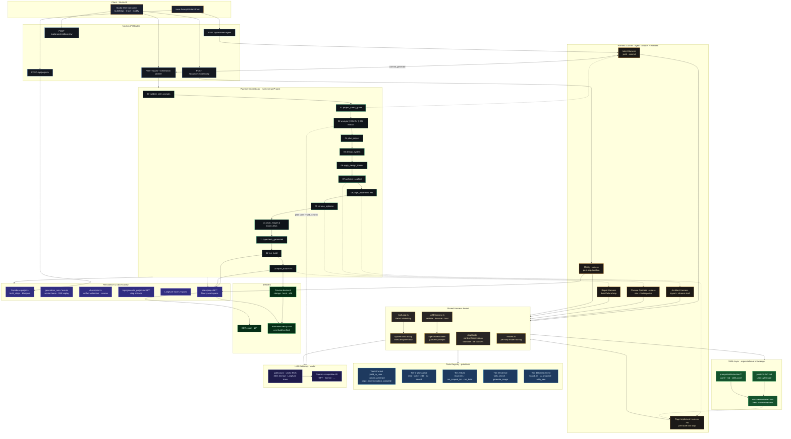
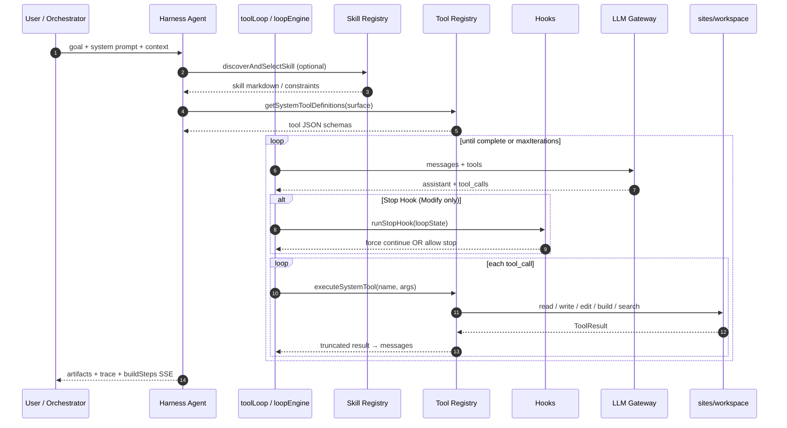
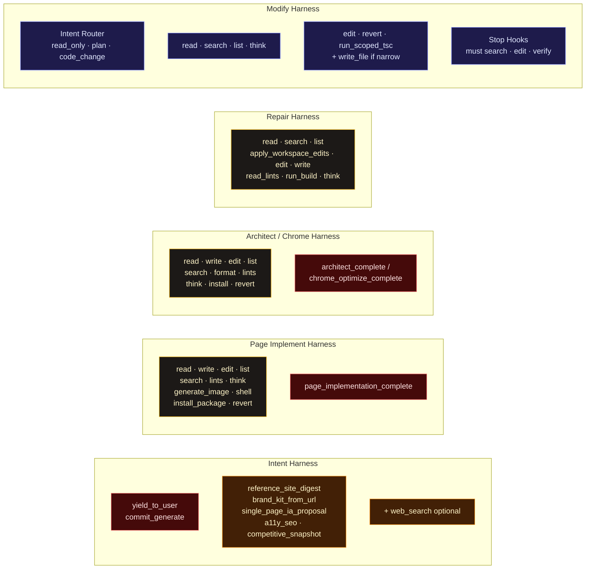
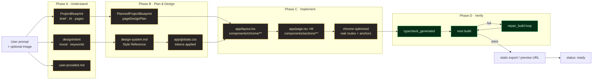
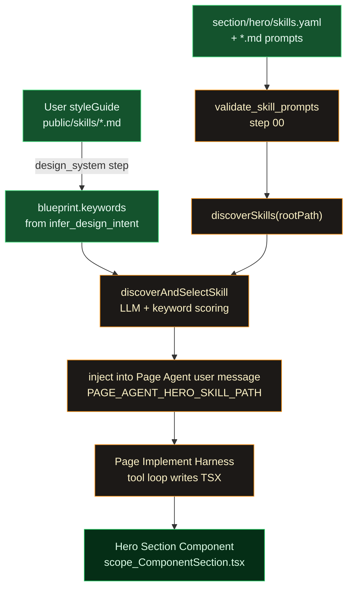

# Open-OX 介绍叙事：以 Harness 为切入点

> 用途：Twitter/X Thread、官网文案、技术博客开场  
> 核心命题：**我们不是又一个聊天生成器，而是一套围绕 LLM 构建的网站生产 Harness。**

---

## 0. 一句话（中英文）

**中文：**  
Open-OX = 把大模型装进「网站生产 Harness」里——不是聊出代码，而是跑完一条可验证、可迭代、可交付的流水线。

**English：**  
Open-OX wraps LLMs in a **website production harness** — not chat-to-code, but a verified, iterable, shippable pipeline.

---

## 1. 开场 Hook（先讲 Harness，再讲产品）

大多数人把 AI 建站理解成：

```
你说一句话 → 模型吐代码 → 祈祷能跑
```

这在工程上缺了一半。**模型只是发动机，真正让 Agent 能干活的是 Harness。**

业界公式：

```
Agent = Model + Harness
```

- **Model**：GPT / Gemini / Claude — 负责推理、生成
- **Harness**：包在模型外的脚手架 — 负责循环、工具、记忆、门禁、验证

没有 Harness，LLM 只能问答。  
有了 Harness，它才能：**读文件 → 改代码 → 跑 build → 失败再修 → 直到交付。**

**Open-OX 做的，就是这件事——而且专门面向「要上线的网站」。**

---

## 2. Harness 是什么？（给非工程师读者 30 秒版）

把 Harness 想成 **整车的底盘和控制系统**：

| Harness 零件 | 干什么 | 没有它会怎样 |
|--------------|--------|--------------|
| **Loop** | 反复调用模型，直到任务完成 | 问一句答一句就结束 |
| **Tools** | 读/写文件、搜索代码、安装依赖、跑构建 | 模型只能「空想」 |
| **Skills** | 把设计/组件经验编成可复用知识 | 每次从零 prompt |
| **Hooks** | 在关键节点强制检查（没 build 不准停） | Agent 半途而废 |
| **Memory** | 会话、步骤、checkpoint 持久化 | 关页面就失忆 |
| **Verification** | typecheck、next build、自动修复 | 预览能看，上线翻车 |

Claude Code、Cursor Agent、Codex CLI 都是 **Coding Harness**。  
Open-OX 是 **Website Production Harness** — 范围更窄，但链条更深。

---

## 3. Open-OX 的 Harness 架构（核心介绍段）

Open-OX **不是**接了一个叫 Harness 的第三方框架。  
我们是 **自建了一整组 Harness**，外面再套一层 **透明的生产流水线**。

```
                    用户一句话
                        │
                        ▼
┌───────────────────────────────────────────────────┐
│  Pipeline Orchestrator（生产流水线）                 │
│  需求 → 蓝图 → 设计系统 → 实现 → build → 修复       │
│  每步 SSE 可见 · DB 持久化 · 支持断点恢复            │
├───────────────────────────────────────────────────┤
│  Harness 集群（多个专用 Agent 循环）                 │
│  ┌─────────────┐ ┌──────────────┐ ┌─────────────┐ │
│  │ Intent      │ │ Page × N     │ │ Modify      │ │
│  │ Agent       │ │ Implement    │ │ Agent       │ │
│  └─────────────┘ └──────────────┘ └─────────────┘ │
├───────────────────────────────────────────────────┤
│  共享 Harness 内核                                 │
│  toolLoop · systemTools · skillDiscovery · hooks  │
└───────────────────────────────────────────────────┘
                        │
                        ▼
                   LLM API（Model）
                        │
                        ▼
              可构建的 Next.js 网站
```

### 3.1 四套 Harness，分工明确

| Harness | 何时运行 | 做什么 |
|---------|----------|--------|
| **Intent Harness** | 生成前 | 澄清需求、收集 brief、`yield` 给用户确认、`commit` 进流水线 |
| **Page Implement Harness** | 生成中 | 每页独立 tool loop：读 layout 契约 → 写组件 → 可选 Hero Skill |
| **Build/Repair Harness** | 生成末 | `next build` 失败 → 定位文件 → 增量修复（最多 5 轮） |
| **Modify Harness** | 生成后 | Claude Code 式循环：search → edit → build，Stop Hook 不准偷懒 |

不是一个大聊天框包打天下，而是 **按阶段换 Harness**。

### 3.2 共享内核：`toolLoop` + `Tools` + `Skills`

所有 Agent 共享同一套 Harness 基础设施：

- **`toolLoop`**：`while` 循环调模型 → 执行 tool → 结果塞回上下文
- **`systemToolCatalog`**：read / write / edit / search / build / lint…
- **`skillDiscovery`**：Hero 特效、section 模板按关键词运行时注入
- **Stop Hooks**（Modify）：没搜索、没编辑、没验证就不准停

**Skills 是 Harness 上的组织知识层** — 不是新模型，是把「怎么做好一个 Hero」沉淀成可插拔能力。

### 3.3 Pipeline 是 Harness 之上的「工厂传送带」

这点和纯 Chat 类产品不同：

- Lovable 类：**一个长 Harness** 在沙箱里边聊边改
- Open-OX：**传送带（13 步）+ 多个短 Harness**，每步有输入输出 artifact

用户看到的是 Studio 里逐步打勾，不是黑盒魔法。

---

## 4. 为什么 Harness 视角能讲清差异化

| 维度 | 普通 AI 生成 | Open-OX Harness |
|------|-------------|-----------------|
| 目标 | 先出预览 | 先过 `next build` |
| 结构 | 单循环黑盒 | Pipeline + 多 Harness |
| 设计 | 即兴 UI | design-system.md → tokens → 全站一致 |
| 修改 | 重新生成或点选 | Modify Harness：搜索、精确 patch、验证 |
| 信任 | 「看起来能跑」 | 步骤可追溯、repair 有日志、可 export |

**对工程师：** 我们工程化的是 Harness，不是 prompt 玄学。  
**对创始人：** 你买到的是交付系统，不是聊天玩具。  
**对设计师：** Skill + 设计系统 Harness 保证视觉一致性。

和 Lovable 的关系（不踩人，划边界）：

> Lovable 是 **full-stack app harness**（快、沙箱、全栈）。  
> Open-OX 是 **marketing site production harness**（透、门禁、可 ship）。

---

## 5. Twitter Thread 正文（英文主发 + 中文 TL;DR）

### Tweet 1 — Hook + 配图：Model vs Harness 对比图

```
Most "AI website builders" sell you the model.

We built the harness.

Agent = Model + Harness
  Model  → reasons
  Harness → loops, tools, skills, hooks, build gates

Open-OX is a website production harness.
Not chat-to-code. Pipeline-to-ship.

🧵
```

**CN：** 多数 AI 建站只卖模型；我们做的是 Harness——让模型能交付网站的整套脚手架。

**配图：** 左「Engine only」右「Engine + Harness → next build ✓」

---

### Tweet 2 — What a harness actually does

```
A raw LLM answers once and stops.

A harness gives it:
→ a tool loop (read / write / search / build)
→ skills (design & hero templates)
→ stop hooks (can't quit before verification)
→ session memory (close browser, resume later)

That's the difference between a demo and a system.
```

**配图：** Harness 解剖五块（Loop / Tools / Skills / Hooks / Verify）

---

### Tweet 3 — Open-OX = multiple harnesses, one pipeline

```
Open-OX doesn't run one endless chat.

We run specialized harnesses on a visible pipeline:

Intent harness     → clarify brief, confirm scope
Page harness × N   → implement each route in parallel
Build harness      → typecheck + next build + repair (5×)
Modify harness     → search → patch → verify (post-ship)

Every step streamed. Every step persisted.
```

**配图：** 录屏 Studio 步骤 / 首页 AgentFlowDemo 粒子流

---

### Tweet 4 — Skills layer

```
Tools are primitives: read_file, edit_file, run_build.

Skills are organizational knowledge on top:
→ Hero motion templates
→ Section design contracts
→ Runtime keyword routing

The model doesn't freestyle every pixel.
The harness injects the right skill at the right step.
```

**配图：** skill yaml → 注入 Page Agent → Hero 产出

---

### Tweet 5 — Stop hooks = discipline

```
The #1 failure mode of coding agents:
they stop too early.

Our Modify harness uses stop hooks:
❌ haven't searched? keep going
❌ haven't edited? keep going
❌ haven't built? keep going

Inspired by Claude Code. Built for website iteration.
```

**配图：** Modify loop 三环闸门示意图

---

### Tweet 6 — Pipeline vs black box

```
Black-box agent:
  prompt → ??? → preview

Open-OX:
  prompt → blueprint → design system → agents → build gate → preview

The harness isn't hidden.
It's the product.
```

**配图：** 13 步 pipeline 时间轴

---

### Tweet 7 — CTA

```
If you need auth + database + Stripe → tools like Lovable are great.

If you need a brand site that actually ships → that's us.

Try Open-OX: [URL]
Docs: [URL]

We didn't wrap a chat UI around a model.
We built a harness around delivery.
```

---

## 6. 官网 / Landing 可用文案

### Hero 标题备选

1. **Not a chatbot. A production harness.**  
   副标：从一句话到可构建、可验证、可迭代的 Next.js 网站。

2. **Model is the engine. We built the car.**  
   副标：透明流水线 · 多 Agent Harness · build 门禁 · 无限修改。

3. **网站生产 Harness**  
   副标：需求 → 蓝图 → 设计系统 → 并行实现 → 构建验证 → 对话修改

### Hero 下方三列

| 列 | 标题 | 正文 |
|----|------|------|
| 1 | Harness, not chat | 固定流水线 + 专用 Agent 循环，每步可追踪 |
| 2 | Skills + Tools | 100+ 设计技能运行时匹配，工具闭环读写构建 |
| 3 | Ship-ready | `next build` 验证，失败自动修复，导出真实工程 |

---

## 7. 配图清单（Harness 叙事专用）

| # | 图名 | 内容 | 用于 |
|---|------|------|------|
| 1 | Engine vs Car | 模型 vs Harness 整车 | Tweet 1 / 官网 Hero 背景 |
| 2 | Harness Anatomy | 五层解剖图 | Tweet 2 |
| 3 | Multi-Harness Pipeline | 4 套 harness + 传送带 | Tweet 3 / 核心主图 |
| 4 | Skill Injection | skill → agent → section | Tweet 4 |
| 5 | Stop Hook Gates | 三环闸门 loop | Tweet 5 |
| 6 | Transparent Steps | Studio SSE 录屏 | Tweet 6 |
| 7 | Positioning Matrix | Open-OX vs app builders 坐标 | Tweet 7 |

视觉规范：背景 `#080a0d`，主色 `#f7931a`，字体 JetBrains Mono + 无衬线标题。

---

## 8. 30 秒口述版（展会 / 视频开场）

> 「大家用 AI 做网站，多半在调模型、调 prompt。但我们认为关键在 Harness——包在模型外面的那层工程结构：工具循环、技能注入、停止钩子、构建验证。
>
> Open-OX 就是一套 **网站生产 Harness**：前面用流水线把需求变成蓝图和设计系统，中间多个 Page Agent 并行写代码，最后必须过 `next build`，失败了自动修。生成之后还有 Modify Harness，让你用自然语言持续改，而且改完会验证。
>
> 一句话：**我们不是聊天生成器，我们是可交付网站的 Harness 系统。**」

---

## 9. 后续 Thread 番外（从 Harness 延伸）

- **番外 A**：我们为什么不用 OpenAI SDK（Harness 层的 timeout 工程）
- **番外 B**：Skill 如何从 prompt 演进为 compiler（Harness 可扩展性）
- **番外 C**：Modify Harness vs Visual Edit — 速度 vs 纪律
- **番外 D**：从单页到多页 = 换 Site Profile，不是换模型

---

## 10. 修订记录

| 日期 | 说明 |
|------|------|
| 2026-06-15 | 初版：Harness 切入点完整叙事 + Twitter Thread + 官网文案 |
| 2026-06-15 | 增补：Mermaid 架构图（总览 / Harness 内核 / 生成流水线 / Modify） |
| 2026-06-15 | 增补：11.0 一体化主架构图（Harness × LLM × Tools × Agent × Skill） |

---

## 11. Mermaid 架构图（可渲染）

> 渲染方式：GitHub / GitLab Markdown、Notion、[Mermaid Live Editor](https://mermaid.live)、VS Code Mermaid 插件。  
> **推荐主图：11.0（一体化）** → Twitter / 官网；**11.2** → 技术博客 Harness 专题。

### 11.0 一体化主架构图（Harness × LLM × Tools × Agent × Skill × 生成流水线）

> 单图涵盖：公式定义、双路径（生成/修改）、13 步流水线、6 套 Agent Harness、共享内核、Skills/Tools 分层、持久化与交付。  
> 复制下方代码块到 Mermaid Live 即可导出 PNG/SVG。

```mermaid
flowchart TB
  classDef formula fill:#422006,stroke:#f7931a,stroke-width:2px,color:#fff7ed
  classDef ui fill:#1a1f2e,stroke:#f7931a,color:#e8e8e8
  classDef api fill:#141820,stroke:#60a5fa,color:#e8e8e8
  classDef pipe fill:#0f1419,stroke:#34d399,color:#e8e8e8
  classDef agent fill:#1c1917,stroke:#f7931a,color:#fef3c7
  classDef kernel fill:#292524,stroke:#fbbf24,color:#fef3c7
  classDef model fill:#1e1b4b,stroke:#818cf8,color:#e0e7ff
  classDef skill fill:#14532d,stroke:#4ade80,color:#ecfdf5
  classDef tool fill:#1e3a5f,stroke:#38bdf8,color:#e0f2fe
  classDef data fill:#312e81,stroke:#a78bfa,color:#ede9fe
  classDef ship fill:#052e16,stroke:#22c55e,color:#dcfce7

  FORM["Agent = Model + Harness<br/>Open-OX = Pipeline + Specialized Harnesses → Shippable Next.js Site"]

  subgraph UI["① Client · Studio"]
    HP["Hero Prompt"]
    IC["Intent Chat · yield / confirm"]
    SS["Studio SSE · buildSteps · modify stream"]
  end

  subgraph API["② API · Next.js App Router"]
    A1["POST /api/projects"]
    A2["POST /api/ai/intent-agent"]
    A3["POST /api/ai · Generation Worker"]
    A4["POST /api/projects/id/modify"]
    A5["preview · export"]
  end

  subgraph GEN["③ Generate Path · Pipeline Orchestrator"]
    direction TB
    P00["00 validate skills"]
    P01["01 intent guide"]
    P02["02 analyze + web_search"]
    P03["03 infer design + 03b user content"]
    P04["04 plan → Blueprint"]
    P05["05 design-system.md"]
    P06["06 globals.css tokens"]
    P07["07 architect scaffold"]
    P08["08 page implement xM parallel"]
    P09["09 chrome optimize"]
    P10["10 images + npm deps"]
    P11["11 typecheck"]
    P12["12 next build"]
    P13["13 repair x5"]
    P00 --> P01 --> P02 --> P03 --> P04 --> P05 --> P06 --> P07 --> P08 --> P09 --> P10 --> P11 --> P12 --> P13
  end

  subgraph MOD["④ Modify Path · Post-ship"]
    MR["Intent Router<br/>conversation · read_only · plan · code_change"]
    ML["Modify Agent Loop<br/>max 100 iter"]
    SH["Stop Hooks<br/>search · edit · verify gates"]
    MR --> ML --> SH
  end

  subgraph AGENTS["⑤ Harness Cluster · Agents"]
    direction LR
    AG1["Intent Agent"]
    AG2["Architect Agent"]
    AG3["Page Agent xN"]
    AG4["Chrome Agent"]
    AG5["Repair Agent"]
    AG6["Modify Agent"]
  end

  subgraph KERNEL["⑥ Shared Harness Kernel"]
    direction TB
    K1["toolLoop.ts · loopEngine.ts<br/>ReAct while-loop"]
    K2["systemToolCatalog + executeSystemTool"]
    K3["skillDiscovery · validate · load"]
    K4["agentRuleBundles · guardrails"]
    K5["stopHooks · compaction · toolGate"]
    K6["models.ts · per-step routing · 300s timeout"]
    K1 --> K2
    K3 --> K4
  end

  subgraph SKILLS["⑦ Skills · knowledge on tools"]
    S1["public/skills user styleGuide"]
    S2["section/hero skills.yaml + md"]
    S3["discoverAndSelectSkill → Page Agent"]
    S1 --> S2 --> S3
  end

  subgraph TOOLS["⑧ Tools · LLM primitives"]
    direction TB
    T0["Control: yield · commit · page_complete"]
    T1["Workspace: read write edit list search"]
    T2["Verify: lints scoped_tsc run_build"]
    T3["External: web_search generate_image"]
    T4["Domain: brand_kit ia_proposal a11y_seo"]
  end

  subgraph LLM["⑨ Model · LLM Gateway"]
    GW["gateway.ts undici fetch"]
    MAPI["OpenAI-compatible API"]
    GW --> MAPI
  end

  subgraph DATA["⑩ State · Observability"]
    D1["Supabase projects + generation_events"]
    D2["checkpoint resume"]
    D3["sites/projectId workspace"]
    D4["Langfuse traces"]
  end

  subgraph SHIP["⑪ Delivery"]
    E1["static preview storage/local/e2b"]
    E2["ZIP export"]
    E3["next build verified site"]
  end

  FORM --> UI
  HP --> A1
  IC --> A2
  SS --> A3
  SS --> A4
  A2 --> AG1
  A3 --> GEN
  A4 --> MOD
  P01 -.-> AG1
  P02 -.-> LLM
  P07 -.-> AG2
  P08 -.-> AG3
  P09 -.-> AG4
  P13 -.-> AG5
  MOD -.-> AG6
  AG1 & AG2 & AG3 & AG4 & AG5 & AG6 --> KERNEL
  KERNEL --> SKILLS
  KERNEL --> TOOLS
  KERNEL --> LLM
  S3 -.-> AG3
  GEN --> DATA
  GEN --> D3
  MOD --> D3
  P13 --> E1
  D3 --> E2
  E1 --> E3
  A5 --> E1

  class FORM formula
  class HP,IC,SS ui
  class A1,A2,A3,A4,A5 api
  class P00,P01,P02,P03,P04,P05,P06,P07,P08,P09,P10,P11,P12,P13 pipe
  class MR,ML,SH mod
  class AG1,AG2,AG3,AG4,AG5,AG6 agent
  class K1,K2,K3,K4,K5,K6 kernel
  class S1,S2,S3 skill
  class T0,T1,T2,T3,T4 tool
  class GW,MAPI model
  class D1,D2,D3,D4 data
  class E1,E2,E3 ship
```



---

### 11.1 全景架构：Website Production Harness



---

### 11.2 Harness 内核：Tool Loop 时序（Agent 如何「动起来」）



---

### 11.3 各 Harness 的 Tool Surface 对照（当前实现）



---

### 11.4 生成流水线数据流（Blueprint → 代码 → 验证）



---

### 11.5 Skills 注入路径（与 Page Agent 的关系）



---

### 11.6 图例与阅读顺序

| 图层 | 含义 | 代码锚点 |
|------|------|----------|
| **Client** | 用户交互与 SSE 消费 | `app/studio`, `HeroPrompt` |
| **API** | 编排入口 | `app/api/ai`, `app/api/projects` |
| **Orchestrator** | 固定 13 步流水线 | `runGenerateProject.ts` |
| **Harness Cluster** | 各阶段 Agent 循环 | Intent / Page / Chrome / Repair / Modify |
| **Kernel** | 共享 loop + tools + hooks | `toolLoop.ts`, `systemTools.ts` |
| **Skills** | 组织知识，非裸 tool | `skillDiscovery.ts` |
| **Tools** | LLM 可调用的原语 | `ai/tools/system/*` |
| **LLM** | Model 网关 | `gateway.ts` |
| **Persistence** | 断点、事件、artifact | `checkpoint.ts`, `generation/*`, Supabase |

**推荐阅读顺序（对外介绍）：**

0. **11.0** 一体化主图（一张讲完全部层次）  
1. **11.2** Harness = loop + tools + hooks（动起来的原理）  
2. **11.1** 或 11.0 展开细节（多 Harness + Pipeline）  
3. **11.3** 分阶段 Tool Surface  
4. **11.4 + 11.5** Blueprint → 代码、Skill 注入

**公式（可印在配图角落）：**

```
Agent = Model + Harness
Open-OX = Pipeline Orchestrator + Σ Specialized Harnesses
Website = fold(Blueprint → Design System → Agents → Build Gate)
```
